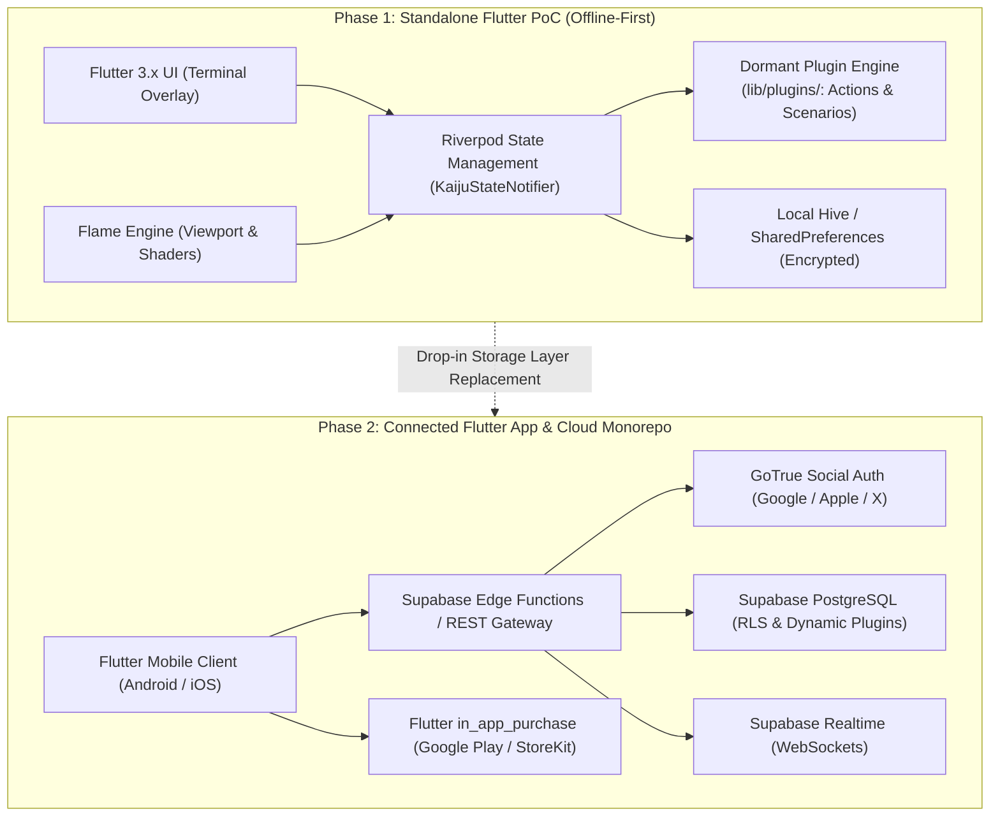

# Architecture: 01 System Overview

This document presents the overarching architectural design of the **Unix Tamagotchi** platform, built **100% in Flutter (Dart 3.x)** and the **Flame engine**, covering its evolution from an offline-first Proof of Concept (PoC) to a scalable, real-time multi-platform monorepo with an extensible **Dormant Plugin System**.

---

## Architecture Evolution

---

## High-Level Component Architecture

### 1. Flutter Mobile Client (`apps/mobile` or `tamagotchi_app/`)
- **Presentation Layer**: Two-layer compositing architecture:
  - **Kaiju Scene Layer (Flame Viewport)**: 1-bit dithered bitmap sprites rendered at low virtual resolution (taking visual reference from `Desing References/Godzila.webp`). Applies dithering shader via Flame `FragmentProgram` and upscales with nearest-neighbor filtering.
  - **UI Layer (Flutter Overlay)**: Native resolution monospace terminal text, bracket-style buttons, hazard stripe decorations, and system diagnostic labels.
- **Engine Core & Riverpod**:
  - `KaijuNotifier`: Orchestrates Kaiju interactions, energy/hunger balance, and cooldown timers.
  - `PluginRegistry`: Service locator containing compiled action and scenario plugins.
  - `Flame Game Component`: Manages sprite animation, particle effects, and the Bayer matrix fragment shader pipeline.
  - `InventoryNotifier`: Manages owned Kaijus (unlimited capacity) and the 240 starting credits.
- **Data Persistence**: Local key-value binary engine (**Hive** or encrypted SharedPreferences) maintaining zero-latency reads/writes without an active network connection.

### 2. Plugin Subsystem (`lib/plugins/`)
- `plugins/user_triggered_actions/`: User-initiated interactions (Eat a ball of humans, Sleep, Play, Crush Tanks).
- `plugins/non_user_triggered_actions/`: Autonomous routines (City rampage work shifts, urban demolition study).
- `plugins/scenarios/`: Dynamic visual environments (Terminal Habitat Room, Metropolis Ruins, Clinic Ward).

### 3. Backend & Cloud Services (`backend/` & Supabase)
- **Database & Row-Level Security**: Supabase PostgreSQL housing player profiles, kaiju inventories, transactions, and the `action_plugins` / `scenario_plugins` tables.
- **Authentication**: Social OAuth with Google Identity, Sign in with Apple, and Twitter (X).
- **Real-Time Engine**: WebSocket channels for remote action broadcasting, presence, and live multiplayer.
- **In-App Purchase Webhook Handler**: Validates Google Play Real-Time Developer Notifications (RTDN) and Apple App Store Server Notifications V2 before crediting user accounts.

> [!NOTE]
> **Humor & Lore Note:** The contrast of a giant kaiju living in a normal containment room, going to school, and getting hungry like a regular tamagotchi is an explicit design choice. This absurdity is central to the game's charm.