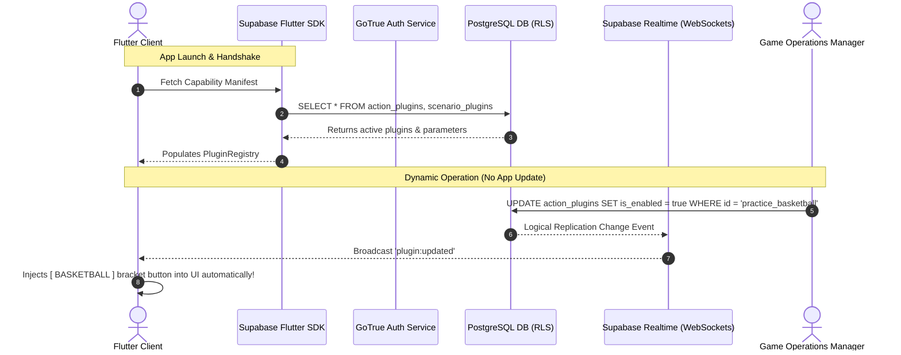

# Architecture: 04 Backend and Realtime Architecture

While the Initial Proof of Concept (PoC) operates 100% offline, the backend architecture is designed to connect the Flutter mobile client to **Supabase** (PostgreSQL, GoTrue Auth, Realtime WebSockets) for dynamic plugin manifests, cloud backups, and multiplayer shared pet care interactions.

---

## 1. High-Level Backend Topology



---

## 2. Dynamic Plugin Synchronization in Flutter

When the app launches or reconnects, a Riverpod provider queries the capability manifest and synchronizes the local `PluginRegistry`:

```dart
// lib/state/plugin_sync_provider.dart
import 'package:flutter_riverpod/flutter_riverpod.dart';
import 'package:supabase_flutter/supabase_flutter.dart';
import '../plugins/plugin_registry.dart';

final pluginSyncProvider = FutureProvider<void>((ref) async {
  final supabase = Supabase.instance.client;

  // 1. Fetch enabled scenarios
  final scenarioResponse = await supabase
      .from('scenario_plugins')
      .select()
      .eq('is_enabled', true);

  // 2. Fetch enabled actions within valid time windows
  final now = DateTime.now().toIso8601String();
  final actionResponse = await supabase
      .from('action_plugins')
      .select()
      .eq('is_enabled', true)
      .or('valid_from.is.null,valid_from.lte.$now')
      .or('valid_until.is.null,valid_until.gte.$now');

  // 3. Update the Flutter PluginRegistry
  PluginRegistry().applyBackendManifest(
    activeActions: (actionResponse as List).map((e) => BackendActionConfig.fromJson(e)).toList(),
    activeScenarios: (scenarioResponse as List).map((e) => BackendScenarioConfig.fromJson(e)).toList(),
  );
});
```

---

## 3. Realtime WebSocket Events for Live Operations

Supabase Realtime listens to PostgreSQL changes and notifies active players instantly:

```dart
void subscribeToLivePluginUpdates() {
  Supabase.instance.client
      .channel('public:action_plugins')
      .onPostgresChanges(
        event: PostgresChangeEvent.all,
        schema: 'public',
        table: 'action_plugins',
        callback: (payload) {
          // Re-sync plugins when manager changes state
          PluginRegistry().updatePluginFromPayload(payload.newRecord);
        },
      )
      .subscribe();
}
```
