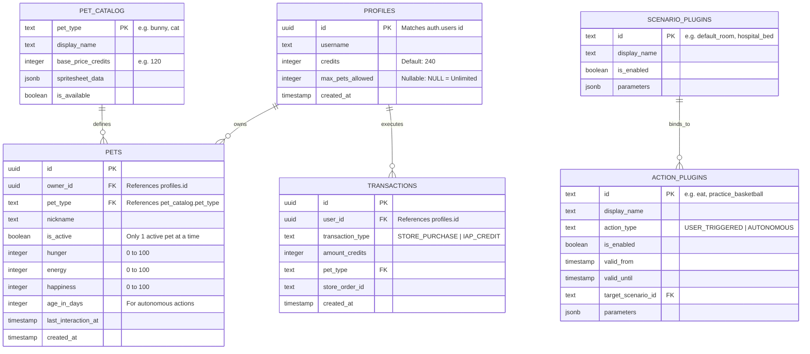

# Architecture: 05 Database and Authentication

This document details the PostgreSQL relational schema, Row-Level Security (RLS) policies, dynamic pet capacity rules, and social authentication architecture for the **Unix Tamagotchi**.

---

## 1. Entity-Relationship Diagram (ERD)



---

## 2. PostgreSQL DDL Schema

```sql
CREATE EXTENSION IF NOT EXISTS "uuid-ossp";

-- 1. User Profiles Table
CREATE TABLE public.profiles (
    id UUID PRIMARY KEY REFERENCES auth.users(id) ON DELETE CASCADE,
    username TEXT NOT NULL,
    avatar_url TEXT,
    credits INTEGER NOT NULL DEFAULT 240 CHECK (credits >= 0),
    max_pets_allowed INTEGER DEFAULT NULL, -- NULL indicates unlimited pets!
    created_at TIMESTAMPTZ NOT NULL DEFAULT timezone('utc'::text, now()),
    updated_at TIMESTAMPTZ NOT NULL DEFAULT timezone('utc'::text, now())
);

-- 2. Scenario Plugins Table
CREATE TABLE public.scenario_plugins (
    id TEXT PRIMARY KEY,
    display_name TEXT NOT NULL,
    is_enabled BOOLEAN NOT NULL DEFAULT true,
    parameters JSONB NOT NULL DEFAULT '{}'::jsonb,
    created_at TIMESTAMPTZ NOT NULL DEFAULT timezone('utc'::text, now())
);

-- 3. Action Plugins Table
CREATE TABLE public.action_plugins (
    id TEXT PRIMARY KEY,
    display_name TEXT NOT NULL,
    action_type TEXT NOT NULL CHECK (action_type IN ('USER_TRIGGERED', 'AUTONOMOUS')),
    is_enabled BOOLEAN NOT NULL DEFAULT false,
    valid_from TIMESTAMPTZ,
    valid_until TIMESTAMPTZ,
    target_scenario_id TEXT REFERENCES public.scenario_plugins(id) ON DELETE SET NULL,
    parameters JSONB NOT NULL DEFAULT '{}'::jsonb,
    created_at TIMESTAMPTZ NOT NULL DEFAULT timezone('utc'::text, now())
);

-- 4. Pet Catalog
CREATE TABLE public.pet_catalog (
    pet_type TEXT PRIMARY KEY,
    display_name TEXT NOT NULL,
    base_price_credits INTEGER NOT NULL DEFAULT 120,
    spritesheet_data JSONB NOT NULL,
    is_available BOOLEAN NOT NULL DEFAULT true,
    created_at TIMESTAMPTZ NOT NULL DEFAULT timezone('utc'::text, now())
);

-- 5. Pets Table (Dynamic Capacity - No Hardcoded 2-Pet Clamp)
CREATE TABLE public.pets (
    id UUID PRIMARY KEY DEFAULT uuid_generate_v4(),
    owner_id UUID NOT NULL REFERENCES public.profiles(id) ON DELETE CASCADE,
    pet_type TEXT NOT NULL REFERENCES public.pet_catalog(pet_type),
    nickname TEXT NOT NULL,
    is_active BOOLEAN NOT NULL DEFAULT false,
    hunger INTEGER NOT NULL DEFAULT 80 CHECK (hunger BETWEEN 0 AND 100),
    energy INTEGER NOT NULL DEFAULT 80 CHECK (energy BETWEEN 0 AND 100),
    happiness INTEGER NOT NULL DEFAULT 80 CHECK (happiness BETWEEN 0 AND 100),
    age_in_days INTEGER NOT NULL DEFAULT 0,
    last_interaction_at TIMESTAMPTZ NOT NULL DEFAULT timezone('utc'::text, now()),
    created_at TIMESTAMPTZ NOT NULL DEFAULT timezone('utc'::text, now())
);

-- Dynamic Capacity Validation Trigger
CREATE OR REPLACE FUNCTION check_dynamic_pets_limit()
RETURNS TRIGGER AS $$
DECLARE
    user_max_limit INTEGER;
    current_pet_count INTEGER;
BEGIN
    SELECT max_pets_allowed INTO user_max_limit FROM public.profiles WHERE id = NEW.owner_id;

    -- If max_pets_allowed is NOT NULL, enforce the backend-specified limit
    IF user_max_limit IS NOT NULL THEN
        SELECT COUNT(*) INTO current_pet_count FROM public.pets WHERE owner_id = NEW.owner_id;
        IF current_pet_count >= user_max_limit THEN
            RAISE EXCEPTION 'User has reached their maximum allowed pet capacity (%).', user_max_limit;
        END IF;
    END IF;

    RETURN NEW;
END;
$$ LANGUAGE plpgsql;

CREATE TRIGGER enforce_dynamic_pets_limit
BEFORE INSERT ON public.pets
FOR EACH ROW
EXECUTE FUNCTION check_dynamic_pets_limit();
```

---

## 3. Social Authentication in Flutter

Authentication is handled natively in Flutter via `supabase_flutter`:

```dart
import 'package:supabase_flutter/supabase_flutter.dart';

class AuthService {
  final SupabaseClient _client = Supabase.instance.client;

  // Google Sign-In (Android & iOS)
  Future<void> signInWithGoogle() async {
    await _client.auth.signInWithOAuth(
      OAuthProvider.google,
      redirectTo: 'tamagotchi://login-callback',
    );
  }

  // Sign in with Apple (Mandatory for iOS Store Approval)
  Future<void> signInWithApple() async {
    await _client.auth.signInWithOAuth(
      OAuthProvider.apple,
      redirectTo: 'tamagotchi://login-callback',
    );
  }
}
```
