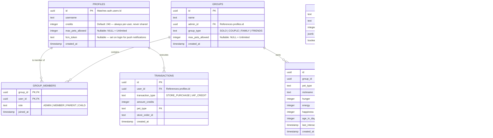

# Architecture: 05 Database and Authentication

This document details the PostgreSQL relational schema, Row-Level Security (RLS) policies, dynamic pet capacity rules, and social authentication architecture for the **Unix Tamagotchi**.

---

## 1. Entity-Relationship Diagram (ERD)



---

## 2. PostgreSQL DDL Schema

```sql
CREATE EXTENSION IF NOT EXISTS "uuid-ossp";

-- 1. User Profiles Table (credits are always per-user, never pooled with a group)
CREATE TABLE public.profiles (
    id UUID PRIMARY KEY REFERENCES auth.users(id) ON DELETE CASCADE,
    username TEXT NOT NULL,
    avatar_url TEXT,
    credits INTEGER NOT NULL DEFAULT 240 CHECK (credits >= 0),
    max_pets_allowed INTEGER DEFAULT NULL, -- NULL indicates unlimited pets!
    fcm_token TEXT, -- updated on every login for push notification targeting
    created_at TIMESTAMPTZ NOT NULL DEFAULT timezone('utc'::text, now()),
    updated_at TIMESTAMPTZ NOT NULL DEFAULT timezone('utc'::text, now())
);

-- 1b. Groups Table
CREATE TABLE public.groups (
    id UUID PRIMARY KEY DEFAULT uuid_generate_v4(),
    name TEXT NOT NULL,
    admin_id UUID REFERENCES public.profiles(id),
    group_type TEXT NOT NULL CHECK (group_type IN ('SOLO', 'COUPLE', 'FAMILY', 'FRIENDS')),
    max_pets_allowed INTEGER DEFAULT NULL,
    created_at TIMESTAMPTZ NOT NULL DEFAULT timezone('utc'::text, now())
);

-- 1c. Group Members Table
-- PARENT/CHILD roles are dialogue labels for FAMILY groups (how the pet addresses members).
-- They do not grant or restrict app permissions beyond ADMIN/MEMBER.
CREATE TABLE public.group_members (
    group_id UUID REFERENCES public.groups(id) ON DELETE CASCADE,
    user_id UUID REFERENCES public.profiles(id) ON DELETE CASCADE,
    role TEXT NOT NULL DEFAULT 'MEMBER' CHECK (role IN ('ADMIN', 'MEMBER', 'PARENT', 'CHILD')),
    joined_at TIMESTAMPTZ NOT NULL DEFAULT timezone('utc'::text, now()),
    PRIMARY KEY (group_id, user_id)
);

-- 1d. Active Pet Sessions (per-user, per-group)
-- Replaces the old is_active boolean on pets, allowing each member to track their own active pet.
CREATE TABLE public.active_pet_sessions (
    user_id UUID NOT NULL REFERENCES public.profiles(id) ON DELETE CASCADE,
    group_id UUID NOT NULL REFERENCES public.groups(id) ON DELETE CASCADE,
    pet_id UUID NOT NULL REFERENCES public.pets(id) ON DELETE CASCADE,
    updated_at TIMESTAMPTZ NOT NULL DEFAULT timezone('utc'::text, now()),
    PRIMARY KEY (user_id, group_id)
);

-- 1e. Group Type Configuration (drives per-group-type pet personality and behavior)
CREATE TABLE public.group_type_config (
    group_type TEXT PRIMARY KEY CHECK (group_type IN ('SOLO', 'COUPLE', 'FAMILY', 'FRIENDS')),
    affection_rate NUMERIC(4,2) NOT NULL DEFAULT 1.0,
    energy_decay_modifier NUMERIC(4,2) NOT NULL DEFAULT 1.0,
    animation_pool JSONB NOT NULL DEFAULT '[]'::jsonb,
    dialogue_labels JSONB NOT NULL DEFAULT '{}'::jsonb, -- e.g. {"caretaker_a": "Mom", "caretaker_b": "Dad"}
    special_events JSONB NOT NULL DEFAULT '[]'::jsonb,
    created_at TIMESTAMPTZ NOT NULL DEFAULT timezone('utc'::text, now())
);

-- 2. Scenario Plugins Table
CREATE TABLE public.scenario_plugins (
    id TEXT PRIMARY KEY,
    display_name TEXT NOT NULL,
    is_enabled BOOLEAN NOT NULL DEFAULT true,
    parameters JSONB NOT NULL DEFAULT '{}'::jsonb,
    created_at TIMESTAMPTZ NOT NULL DEFAULT timezone('utc'::text, now())
);

-- 3. Action Plugins Table
CREATE TABLE public.action_plugins (
    id TEXT PRIMARY KEY,
    display_name TEXT NOT NULL,
    action_type TEXT NOT NULL CHECK (action_type IN ('USER_TRIGGERED', 'AUTONOMOUS')),
    is_enabled BOOLEAN NOT NULL DEFAULT false,
    valid_from TIMESTAMPTZ,
    valid_until TIMESTAMPTZ,
    target_scenario_id TEXT REFERENCES public.scenario_plugins(id) ON DELETE SET NULL,
    parameters JSONB NOT NULL DEFAULT '{}'::jsonb,
    created_at TIMESTAMPTZ NOT NULL DEFAULT timezone('utc'::text, now())
);

-- 4. Pet Catalog
CREATE TABLE public.pet_catalog (
    pet_type TEXT PRIMARY KEY,
    display_name TEXT NOT NULL,
    base_price_credits INTEGER NOT NULL DEFAULT 120,
    spritesheet_data JSONB NOT NULL,
    is_available BOOLEAN NOT NULL DEFAULT true,
    created_at TIMESTAMPTZ NOT NULL DEFAULT timezone('utc'::text, now())
);

-- 5. Pets Table (Dynamic Capacity - No Hardcoded 2-Pet Clamp)
-- Owned by a GROUP, not an individual user. is_active removed — see active_pet_sessions.
CREATE TABLE public.pets (
    id UUID PRIMARY KEY DEFAULT uuid_generate_v4(),
    group_id UUID NOT NULL REFERENCES public.groups(id) ON DELETE CASCADE,
    pet_type TEXT NOT NULL REFERENCES public.pet_catalog(pet_type),
    nickname TEXT NOT NULL,
    hunger INTEGER NOT NULL DEFAULT 80 CHECK (hunger BETWEEN 0 AND 100),
    energy INTEGER NOT NULL DEFAULT 80 CHECK (energy BETWEEN 0 AND 100),
    happiness INTEGER NOT NULL DEFAULT 80 CHECK (happiness BETWEEN 0 AND 100),
    age_in_days INTEGER NOT NULL DEFAULT 0,
    last_interaction_at TIMESTAMPTZ NOT NULL DEFAULT timezone('utc'::text, now()),
    created_at TIMESTAMPTZ NOT NULL DEFAULT timezone('utc'::text, now())
);

-- Dynamic Capacity Validation Trigger (capacity is now per-group)
CREATE OR REPLACE FUNCTION check_dynamic_pets_limit()
RETURNS TRIGGER AS $$
DECLARE
    group_max_limit INTEGER;
    current_pet_count INTEGER;
BEGIN
    SELECT max_pets_allowed INTO group_max_limit FROM public.groups WHERE id = NEW.group_id;

    IF group_max_limit IS NOT NULL THEN
        SELECT COUNT(*) INTO current_pet_count FROM public.pets WHERE group_id = NEW.group_id;
        IF current_pet_count >= group_max_limit THEN
            RAISE EXCEPTION 'Group has reached its maximum allowed pet capacity (%).', group_max_limit;
        END IF;
    END IF;

    RETURN NEW;
END;
$$ LANGUAGE plpgsql;

CREATE TRIGGER enforce_dynamic_pets_limit
BEFORE INSERT ON public.pets
FOR EACH ROW
EXECUTE FUNCTION check_dynamic_pets_limit();
```

---

## 3. Social Authentication in Flutter

Authentication is handled natively in Flutter via `supabase_flutter`:

```dart
import 'package:supabase_flutter/supabase_flutter.dart';

class AuthService {
  final SupabaseClient _client = Supabase.instance.client;

  // Google Sign-In (Android & iOS)
  Future<void> signInWithGoogle() async {
    await _client.auth.signInWithOAuth(
      OAuthProvider.google,
      redirectTo: 'tamagotchi://login-callback',
    );
  }

  // Sign in with Apple (Mandatory for iOS Store Approval)
  Future<void> signInWithApple() async {
    await _client.auth.signInWithOAuth(
      OAuthProvider.apple,
      redirectTo: 'tamagotchi://login-callback',
    );
  }
}
```
