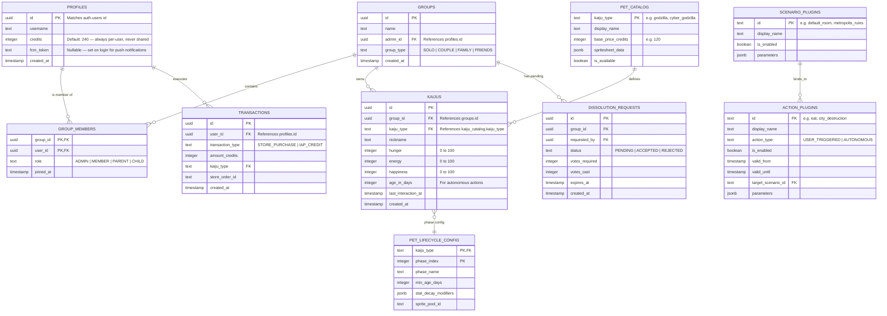

# Architecture: 05 Database and Authentication

This document details the PostgreSQL relational schema, Row-Level Security (RLS) policies, and social authentication architecture for the **Unix Tamagotchi**. Kaiju ownership is **unbounded by design** — any user may own as many kaijus as their credit balance allows; no server-side quota field exists.

---

## 1. Entity-Relationship Diagram (ERD)



---

## 2. PostgreSQL DDL Schema

```sql
CREATE EXTENSION IF NOT EXISTS "uuid-ossp";

-- 1. User Profiles Table (credits are always per-user, never pooled with a group)
CREATE TABLE public.profiles (
    id UUID PRIMARY KEY REFERENCES auth.users(id) ON DELETE CASCADE,
    username TEXT NOT NULL,
    avatar_url TEXT,
    credits INTEGER NOT NULL DEFAULT 240 CHECK (credits >= 0),
    fcm_token TEXT, -- updated on every login for push notification targeting
    created_at TIMESTAMPTZ NOT NULL DEFAULT timezone('utc'::text, now()),
    updated_at TIMESTAMPTZ NOT NULL DEFAULT timezone('utc'::text, now())
);

-- 1b. Groups Table
CREATE TABLE public.groups (
    id UUID PRIMARY KEY DEFAULT uuid_generate_v4(),
    name TEXT NOT NULL,
    admin_id UUID REFERENCES public.profiles(id),
    group_type TEXT NOT NULL CHECK (group_type IN ('SOLO', 'COUPLE', 'FAMILY', 'FRIENDS')),
    created_at TIMESTAMPTZ NOT NULL DEFAULT timezone('utc'::text, now())
);

-- 1c. Group Members Table
-- PARENT/CHILD roles are dialogue labels for FAMILY groups (how the kaiju addresses members).
-- They do not grant or restrict app permissions beyond ADMIN/MEMBER.
CREATE TABLE public.group_members (
    group_id UUID REFERENCES public.groups(id) ON DELETE CASCADE,
    user_id UUID REFERENCES public.profiles(id) ON DELETE CASCADE,
    role TEXT NOT NULL DEFAULT 'MEMBER' CHECK (role IN ('ADMIN', 'MEMBER', 'PARENT', 'CHILD')),
    joined_at TIMESTAMPTZ NOT NULL DEFAULT timezone('utc'::text, now()),
    PRIMARY KEY (group_id, user_id)
);

-- 1d. Active Kaiju Sessions (per-user, per-group)
-- Replaces the old is_active boolean on kaijus, allowing each member to track their own active kaiju.
CREATE TABLE public.active_kaiju_sessions (
    user_id UUID NOT NULL REFERENCES public.profiles(id) ON DELETE CASCADE,
    group_id UUID NOT NULL REFERENCES public.groups(id) ON DELETE CASCADE,
    kaiju_id UUID NOT NULL REFERENCES public.kaijus(id) ON DELETE CASCADE,
    updated_at TIMESTAMPTZ NOT NULL DEFAULT timezone('utc'::text, now()),
    PRIMARY KEY (user_id, group_id)
);

-- 1e. Group Type Configuration (drives per-group-type kaiju personality and behavior)
CREATE TABLE public.group_type_config (
    group_type TEXT PRIMARY KEY CHECK (group_type IN ('SOLO', 'COUPLE', 'FAMILY', 'FRIENDS')),
    affection_rate NUMERIC(4,2) NOT NULL DEFAULT 1.0,
    energy_decay_modifier NUMERIC(4,2) NOT NULL DEFAULT 1.0,
    animation_pool JSONB NOT NULL DEFAULT '[]'::jsonb,
    dialogue_labels JSONB NOT NULL DEFAULT '{}'::jsonb, -- e.g. {"caretaker_a": "Mom", "caretaker_b": "Dad"}
    special_events JSONB NOT NULL DEFAULT '[]'::jsonb,
    created_at TIMESTAMPTZ NOT NULL DEFAULT timezone('utc'::text, now())
);

-- 2. Scenario Plugins Table
CREATE TABLE public.scenario_plugins (
    id TEXT PRIMARY KEY,
    display_name TEXT NOT NULL,
    is_enabled BOOLEAN NOT NULL DEFAULT true,
    parameters JSONB NOT NULL DEFAULT '{}'::jsonb,
    created_at TIMESTAMPTZ NOT NULL DEFAULT timezone('utc'::text, now()),
    updated_at TIMESTAMPTZ NOT NULL DEFAULT timezone('utc'::text, now())
);

-- 3. Action Plugins Table
CREATE TABLE public.action_plugins (
    id TEXT PRIMARY KEY,
    display_name TEXT NOT NULL,
    action_type TEXT NOT NULL CHECK (action_type IN ('USER_TRIGGERED', 'AUTONOMOUS')),
    is_enabled BOOLEAN NOT NULL DEFAULT false,
    valid_from TIMESTAMPTZ,
    valid_until TIMESTAMPTZ,
    target_scenario_id TEXT REFERENCES public.scenario_plugins(id) ON DELETE SET NULL,
    -- Age gates: NULL on either bound means unconstrained on that end.
    min_age_phase TEXT DEFAULT NULL CHECK (min_age_phase IN ('baby','child','young','adult','elder')),
    max_age_phase TEXT DEFAULT NULL CHECK (max_age_phase IN ('baby','child','young','adult','elder')),
    -- Lower priority value = higher precedence (0 overrides all others).
    priority INTEGER NOT NULL DEFAULT 50,
    -- blocking_conditions: [{"condition": "is_sick"}] — omit the field, presence alone means blocks=true.
    blocking_conditions JSONB NOT NULL DEFAULT '[]'::jsonb,
    parameters JSONB NOT NULL DEFAULT '{}'::jsonb,
    created_at TIMESTAMPTZ NOT NULL DEFAULT timezone('utc'::text, now()),
    updated_at TIMESTAMPTZ NOT NULL DEFAULT timezone('utc'::text, now())
);

-- 4. Kaiju Catalog
CREATE TABLE public.kaiju_catalog (
    kaiju_type TEXT PRIMARY KEY,
    display_name TEXT NOT NULL,
    base_price_credits INTEGER NOT NULL DEFAULT 120,
    spritesheet_data JSONB NOT NULL,
    is_available BOOLEAN NOT NULL DEFAULT true,
    created_at TIMESTAMPTZ NOT NULL DEFAULT timezone('utc'::text, now())
);

-- 5. Kaijus Table
-- Owned by a GROUP, not an individual user. is_active removed — see active_kaiju_sessions.
CREATE TABLE public.kaijus (
    id UUID PRIMARY KEY DEFAULT uuid_generate_v4(),
    group_id UUID NOT NULL REFERENCES public.groups(id) ON DELETE CASCADE,
    kaiju_type TEXT NOT NULL REFERENCES public.kaiju_catalog(kaiju_type),
    nickname TEXT NOT NULL,
    hunger INTEGER NOT NULL DEFAULT 80 CHECK (hunger BETWEEN 0 AND 100),
    energy INTEGER NOT NULL DEFAULT 80 CHECK (hunger BETWEEN 0 AND 100),
    happiness INTEGER NOT NULL DEFAULT 80 CHECK (hunger BETWEEN 0 AND 100),
    age_in_days INTEGER NOT NULL DEFAULT 0,
    last_interaction_at TIMESTAMPTZ NOT NULL DEFAULT timezone('utc'::text, now()),
    created_at TIMESTAMPTZ NOT NULL DEFAULT timezone('utc'::text, now())
);

-- 6. Kaiju Lifecycle Configuration (per-kaiju type aging schedule, Phase 2+)
-- See Features/05-kaiju-lifecycle-and-aging.md for design intent and example seed data.
CREATE TABLE public.kaiju_lifecycle_config (
    kaiju_type TEXT NOT NULL REFERENCES public.kaiju_catalog(kaiju_type) ON DELETE CASCADE,
    phase_index INTEGER NOT NULL CHECK (phase_index BETWEEN 0 AND 4),
    phase_name TEXT NOT NULL CHECK (phase_name IN ('baby', 'child', 'young', 'adult', 'elder')),
    min_age_days INTEGER NOT NULL,
    stat_decay_modifiers JSONB NOT NULL DEFAULT '{"hunger": 1.0, "energy": 1.0, "happiness": 1.0}'::jsonb,
    sprite_pool_id TEXT,
    created_at TIMESTAMPTZ NOT NULL DEFAULT NOW(),
    PRIMARY KEY (kaiju_type, phase_index)
);

-- 7. Dissolution Requests (consensus-based group dissolution, Phase 4+)
-- COUPLE groups require both members to accept. FAMILY/FRIENDS require majority (50% + 1).
CREATE TABLE public.dissolution_requests (
    id UUID PRIMARY KEY DEFAULT uuid_generate_v4(),
    group_id UUID NOT NULL REFERENCES public.groups(id) ON DELETE CASCADE,
    requested_by UUID NOT NULL REFERENCES public.profiles(id) ON DELETE CASCADE,
    status TEXT NOT NULL DEFAULT 'PENDING' CHECK (status IN ('PENDING', 'ACCEPTED', 'REJECTED')),
    votes_required INTEGER NOT NULL,   -- set at creation time: 2 for COUPLE, ceil(n/2)+1 for others
    votes_cast INTEGER NOT NULL DEFAULT 1,  -- initiator’s vote is counted automatically
    expires_at TIMESTAMPTZ NOT NULL DEFAULT NOW() + INTERVAL '48 hours',
    created_at TIMESTAMPTZ NOT NULL DEFAULT NOW()
);

CREATE INDEX idx_dissolution_requests_group ON public.dissolution_requests(group_id);

-- updated_at auto-update triggers for mutable plugin tables
CREATE OR REPLACE FUNCTION set_updated_at()
RETURNS TRIGGER AS $$
BEGIN NEW.updated_at = NOW(); RETURN NEW; END;
$$ LANGUAGE plpgsql;

CREATE TRIGGER trg_action_plugins_updated_at
BEFORE UPDATE ON public.action_plugins
FOR EACH ROW EXECUTE FUNCTION set_updated_at();

CREATE TRIGGER trg_scenario_plugins_updated_at
BEFORE UPDATE ON public.scenario_plugins
FOR EACH ROW EXECUTE FUNCTION set_updated_at();
```

---

## 3. Social Authentication in Flutter

Authentication is handled natively in Flutter via `supabase_flutter`:

```dart
import 'package:supabase_flutter/supabase_flutter.dart';

class AuthService {
  final SupabaseClient _client = Supabase.instance.client;

  // Google Sign-In (Android & iOS)
  Future<void> signInWithGoogle() async {
    await _client.auth.signInWithOAuth(
      OAuthProvider.google,
      redirectTo: 'tamagotchi://login-callback',
    );
  }

  // Sign in with Apple (Mandatory for iOS Store Approval)
  Future<void> signInWithApple() async {
    await _client.auth.signInWithOAuth(
      OAuthProvider.apple,
      redirectTo: 'tamagotchi://login-callback',
    );
  }
}
```
