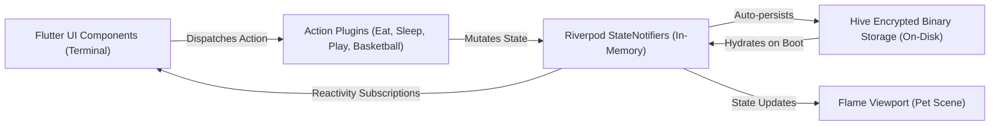

# Architecture: 06 Offline-First State Management (Flutter Riverpod)

This document defines the client-side state management architecture for the **Unix Tamagotchi**, explaining how the application functions 100% offline for the Initial Proof of Concept (PoC) using **Flutter Riverpod** and **Hive**.

---

## 1. PoC State Architecture (Riverpod + Hive)

For the PoC, all application state resides on the user's device. We utilize **Flutter Riverpod** paired with **Hive** for instant, binary-level read/write persistence across app restarts.



---

## 2. Dart State Models (`lib/models/`)

```dart
import 'package:flutter/foundation.dart';

@immutable
class PetInstance {
  final String id;
  final String groupId; // maps to groups.id; 'solo_<userId>' during PoC offline phase
  final String petType; // 'bunny' | 'cat'
  final String nickname;
  final int hunger;     // 0 - 100
  final int energy;     // 0 - 100
  final int happiness;  // 0 - 100
  final int ageInDays;
  final String currentActionState; // 'idle' | 'eating' | 'sleeping' | 'playing'
  final String activeScenarioId;   // e.g. 'default_room' | 'hospital_bed'
  final DateTime lastInteractionTimestamp;

  const PetInstance({
    required this.id,
    required this.groupId,
    required this.petType,
    required this.nickname,
    this.hunger = 80,
    this.energy = 80,
    this.happiness = 80,
    this.ageInDays = 0,
    this.currentActionState = 'idle',
    this.activeScenarioId = 'default_room',
    required this.lastInteractionTimestamp,
  });

  PetInstance copyWith({
    int? hunger,
    int? energy,
    int? happiness,
    int? ageInDays,
    String? currentActionState,
    String? activeScenarioId,
    DateTime? lastInteractionTimestamp,
  }) {
    return PetInstance(
      id: id,
      groupId: groupId,
      petType: petType,
      nickname: nickname,
      hunger: hunger ?? this.hunger,
      energy: energy ?? this.energy,
      happiness: happiness ?? this.happiness,
      ageInDays: ageInDays ?? this.ageInDays,
      currentActionState: currentActionState ?? this.currentActionState,
      activeScenarioId: activeScenarioId ?? this.activeScenarioId,
      lastInteractionTimestamp: lastInteractionTimestamp ?? this.lastInteractionTimestamp,
    );
  }
}
```

---

## 3. Riverpod State Notifier Implementation (`lib/state/pet_state_notifier.dart`)

```dart
import 'package:flutter_riverpod/flutter_riverpod.dart';
import '../models/pet_state.dart';
import '../plugins/interfaces/action_plugin.dart';
import '../plugins/plugin_registry.dart';

class GameState {
  final int credits;
  final List<PetInstance> ownedPets;
  final String? activePetId;

  const GameState({
    required this.credits,
    required this.ownedPets,
    this.activePetId,
  });

  PetInstance? get activePet {
    if (activePetId == null || ownedPets.isEmpty) return null;
    return ownedPets.firstWhere(
      (p) => p.id == activePetId,
      orElse: () => ownedPets.first,
    );
  }
}

class GameNotifier extends StateNotifier<GameState> {
  GameNotifier()
      : super(const GameState(
          credits: 240, // Starting PoC balance
          ownedPets: [],
          activePetId: null,
        ));

  /// Purchase a pet: Dynamic capacity (no hardcoded 2-pet limit)
  bool buyPet({
    required String petType,
    required String nickname,
    required int price,
  }) {
    if (state.credits < price) {
      return false; // Insufficient credits
    }

    final newPet = PetInstance(
      id: 'pet_${DateTime.now().millisecondsSinceEpoch}',
      petType: petType,
      nickname: nickname,
      lastInteractionTimestamp: DateTime.now(),
    );

    state = GameState(
      credits: state.credits - price,
      ownedPets: [...state.ownedPets, newPet],
      activePetId: state.activePetId ?? newPet.id,
    );

    return true;
  }

  void switchActivePet(String petId) {
    if (state.ownedPets.any((p) => p.id == petId)) {
      state = GameState(
        credits: state.credits,
        ownedPets: state.ownedPets,
        activePetId: petId,
      );
    }
  }

  /// Executes an Action Plugin dynamically
  void executePluginAction(ActionPlugin plugin) {
    final pet = state.activePet;
    if (pet == null) return;

    final backendParams = PluginRegistry().getActiveParamsForAction(plugin.id);
    final result = plugin.execute(
      currentPet: pet,
      backendParams: backendParams,
      triggeredAt: DateTime.now(),
    );

    if (!result.success) return;

    // Apply stat deltas
    final updatedPet = pet.copyWith(
      hunger: (pet.hunger + result.hungerDelta).clamp(0, 100),
      energy: (pet.energy + result.energyDelta).clamp(0, 100),
      happiness: (pet.happiness + result.happinessDelta).clamp(0, 100),
      currentActionState: result.animationTrigger,
      activeScenarioId: result.targetScenarioId,
      lastInteractionTimestamp: DateTime.now(),
    );

    state = GameState(
      credits: state.credits + result.creditsEarned,
      ownedPets: state.ownedPets.map((p) => p.id == pet.id ? updatedPet : p).toList(),
      activePetId: state.activePetId,
    );

    // Reset action state to idle after duration
    Future.delayed(result.duration, () {
      final current = state.activePet;
      if (current != null && current.id == updatedPet.id) {
        final resetPet = current.copyWith(currentActionState: 'idle');
        state = GameState(
          credits: state.credits,
          ownedPets: state.ownedPets.map((p) => p.id == current.id ? resetPet : p).toList(),
          activePetId: state.activePetId,
        );
      }
    });
  }
}

final gameStateProvider = StateNotifierProvider<GameNotifier, GameState>((ref) {
  return GameNotifier();
});
```
