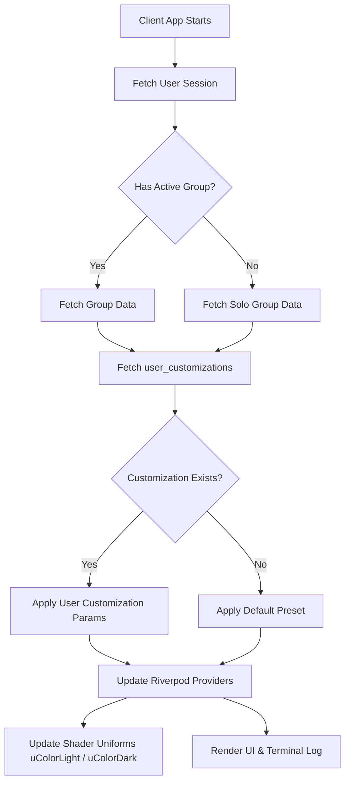

# Customization: 01 Customization System Overview

The Unix Tamagotchi features a robust customization system designed around its 1-bit dithered, industrial terminal aesthetic. This document outlines the scope, architecture, and user interface for cosmetic customizations.

## 1. Customizable Elements

The system supports several layers of cosmetic personalization for the Tactical 1-Bit Cyber-Specimen OS:

1. **Room Palette Themes:** Swaps the dithering shader's `uColorLight` and `uColorDark` uniforms. 
   - *Examples:* 'Game Boy Green', 'Amber Monitor', 'Blue Terminal', 'Classic Khaki'.
2. **Pet Nicknames:** Custom names for the specimen (already implemented).
3. **Terminal Boot Messages:** Custom welcome text displayed in the log panel upon startup.
4. **Room Ambient Effects:** Shader parameters controlling fog density, scan lines, and CRT curvature.
5. **Future Additions:** Pet accessories, pet skins (alternative spritesheets).

### 1.1 PoC Scope
For the initial Proof of Concept (PoC), the following elements are in scope:
- Room Palette Themes
- Pet Nicknames
- Terminal Boot Messages

**Deferred to post-PoC:** Room Ambient Effects, Pet accessories, and Pet skins.

## 2. Per-User Rendering in Shared Groups

The Unix Tamagotchi employs a client-side rendering approach for most customizations. In a multiplayer group setting (COUPLE, FAMILY, FRIENDS):

- **Visual Customizations (Themes, Messages):** Each member sees their *own* customizations. For example, User A might view the specimen in 'Amber Monitor' mode, while User B simultaneously views the same specimen in 'Game Boy Green'. 
- **Shared Customizations (Nicknames):** Pet nicknames are synchronized globally within the group; all members see the same nickname.

## 3. Customization Selector UI

The customization interface maintains the industrial terminal aesthetic, utilizing VT323 monospace font and hazard caution stripes where applicable, using bracket-style buttons `[ ACTION ]`.

```text
=================================================
// SYSTEM.CUSTOMIZATION_MODULE_v1.0.4
=================================================

> SELECT_THEME:
  [X] CLASSIC_KHAKI (DEFAULT)
  [ ] AMBER_MONITOR
  [ ] GAME_BOY_GREEN
  [ ] BLUE_TERMINAL

> CONFIGURE_BOOT_SEQUENCE:
  MSG: "WAKE UP, NEO..."           [ EDIT ]

> SPECIMEN_DESIGNATION:
  ID: "RUSTY"                      [ RENAME ]

=================================================
[ APPLY_CHANGES ]    [ REVERT_TO_DEFAULT ]
=================================================
```

## 4. Customization Data Flow

The following flow illustrates how customizations are fetched and applied on the client.


