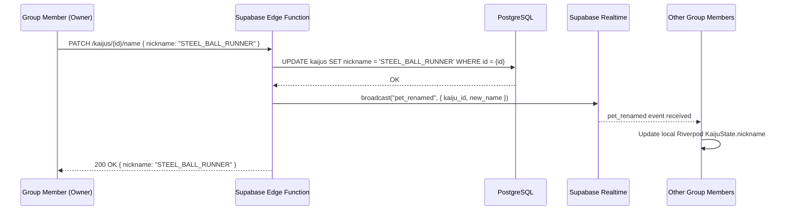

# Customization: 03 Kaiju Name Customization

This document specifies the manual kaiju rename feature: its UX behavior, validation rules, backend API contract, and group synchronization logic. This feature is **deferred to post-PoC** (Phase 2 — Supabase backend).

---

## 1. Feature Summary

| Attribute | Value |
| :--- | :--- |
| **PoC availability** | 🔴 Not available — `[ RENAME ]` button is not rendered |
| **Phase introduced** | Phase 2 (Supabase backend) |
| **Who can rename** | The kaiju's owner only |
| **Rename frequency** | Unlimited (no cooldown in base design) |
| **Auto-generated name** | Assigned at adoption; persists until player renames |
| **Group sync** | 🟢 Synced globally — all group members see the updated name in real-time |
| **Name persistence** | `KAIJUS.nickname` column in PostgreSQL |

For the auto-generation logic that produces the initial default name, see [NameGeneration/01-name-generation-overview.md](../NameGeneration/01-name-generation-overview.md).

---

## 2. PoC Behavior (Read-Only Name)

In the PoC, the kaiju's designation is **read-only**. The name is auto-generated at adoption (see [NameGeneration/01-name-generation-overview.md](../NameGeneration/01-name-generation-overview.md)) and displayed throughout the UI with no rename controls present.

The `[ RENAME ]` button is **not rendered** in the Customization screen during the PoC. There is no greyed-out placeholder — the row is simply absent to avoid user confusion.

Terminal log message at adoption (PoC):
```text
> SPECIMEN_DESIGNATION: CRAZY_DIAMOND_PULSE
> DESIGNATION_STATUS: LOCKED [BACKEND_REQUIRED]
```

---

## 3. Post-PoC: Rename Feature

### 3.1 UI Entry Point

The rename control is added to the existing Customization screen (documented in [01-customization-overview.md](./01-customization-overview.md)) under the `SPECIMEN_DESIGNATION` row, replacing the static text display with an interactive control:

```text
=================================================
// SYSTEM.CUSTOMIZATION_MODULE_v1.0.4
=================================================

> SELECT_THEME:
  [X] CLASSIC_KHAKI (DEFAULT)
  [ ] AMBER_MONITOR
  [ ] GAME_BOY_GREEN
  [ ] BLUE_TERMINAL

> CONFIGURE_BOOT_SEQUENCE:
  MSG: "WAKE UP, NEO..."           [ EDIT ]

> SPECIMEN_DESIGNATION:
  ID: "CRAZY_DIAMOND_PULSE"        [ RENAME ]

=================================================
[ APPLY_CHANGES ]    [ REVERT_TO_DEFAULT ]
=================================================
```

### 3.2 Rename Input Dialog

Pressing `[ RENAME ]` opens a modal dialog in the terminal aesthetic. The dialog is a simple text input with bracket-style buttons:

```text
┌─────────────────────────────────────────────────────┐
│                                                     │
│  > RECONFIGURE SPECIMEN DESIGNATION                 │
│                                                     │
│  CURRENT: CRAZY_DIAMOND_PULSE                       │
│                                                     │
│  NEW_ID: [_________________________]                │
│                                                     │
│  > RULES:                                           │
│    - 3 TO 24 CHARACTERS                             │
│    - UPPERCASE LETTERS, NUMBERS, UNDERSCORES ONLY  │
│    - NO SPACES OR SPECIAL CHARACTERS                │
│                                                     │
│  [ CONFIRM_RENAME ]        [ ABORT ]                │
│                                                     │
└─────────────────────────────────────────────────────┘
```

**Input handling:**
- Input is automatically converted to uppercase in real-time as the player types.
- Spaces are silently converted to underscores.
- Disallowed characters are silently rejected (not typed).

### 3.3 Validation Rules

Validation is enforced on **both the client** (immediate feedback) and **the server** (source of truth).

| Rule | Constraint | Error Message |
| :--- | :--- | :--- |
| Minimum length | ≥ 3 characters | `> ERR: DESIGNATION TOO SHORT. MIN 3 CHARS.` |
| Maximum length | ≤ 24 characters | `> ERR: DESIGNATION TOO LONG. MAX 24 CHARS.` |
| Character set | `[A-Z0-9_]` only | `> ERR: INVALID CHARS DETECTED. USE A-Z, 0-9, _.` |
| Not empty/whitespace-only | Must contain at least one non-underscore character | `> ERR: DESIGNATION CANNOT BE BLANK.` |
| Leading/trailing underscores | Not allowed | `> ERR: UNDERSCORES CANNOT BE AT START OR END.` |
| Consecutive underscores | Max 1 consecutive `_` | `> ERR: CONSECUTIVE UNDERSCORES NOT ALLOWED.` |

---

## 4. Backend API Contract

### 4.1 Rename Endpoint

```
PATCH /kaijus/{kaiju_id}/name
Authorization: Bearer <user_jwt>
Content-Type: application/json

{
  "nickname": "STEEL_BALL_RUNNER"
}
```

**Responses:**

| Status | Body | Condition |
| :--- | :--- | :--- |
| `200 OK` | `{ "nickname": "STEEL_BALL_RUNNER" }` | Rename successful |
| `400 Bad Request` | `{ "error": "VALIDATION_FAILED", "detail": "..." }` | Validation rule violated |
| `403 Forbidden` | `{ "error": "NOT_OWNER" }` | Authenticated user is not the kaiju's owner |
| `404 Not Found` | `{ "error": "PET_NOT_FOUND" }` | `kaiju_id` does not exist |

**Row-Level Security (RLS) policy:**
```sql
-- Only the kaiju's owning group member can rename it
CREATE POLICY "owner_can_rename_pet"
ON kaijus
FOR UPDATE
USING (
    owner_id = auth.uid()
);
```

### 4.2 Name Change Audit Log (Optional, Phase 3+)

For future anti-abuse tracking, a `pet_name_history` table can be introduced:

```sql
CREATE TABLE pet_name_history (
    id          UUID PRIMARY KEY DEFAULT uuid_generate_v4(),
    kaiju_id      UUID NOT NULL REFERENCES kaijus(id) ON DELETE CASCADE,
    old_name    TEXT NOT NULL,
    new_name    TEXT NOT NULL,
    changed_by  UUID NOT NULL REFERENCES profiles(id),
    changed_at  TIMESTAMPTZ DEFAULT NOW()
);
```

---

## 5. Group Synchronization

Kaiju nicknames are **shared globally within a group** — all members see the same designation, regardless of who renamed it. This is consistent with the multiplayer visibility rules defined in [02-customization-ownership-and-groups.md](./02-customization-ownership-and-groups.md).

When a rename is committed:



**Terminal log broadcast (all clients):**
```text
> SYS: SPECIMEN_DESIGNATION UPDATED
> OLD_ID: CRAZY_DIAMOND_PULSE → NEW_ID: STEEL_BALL_RUNNER
> SYNC: ALL_NODES_UPDATED
```

---

## 6. Flutter / Dart Implementation Notes

### 6.1 Riverpod State Update

The rename triggers a targeted update to the `KaijuState` provider:

```dart
// In the rename notifier
Future<void> renamePet(String kaijuId, String newName) async {
  final validated = KaijuNameValidator.validate(newName);
  if (!validated.isValid) throw KaijuNameValidationException(validated.error);

  await _petsRepository.updateNickname(kaijuId, newName);

  state = state.copyWith(
    kaijus: state.kaijus.map((p) => p.id == kaijuId ? p.copyWith(nickname: newName) : p).toList(),
  );
}
```

### 6.2 Client-Side Validation

```dart
class KaijuNameValidator {
  static const int minLength = 3;
  static const int maxLength = 24;
  static final RegExp _allowedChars = RegExp(r'^[A-Z0-9_]+$');
  static final RegExp _consecutiveUnderscores = RegExp(r'__+');

  static ValidationResult validate(String input) {
    if (input.isEmpty || input.replaceAll('_', '').isEmpty) {
      return ValidationResult.error('ERR: DESIGNATION CANNOT BE BLANK.');
    }
    if (input.length < minLength) {
      return ValidationResult.error('ERR: DESIGNATION TOO SHORT. MIN $minLength CHARS.');
    }
    if (input.length > maxLength) {
      return ValidationResult.error('ERR: DESIGNATION TOO LONG. MAX $maxLength CHARS.');
    }
    if (!_allowedChars.hasMatch(input)) {
      return ValidationResult.error('ERR: INVALID CHARS DETECTED. USE A-Z, 0-9, _.');
    }
    if (input.startsWith('_') || input.endsWith('_')) {
      return ValidationResult.error('ERR: UNDERSCORES CANNOT BE AT START OR END.');
    }
    if (_consecutiveUnderscores.hasMatch(input)) {
      return ValidationResult.error('ERR: CONSECUTIVE UNDERSCORES NOT ALLOWED.');
    }
    return ValidationResult.ok();
  }
}
```

---

## 7. Cross-References

- [NameGeneration/01-name-generation-overview.md](../NameGeneration/01-name-generation-overview.md) — How the initial auto-generated name is created.
- [NameGeneration/02-per-type-name-pools.md](../NameGeneration/02-per-type-name-pools.md) — Curated name pools per kaiju type.
- [Customization/01-customization-overview.md](./01-customization-overview.md) — Parent customization system; rename lives in this UI.
- [Customization/02-customization-ownership-and-groups.md](./02-customization-ownership-and-groups.md) — Group visibility rules for nicknames.
- [Architecture/05-database-and-auth.md](../Architecture/05-database-and-auth.md) — `KAIJUS.nickname` column; RLS policies.
- [Contracts/01-openapi-spec.yaml](../Contracts/01-openapi-spec.yaml) — `PATCH /kaijus/{id}/name` endpoint definition.
