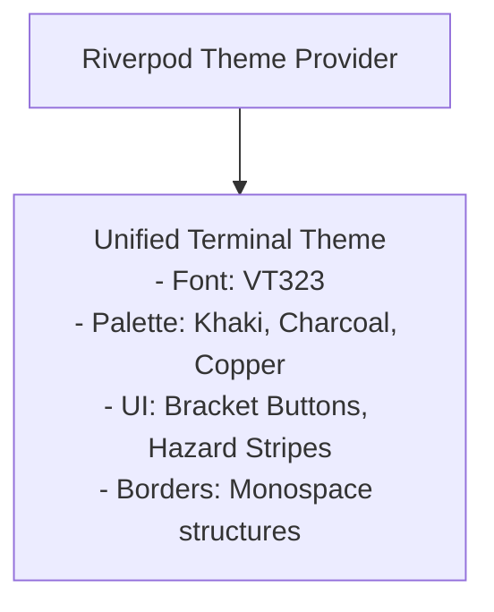

# Design: 01 Design System and Theming (Flutter)

This document details the unified design system for the **Unix Tamagotchi**, implemented using **Flutter ThemeData**. The app utilizes a single visual style: a **Tactical 1-Bit Cyber-Specimen OS** combining a 1-bit dithered pixel art aesthetic with an industrial terminal UI.

---

## 1. Design System Philosophy

The design is strictly single-theme. All components, layouts, and typography revolve around an industrial diagnostic terminal style, heavily utilizing monospace text and bracketed UI actions.



---

## 2. Color Palettes & Semantic Tokens

The visual language relies on a strict 3-color palette plus one emergency color for critical states. 

### Unified Terminal Palette
| Semantic Token | Hex | Purpose |
| :--- | :--- | :--- |
| `background` | `#C5BEAA` to `#D4D99C` | Warm khaki/cream LCD surface with subtle grid texture (matches `Desing References/Godzila.webp`) |
| `foreground` / `ink` | `#141512` to `#1A1C16` | Deep charcoal/black for text, borders, Kaiju titan sprites, atomic breath blast |
| `accent` | `#B85E2B` to `#D48038` | Warm copper/amber for stat values, active selections, highlights |
| `emergency` | `#B72828` | Crimson red — ONLY for critical failure, reactor meltdown, and reboot states |

---

## 3. Typography & UI Language

### Typography
- **Font**: VT323 (Monospace)
- **Usage**: Used universally across all UI text, labels, buttons, and system outputs. 

### Terminal UI Language
- **Buttons**: Bracket-style syntax with monospace formatting, e.g., `[ EAT ]`, `[ ACQUIRE ]`, `[ CONFIG ]`.
- **System Diagnostics**: Labels and headers use rigid diagnostic naming conventions like `SYS_DIAG`, `SUB_SYS: TITAN-01`, `STORAGE_MGR // V.02`, `PID: 8832`, `SECURED_SESSION`.
- **Visual Benchmark**: The rendering aesthetic directly mirrors `Desing References/Godzila.webp`, displaying a massive Kaiju looming over city skylines with atomic breath rendered using ordered Bayer matrix dithering.
- **Decorations**: Hazard caution stripes (diagonal black/cream) mark decorative borders and warnings. Camera reticles (`┌ ┐ └ ┘`) denote viewports.

---

## 4. Flutter ThemeData Implementation (`lib/core/theme/app_theme.dart`)

```dart
import 'package:flutter/material.dart';

class AppTheme {
  /// Unified Industrial Terminal Theme
  static ThemeData get terminalTheme {
    return ThemeData(
      brightness: Brightness.light, // Emulating the light khaki LCD background
      scaffoldBackgroundColor: const Color(0xFFC5BEAA), // Khaki Background
      primaryColor: const Color(0xFF141512), // Charcoal Ink
      fontFamily: 'VT323',
      textTheme: const TextTheme(
        bodyLarge: TextStyle(color: Color(0xFF141512), fontSize: 22, height: 1.1),
        bodyMedium: TextStyle(color: Color(0xFF141512), fontSize: 18, height: 1.1),
        titleLarge: TextStyle(color: Color(0xFFB85E2B), fontSize: 24, fontWeight: FontWeight.bold),
      ),
      colorScheme: const ColorScheme.light(
        primary: Color(0xFF141512), // Charcoal
        secondary: Color(0xFFB85E2B), // Copper Accent
        error: Color(0xFFB72828), // Crimson Emergency
        surface: Color(0xFFD4D99C), // Slightly lighter khaki for surface elements
      ),
    );
  }
}
```
