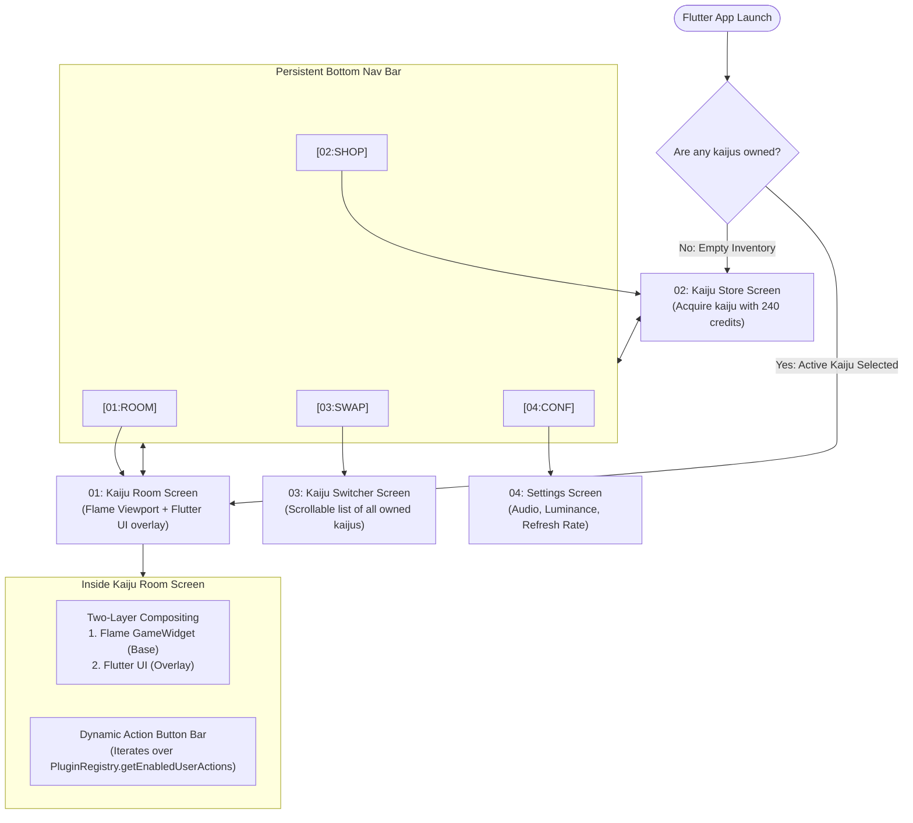

# Design: 04 Screens Flow and Navigation (Flutter)

This document specifies the screen navigation architecture, dynamic action bar injection, Flame two-layer compositing, and transition effects for the **Unix Tamagotchi** in Flutter.

---

## 1. Screen Flow Diagram



---

## 2. Dynamic Room Screen Composition

The Kaiju Room screen utilizes a two-layer compositing architecture:
1. **Flame GameWidget Viewport**: A low-resolution render surface where the 1-bit dithered kaiju sprite and scenario exist, processed via a dithering fragment shader.
2. **Flutter UI Overlay**: High-resolution monospace terminal text, hazard stripes, diagnostic labels, and action buttons overlaid on top of or around the viewport.

The UI also dynamically coordinates an **Action Button Bar** which reads all active `UserActionPlugin` entries and renders them horizontally in a scrollable bar.

```dart
// lib/features/room/screens/room_screen.dart
import 'package:flutter/material.dart';
import 'package:flutter_riverpod/flutter_riverpod.dart';

class RoomScreen extends ConsumerWidget {
  const RoomScreen({super.key});

  @override
  Widget build(BuildContext context, WidgetRef ref) {
    final kaiju = ref.watch(gameStateProvider.select((s) => s.activeKaiju));

    if (kaiju == null) {
      return const Center(child: Text('> NO ACTIVE KAIJU DETECTED. VISIT SHOP.'));
    }

    return Scaffold(
      body: SafeArea(
        child: Column(
          children: [
            // 1. Top Terminal HUD (Flutter Overlay)
            const SystemHeaderBar(subSystem: 'TITAN-01'),
            const SizedBox(height: 12),

            // 2. Two-Layer Compositing: Flame GameWidget + Camera Reticles
            Expanded(
              child: Center(
                child: CameraReticleOverlay(
                  child: KaijuViewport(
                    kaijuDef: kaiju.definition,
                    action: kaiju.currentAction,
                  ),
                ),
              ),
            ),

            // 3. Stat Progress Meters (Flutter Overlay)
            TerminalProgressBar(label: 'VITALS.HUNGER', value: kaiju.hunger),
            TerminalProgressBar(label: 'VITALS.ENERGY', value: kaiju.energy),
            TerminalProgressBar(label: 'VITALS.JOY', value: kaiju.happiness),
            const SizedBox(height: 12),

            // 4. Dynamic Action Button Bar (Injected from Plugin Registry)
            const DynamicActionButtonBar(),
            const SizedBox(height: 16),
          ],
        ),
      ),
    );
  }
}
```

---

## 3. Screen Summaries

- **Kaiju Store Screen (SHOP)**:
  - Displays available Kaijus from the catalog (e.g., Godzilla 120 credits, Cyber Godzilla 120 credits).
  - Purchase is permitted as long as `credits >= item.price`. 
- **Kaiju Switcher Screen (SWAP)**:
  - Displays a scrollable `ListView` of all owned Kaijus.
  - Tapping `[ SWAP TO THIS COMPANION ]` invokes `ref.read(gameStateProvider.notifier).switchActiveKaiju(kaiju.id)` and redirects to the Room Screen.
- **Settings Screen (CONF)**:
  - Instead of theme switching, provides immersive hardware controls:
    - Audio (volume/mute).
    - Luminance (adjusts the shader's threshold or palette brightness).
    - Refresh Rate (simulates a slower terminal update rate for aesthetic preference).
  - Includes a "Hardware Info" panel detailing system version, PID, etc.
