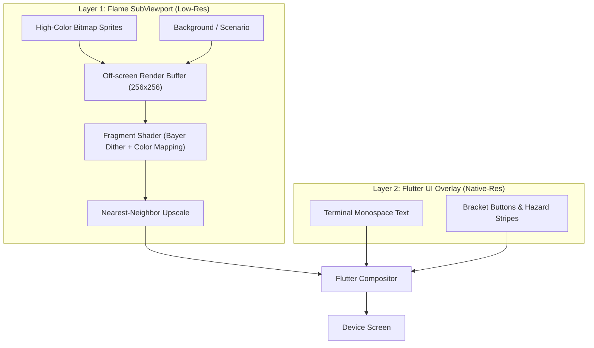

# Design: 06 1-Bit Ditherering Rendering Pipeline

This document details the graphics rendering pipeline for the **Unix Tamagotchi**, focusing on how high-resolution UI and low-resolution 1-bit dithered pixel art are combined using Flame, fragment shaders, and Flutter's compositing engine.

---

## 1. Architectural Overview: Two-Layer Compositing

To achieve the "Tactical 1-Bit Cyber-Specimen OS" aesthetic without sacrificing UI legibility, the app uses a strict two-layer compositing architecture:

1. **Layer 1: The Pet Scene (SubViewport)**
   - Managed by Flame.
   - Sprites and backgrounds are rendered into an off-screen buffer at a very low virtual resolution (e.g., 256×256).
   - A custom Fragment Shader (GLSL/FLSL) is applied to this buffer to perform Ordered Bayer Dithering.
   - The result is then upscaled to the device screen size using **Nearest-Neighbor** filtering to ensure crisp, chunky pixels.
2. **Layer 2: The Flutter UI Overlay**
   - Managed by Flutter's standard widget tree.
   - Renders exactly at native device resolution.
   - Handles crisp monospace typography, terminal borders, and user interactions.



---

## 2. Mathematical Foundation: Ordered Bayer Dithering

Why Ordered Dithering? We chose **Ordered Bayer Matrix Dithering** over error-diffusion algorithms like Floyd-Steinberg because ordered dithering is purely a screen-space operation. It can be executed entirely in parallel within a fragment shader, making it extremely highly performant on mobile GPUs.

### The Formula
For a given Bayer matrix $M$ of size $N \times N$, the normalized threshold for a pixel at screen coordinate $(x, y)$ is:

$$ threshold = \frac{M_N(x \bmod N, y \bmod N)}{N^2} $$

The pixel color is then determined by comparing its original luminance to this threshold:

$$ Color = \begin{cases} Color_{light} & \text{if } Luminance > threshold \\ Color_{dark} & \text{otherwise} \end{cases} $$

### Screen-Space vs Sprite-Space UVs
Crucially, the modulo operation $(x \bmod N, y \bmod N)$ is calculated using **screen-space coordinates**, not sprite-space UVs. This ensures that as sprites move or animate across the screen, they "swim" through a fixed screen-space checkerboard pattern, maintaining the structural illusion of a physical LCD matrix.

---

## 3. Shader Implementation (GLSL / FLSL)

The dithering is handled via a Flutter Fragment Shader (`.frag`).

```glsl
#include <flutter/runtime_effect.glsl>

uniform sampler2D uTexture;
uniform vec2 uResolution;
uniform vec4 uColorLight; // e.g., Khaki Background #C5BEAA
uniform vec4 uColorDark;  // e.g., Charcoal Ink #141512

out vec4 fragColor;

// 4x4 Bayer Matrix
const float bayerMatrix[16] = float[](
    0.0/16.0,  8.0/16.0,  2.0/16.0, 10.0/16.0,
    12.0/16.0, 4.0/16.0, 14.0/16.0,  6.0/16.0,
    3.0/16.0, 11.0/16.0,  1.0/16.0,  9.0/16.0,
    15.0/16.0, 7.0/16.0, 13.0/16.0,  5.0/16.0
);

void main() {
    vec2 uv = FlutterFragCoord().xy / uResolution;
    vec4 texColor = texture(uTexture, uv);
    
    // Ignore transparent pixels
    if (texColor.a < 0.1) {
        fragColor = vec4(0.0);
        return;
    }

    // Calculate luminance
    float luminance = dot(texColor.rgb, vec3(0.299, 0.587, 0.114));

    // Screen-space pixel coordinates for the matrix
    int x = int(mod(FlutterFragCoord().x, 4.0));
    int y = int(mod(FlutterFragCoord().y, 4.0));
    int bayerIndex = y * 4 + x;
    
    float threshold = bayerMatrix[bayerIndex];

    // Apply 1-bit thresholding and map to palette
    if (luminance > threshold) {
        fragColor = uColorLight;
    } else {
        fragColor = uColorDark;
    }
}
```

---

## 4. Flame Engine Integration

To use this shader in Flutter/Flame:

1. **Load the Shader**: Use `FragmentProgram.fromAsset()` to load the compiled shader.
2. **Bind Uniforms**: Pass the resolution and palette colors (`uColorLight`, `uColorDark`) to the shader. 
3. **Color Palette Uniform System**: By passing colors as uniforms, the application can easily implement effects like "Emergency Red" without modifying the shader logic. If a critical failure occurs, Flutter simply passes the Crimson emergency color to `uColorDark`.

```dart
import 'dart:ui';
import 'package:flame/game.dart';
import 'package:flame/components.dart';

class DitheredViewport extends PositionComponent {
  late FragmentProgram _program;
  late FragmentShader _shader;
  
  final Color lightColor = const Color(0xFFC5BEAA);
  final Color darkColor = const Color(0xFF141512);

  @override
  Future<void> onLoad() async {
    _program = await FragmentProgram.fromAsset('shaders/bayer_dither.frag');
    _shader = _program.fragmentShader();
  }

  @override
  void render(Canvas canvas) {
    // Set uniforms
    _shader.setFloat(0, size.x); // uResolution.x
    _shader.setFloat(1, size.y); // uResolution.y
    
    // Set Light Color
    _shader.setFloat(2, lightColor.red / 255);
    _shader.setFloat(3, lightColor.green / 255);
    _shader.setFloat(4, lightColor.blue / 255);
    _shader.setFloat(5, 1.0);
    
    // Set Dark Color
    _shader.setFloat(6, darkColor.red / 255);
    _shader.setFloat(7, darkColor.green / 255);
    _shader.setFloat(8, darkColor.blue / 255);
    _shader.setFloat(9, 1.0);

    final paint = Paint()..shader = _shader;
    
    // Render the off-screen buffer using the shader
    // (Assuming a backing texture or image is sampled here)
    canvas.drawRect(size.toRect(), paint);
  }
}
```
