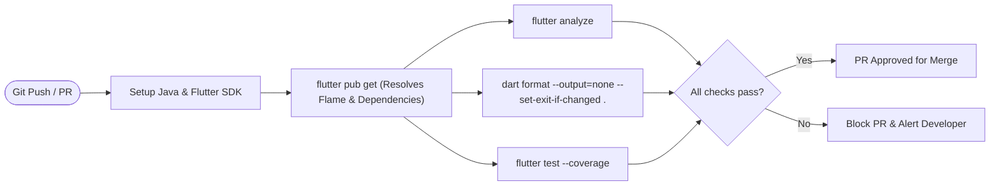

# DevOps: 01 Continuous Integration & GitHub Actions (Flutter + Flame)

This document specifies the CI pipeline for the **Unix Tamagotchi** Flutter and Flame application using **GitHub Actions**.

---

## 1. CI Pipeline Architecture



---

## 2. GitHub Actions Workflow Configuration (`.github/workflows/ci.yml`)

```yaml
name: Flutter + Flame CI Pipeline

on:
  push:
    branches: [main, develop]
  pull_request:
    branches: [main, develop]

concurrency:
  group: ${{ github.workflow }}-${{ github.ref }}
  cancel-in-progress: true

jobs:
  validate:
    name: Lint, Analyze & Test
    runs-on: ubuntu-latest
    steps:
      - name: Checkout Code
        uses: actions/checkout@v4

      - name: Setup Java (Required for Android Toolchain)
        uses: actions/setup-java@v4
        with:
          distribution: 'zulu'
          java-version: '17'

      - name: Setup Flutter SDK
        uses: subosito/flutter-action@v2
        with:
          flutter-version: '3.x'
          channel: 'stable'
          cache: true

      - name: Install Dependencies
        run: flutter pub get

      - name: Check Code Formatting
        run: dart format --output=none --set-exit-if-changed .

      - name: Run Static Analysis (Lints)
        run: flutter analyze

      - name: Run Unit & Widget Tests
        run: flutter test --coverage
```

## 3. iOS Platform Note

> [!NOTE]
> **iOS CI/CD is deferred to a future phase.** The initial PoC targets Android only. iOS build pipeline (Xcode, code signing, TestFlight, App Store Connect) will be documented in a future `03-ios-build-and-release-pipeline.md`.
