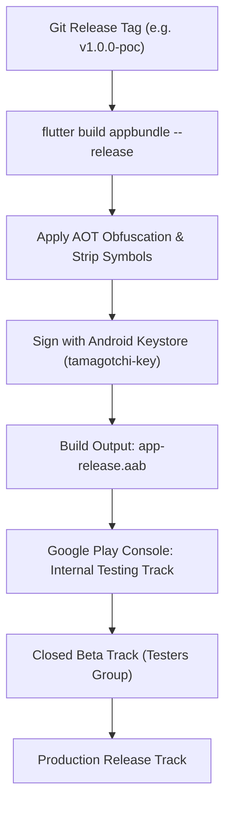

# DevOps: 02 Mobile Build & Release Pipeline (Flutter)

This document details the build automation, Android keystore signing, and deployment tracks for the **Unix Tamagotchi** using native Flutter tooling and Google Play Console tracks.

---

## 1. Release Flow Architecture



---

## 2. Android Keystore Signing Configuration (`android/app/build.gradle`)

```groovy
android {
    ...
    signingConfigs {
        release {
            storeFile file(System.getenv("KEYSTORE_PATH") ?: "upload-keystore.jks")
            storePassword System.getenv("KEYSTORE_PASSWORD")
            keyAlias System.getenv("KEY_ALIAS")
            keyPassword System.getenv("KEY_PASSWORD")
        }
    }

    buildTypes {
        release {
            signingConfig signingConfigs.release
            minifyEnabled true
            shrinkResources true
            proguardFiles getDefaultProguardFile('proguard-android.txt'), 'proguard-rules.pro'
        }
    }
}
```

---

## 3. Production Build Command

```bash
# Build production Android App Bundle (AAB) with code obfuscation:
flutter build appbundle --release \
  --obfuscate \
  --split-debug-info=./build/app/outputs/symbols
```

## 4. iOS Release Pipeline

> [!NOTE]
> **iOS builds and App Store submission are deferred to a future phase.** The current pipeline covers Android only. iOS provisioning profiles, Xcode archiving, TestFlight distribution, and App Store Connect submission will be added in a dedicated document when the project targets iOS.
