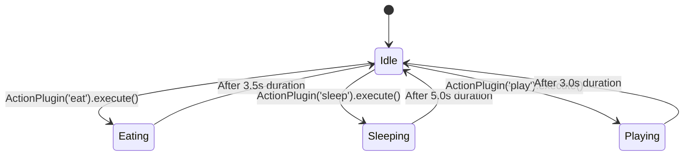

# Features: 01 Core Pet Actions (As Plugins)

This document specifies how the **3 core Tamagotchi actions** (**Eat**, **Sleep**, and **Play**) are implemented as the initial **User-Triggered Action Plugins** in the **Unix Tamagotchi**.

---

## 1. Action Mechanics & Plugin Architecture

In accordance with the plugin engine architecture:
- Core actions are **modular plugins** implementing a common Action interface.
- The UI renders them dynamically by querying the registry of enabled user actions.
- Future actions (e.g. `Crush Tanks`, `Search for Artifact`) plug into this exact same pipeline.

---

## 2. Action Specifications

### Action 1: Eat (Devour Ball of Humans)
- **Plugin ID**: `'eat'`
- **Target Scenario**: `default_room` (Terminal Habitat Room, configurable by backend)
- **Visual Animation**: Eating sprite sequence (1-bit dithered bitmap animation: giant Kaiju lifting and devouring a compressed ball of human people, with micro-silhouette particle dispersal rendered via stipple dithering).
- **Stat Deltas**:
  - **Hunger**: $+25$ (Clamped at $100$).
  - **Energy**: $-5$ (Digestion fatigue, minimum $0$).
  - **Happiness**: $+5$ (Satisfaction bonus).
- **Duration**: $3.5\text{ seconds}$.

---

### Action 2: Sleep (Dormancy / Slumber)
- **Plugin ID**: `'sleep'`
- **Target Scenario**: `default_room`
- **Visual Animation**: Sleeping sprite sequence (1-bit dithered bitmap animation: massive Kaiju resting its head on the habitat floor, closed reptilian eyes, slow deep breathing tween with steam/smoke puff dispersal).
- **Stat Deltas**:
  - **Energy**: $+35$ (Clamped at $100$).
  - **Hunger**: $-10$ (Metabolism during rest).
  - **Happiness**: $+0$.
- **Duration**: $5.0\text{ seconds}$.

---

### Action 3: Play (Demolition Practice / Smash Toys)
- **Plugin ID**: `'play'`
- **Target Scenario**: `default_room`
- **Visual Animation**: Playful destruction sprite sequence (1-bit dithered bitmap animation: Kaiju playfully swatting miniature tanks, stomping toy skyscrapers, and flashing mini atomic sparks with ordered Bayer matrix fading).
- **Stat Deltas**:
  - **Happiness**: $+30$ (Clamped at $100$).
  - **Hunger**: $-15$ (Physical exertion burns calories).
  - **Energy**: $-20$ (Tires out the Kaiju).
- **Prerequisite Check**:
  - If `Energy < 15`, action is rejected with warning:
    `> [ALERT] <nickname> is too exhausted to play! Needs dormancy.`
- **Duration**: $3.0\text{ seconds}$.
