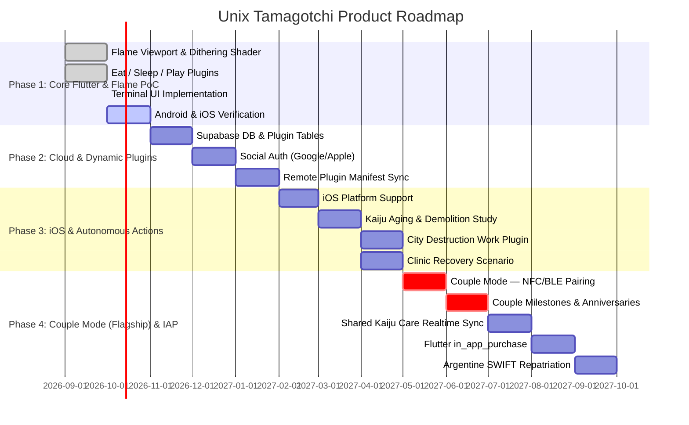

# Features: 04 PoC Scope and Future Roadmap

This document establishes the strict boundaries of the Initial Proof of Concept (PoC) versus the multi-phase product roadmap for the **Unix Tamagotchi**.

---

## 1. Scope Boundary Matrix

| Feature Domain | Included in Initial PoC | Deferred to Future Roadmap | Rationale |
| :--- | :---: | :---: | :--- |
| **Framework** | 🟢 **Flutter + Flame Engine** | — | Single codebase prevents costly migrations; Flame drives kaiju viewport. |
| **Plugin Subsystem** | 🟢 **3 core actions (Eat, Sleep, Play) hardcoded as plugins + Default Room scenario. Code structured for easy dynamic manifest swap.** | 🟡 Dynamic remote manifest sync | Validates modular action & scenario contracts early. |
| **Backend & Cloud** | 🔴 100% Offline (Local Hive) | 🟢 Supabase PostgreSQL & Realtime | Zero cloud infrastructure required on Day 1. |
| **Kaiju Capacity** | 🟢 **Unbounded (Credit-bound only — no server quota)** | — | Players may own as many kaijus as their credits allow. No backend limit field exists. |
| **Starting Economy** | 🟢 Fixed 240 Credits | 🟡 In-App Purchases, daily quests | Pre-calculates exact initial acquisition testing. |
| **Core Actions** | 🟢 Eat, Sleep, Play (As Plugins) | 🟡 Crush Tanks, Relic Search, City Rampage Shifts | Core loop proven with zero friction. |
| **Scenarios** | 🟢 Default Room Plugin | 🟡 Metropolis Ruins, Containment Ward | Proves scenario viewport rendering. |
| **Kaiju Lifecycle** | 🟡 **Static UI teaser with mock data (EVO_MGR screen)** | 🟢 **Aging, Autonomous Work, Illness logic** | Keeps early state models minimal. |
| **Visual System** | 🟢 1-Bit Dithered Visual System | 🟡 Additional stippling effects | Proves the core dithering and terminal UI aesthetics. |
| **Social** | 🔴 Solo play only | 🟢 Collaborative Multiplayer Care (couple-first) | Delays complex state sync to Phase 4. Primary target: couples. Families & friends also supported. |
| **Furniture & Habitat** |  **Excluded** | 🟢 **Furniture Store, catalog, placement, and stat modifiers (Phase 2+)** | Furniture stat modifiers require extending the kaiju model beyond hunger/energy/happiness; deferred to Phase 2. |
| **Customization** | 🟢 **Room palette themes, boot messages** | 🟡 **Kaiju accessories, skins** | Per-user visual personalization. |
| **Ownership Model** | 🟢 **Solo-as-group-of-1 data model** | 🟡 **Multiplayer group creation UI** | Foundation for seamless solo ↔ multiplayer transition. |
| **iOS Platform** | 🔴 Excluded | 🟢 Phase 3 — before Couple Mode | Android-first for PoC. iOS planned for Phase 3, before multiplayer launch. |

---

## 2. Multi-Phase Product Roadmap

