# Furniture: 03 Placement & Rendering

## 1. Scenario Rendering Integration

The furniture system is deeply integrated into the existing dormant plugin architecture. Furniture items are passed to scenarios as part of their instantiation parameters.

```mermaid
sequenceDiagram
    participant RM as RoomManager (Riverpod)
    participant SP as ScenarioParams
    participant DTR as default_terminal_room
    participant SG as Flame SceneGraph
    
    RM->>SP: inject activeGroupFurniture
    SP->>DTR: buildScene(params)
    
    rect rgb(20, 20, 20)
    note right of DTR: 1-Bit Rendering Loop
    DTR->>SG: render BackgroundLayer (z: 0-20)
    DTR->>SG: render FurnitureComponents (z: 21-49)
    DTR->>SG: render KaijuTitan (z: 50)
    end
```



## 2. Placement Mechanics & Slots

The `default_terminal_room.dart` scene uses a hardcoded slot grid for the 12-unit capacity limit.

*   **Z-Index Layering:** Background objects operate between `priority = 0` to `20`. Furniture items (bed, couch, desktop workstation, kitchen) are added dynamically with `priority = 21` to `49`, depending on their Y-axis (isometric/pseudo-3D depth sorting). The giant Kaiju titan (e.g., Godzilla) is rendered at `priority = 50`.
*   **Sprite Application:** Items are instantiated as `SpriteComponent` entities inheriting the 1-bit dithered shader/palette rules.

## 3. Stat Modifiers (Passive Bonuses)

Furniture is not merely cosmetic; it acts as a passive aura for the Kaiju's metabolic loop.

*   **Modifier Application:** A background isolate/ticker checks the room's furniture sum periodically.
*   **Example Effect:** A `SLEEP_POD` providing `+40 ENERGY` modifies the base recovery rate when the Kaiju is in an idle/dormant state.
*   Modifiers are cumulative, but capped based on maximum storage capacity (12 items) to prevent balance breaking.

## 4. Terminal Aesthetic Integration

When rendering the interface, system logs provide flavor text regarding the habitat structure.

> [!TIP]
> Use flavor text to mask loading states or to reinforce the Tactical 1-Bit Cyber-Specimen OS vibe.

**Empty Room Log Sequence:**
```text
> HABITAT_SYS INITIALIZING...
> ASSET_MGR: 0 UNITS DETECTED
> STATUS: HABITAT SPACE DETECTED: 100% FREE
> WARNING: COMFORT METRICS SUB-OPTIMAL
```

**Furnished Room Log Sequence:**
```text
> HABITAT_SYS INITIALIZING...
> ASSET_MGR: [KITCH_UNIT, HYDRA_DISP, SLEEP_POD] DETECTED
> STATUS: HABITAT SPACE DETECTED: 75% FREE
> APPLYING PASSIVE BUFFS...
> ++ ENERGY_REC
> ++ HYDRATION_REC
```
