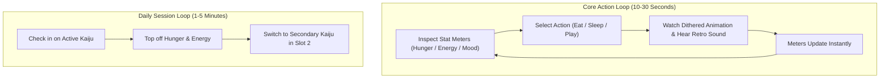

# Game Design Document: Unix Tamagotchi

---

## 1. High Concept & Creative Vision

**Unix Tamagotchi** is a retro digital companion **primarily marketed toward couples** — two partners sharing, nurturing, and managing a giant Kaiju specimen (inspired by the Godzillaverse) together. Families, friend groups, and solo players are also fully supported, but the game's identity, onboarding, and social features are centered on the couple experience.

Instead of ordinary domestic animals, the companions are towering **Kaijus from the Godzillaverse** rendered in hand-crafted **1-bit dithered pixel art sprites** (taking direct visual inspiration from `Desing References/Godzila.webp`, featuring Godzilla looming over city skylines and unleashing dithered atomic breath). In a delightful retro-surreal contrast, the giant Kaiju lives inside an authentic monospace terminal habitat equipped with an oversized bed, chair/couch, desktop workstation, and kitchen. Its daily routine includes devouring compressed balls of human people for sustenance, going to work to destroy cities, and attending academy studies to master urban demolition techniques.

### Key Pillars
1. **Authentic Hacker Aesthetic**: Monospace typography (`VT323`), ANSI block characters (`█ ▓ ▒ ░`), prompt syntax (`[ > ACTION ]`), and retro hardware audio beeps.
2. **Stress-Free Companion (PoC Focus)**: In the initial version, the Kaiju does not die or abandon the player. The game serves as a cozy, charming terminal mobile companion.
3. **Unified 1-Bit Dithered Aesthetic**: A cohesive visual language combining the tactile Game Boy DMG style with a Macintosh-inspired industrial diagnostic terminal layout, shaded dynamically with Bayer matrix dithering as exemplified in `Desing References/Godzila.webp`.
4. **Collaborative Kaiju Care (Couple-First)**: Support for multiplayer group mechanics (in future phases) where two players — primarily a romantic couple — share responsibility and co-parent the same giant Kaiju. Larger groups (families, friends) are supported but are not the primary marketing focus.

---

## 2. Core Game Loops

---

## 3. Kaiju Mood States & Expressions

The Kaiju's emotional state is derived dynamically from its 3 core meters ($0$ to $100$):

| Mood State | Trigger Condition | Visual Dithered Sprite Cue | Terminal Log Message |
| :--- | :--- | :--- | :--- |
| **Ecstatic** | `Happiness >= 85` & `Hunger >= 70` | Dorsal plates glowing, sparkling eyes with heart stipple effect | `[MOOD] <kaiju> emits a resonant sub-bass rumble of pure affection!` |
| **Content / OK** | Standard ranges ($40$ to $84$) | Calm rhythmic breathing, light smoke curling from nostrils | `[MOOD] Reactor stable. Kaiju is calm and observant.` |
| **Hungry** | `Hunger < 30` | Snapping jaws, stomping feet with empty stomach bubble | `[WARNING] Caloric reserves depleted! Feed <kaiju> a ball of humans soon.` |
| **Exhausted** | `Energy < 20` | Dim dorsal plates, heavy steam exhales, resting head on floor | `[WARNING] Atomic reactor depleted. Kaiju requires rest/dormancy.` |
| **Bored** | `Happiness < 30` | Swishing spiked tail, chipping at concrete floor | `[WARNING] Destructive restlessness detected. Play with <kaiju>!` |

---

## 4. Audio & Haptic Feedback Guidelines

- **Keystroke Click**: Sharp, subtle mechanical keyboard click on every button press.
- **Action Success Chime**: Authentic retro chiptune rising two-tone chime when feeding or playing.
- **Terminal Error Beep**: Low-frequency 440Hz vintage computer bell (`\a`) when an action is blocked due to low energy or full capacity.
- **Haptics**: Subtle micro-vibration on action completion (Android `HapticFeedbackConstants.KEYBOARD_TAP`).
