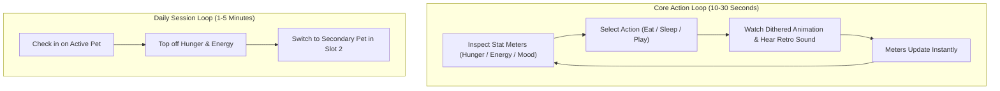

# Game Design Document: Unix Tamagotchi

---

## 1. High Concept & Creative Vision

**Unix Tamagotchi** is a retro digital pet companion tailored for couples, families, friends, and tech enthusiasts.

Instead of glossy, cartoonish 3D models or low-effort pixel dumps, the pets are hand-crafted **1-bit dithered pixel art sprites** living inside an authentic **monospace terminal environment**, featuring industrial UI bracket buttons and diagnostic paneling.

### Key Pillars
1. **Authentic Hacker Aesthetic**: Monospace typography (`VT323`), ANSI block characters (`█ ▓ ▒ ░`), prompt syntax (`[ > ACTION ]`), and retro hardware audio beeps.
2. **Stress-Free Companion (PoC Focus)**: In the initial version, pets do not die or abandon the player. The game serves as a cozy, charming terminal mobile companion.
3. **Unified 1-Bit Dithered Aesthetic**: A cohesive visual language combining the tactile Game Boy DMG style with a Macintosh-inspired industrial diagnostic terminal layout, shaded dynamically with Bayer matrix dithering.
4. **Collaborative Pet Care**: Support for multiplayer group mechanics (in future phases) where couples, families, and friends can share responsibility and interact with the same digital pet.

---

## 2. Core Game Loops

---

## 3. Pet Mood States & Expressions

The pet's emotional state is derived dynamically from its 3 core meters ($0$ to $100$):

| Mood State | Trigger Condition | Visual Dithered Sprite Cue | Terminal Log Message |
| :--- | :--- | :--- | :--- |
| **Ecstatic** | `Happiness >= 85` & `Hunger >= 70` | Sparkling eyes sprite with heart particle effect | `[MOOD] <pet> is purring and full of joy!` |
| **Content / OK** | Standard ranges ($40$ to $84$) | Calm idle breathing sprite | `[MOOD] System operational. Pet is relaxed.` |
| **Hungry** | `Hunger < 30` | Drooling / flat mouth sprite with hunger bubble | `[WARNING] Low fuel! Feed <pet> soon.` |
| **Exhausted** | `Energy < 20` | Drooping ears / eyelids sprite with heavy breathing | `[WARNING] Battery critical. Needs rest.` |
| **Bored** | `Happiness < 30` | Grumpy face sprite looking away | `[WARNING] Boredom detected. Play with <pet>!` |

---

## 4. Audio & Haptic Feedback Guidelines

- **Keystroke Click**: Sharp, subtle mechanical keyboard click on every button press.
- **Action Success Chime**: Authentic retro chiptune rising two-tone chime when feeding or playing.
- **Terminal Error Beep**: Low-frequency 440Hz vintage computer bell (`\a`) when an action is blocked due to low energy or full capacity.
- **Haptics**: Subtle micro-vibration on action completion (Android `HapticFeedbackConstants.KEYBOARD_TAP`).
