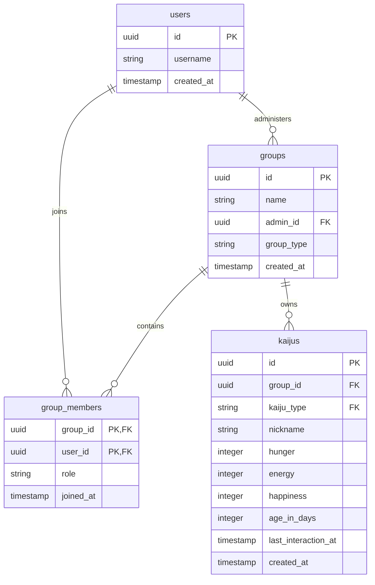
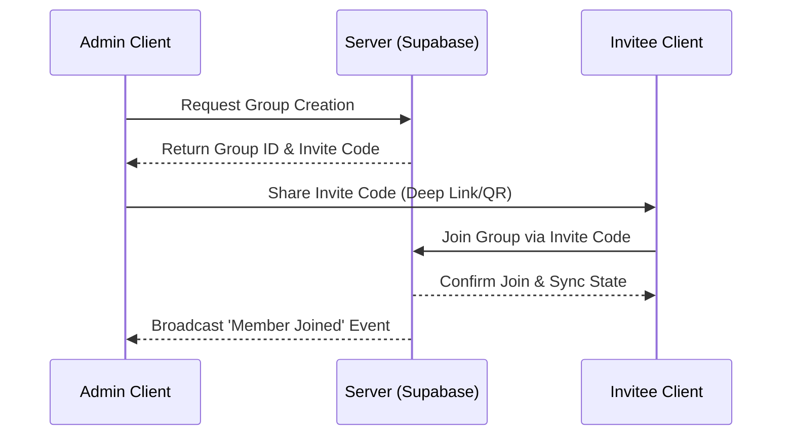
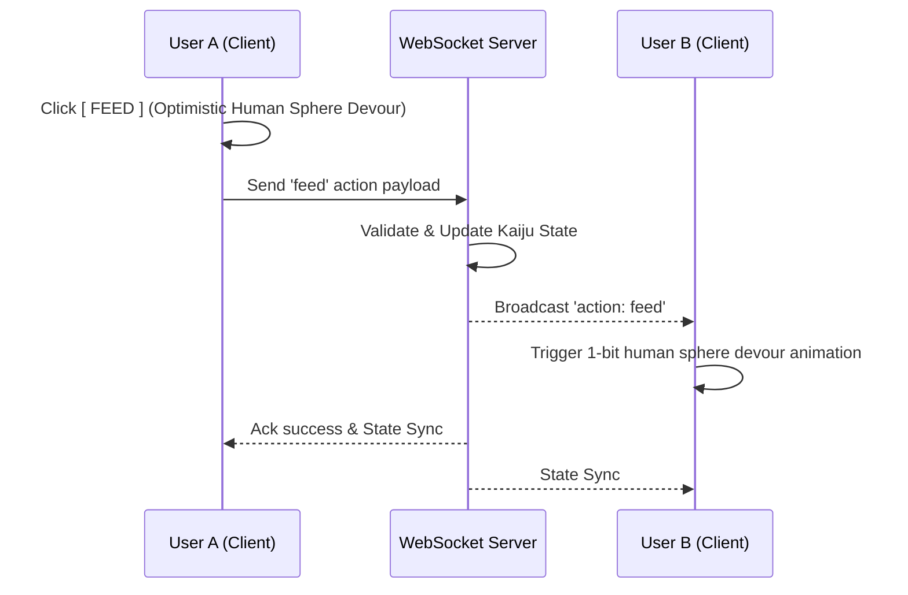

# Unix Tamagotchi: Shared Kaiju Care Architecture

## 1. Concept Overview
The core of Unix Tamagotchi's multiplayer experience is the "Care Group." Instead of individual, isolated experiences, users form a group to collaboratively manage and nurture a shared giant Kaiju (Titan). All users interact with the exact same Titan instance, fostering cooperation and shared containment responsibility within an industrial terminal aesthetic.

> **Marketing Focus — Couples First**: Although the system supports groups of 2 to 6 members (and solo play), the game is **primarily marketed as an experience for couples**. The default onboarding flow, promotional materials, and UX writing are written with a two-partner audience in mind (co-parenting a 100-meter Titan). `FAMILY` and `FRIENDS` group types are fully functional but are secondary in the product's public identity.

## 2. Group Creation and Onboarding
Care Groups are the fundamental social unit. The group creation process involves a single "Admin" who creates the unit and invites others.

- **Invitation Codes**: Alphanumeric codes generated by the terminal (e.g., `INV-8X2F-99A`).
- **Deep Links**: Direct URLs that open the application and prompt the user to join.
- **QR Codes**: Scannable matrix barcodes styled as tactical system diagnostics.

## 3. Shared Kaiju Ownership
The digital Kaiju entity is bound to the *group*, not an individual user.
- Any group member can execute care actions (e.g., `[ FEED ]`, `[ SLEEP ]`, `[ PLAY ]`).
- Kaiju care interactions and shared habitat furniture are accessible to all group members. **Credits (the in-game currency) are always per-user and are never pooled or shared.** Each member's credit balance is independent of group membership.
- The Kaiju's lifecycle, evolution, and containment status are mutually managed.

## 4. Real-Time Sync Architecture
To maintain the illusion of a living digital entity, the system relies on **Supabase Realtime WebSockets** for instant state synchronization.
- When an action is executed, it is immediately synchronized across all connected devices in the group.
- The Kaiju's 1-bit dithered pixel art animations trigger simultaneously across all viewports.

## 5. Action Broadcasting
All care actions broadcast their state to online members:
- **Action Trigger**: User A clicks `[ FEED ]`.
- **Local Response**: User A's client immediately plays the feeding animation (Optimistic UI devouring `HUMAN_SPHERE_BALL`).
- **Broadcast**: The backend broadcasts an `action_executed` payload to the group's channel.
- **Remote Response**: Users B and C see the devour animation and the subsequent stat update in real-time, along with a terminal log entry (e.g., `> SYSTEM LOG: USER_B DISPENSED HUMAN_SPHERE_BALL TO TITAN`).

## 6. Presence System
The terminal UI includes a "Secured Session" presence tracker.
- Group members currently online and viewing the kaiju are displayed in the UI (e.g., `ACTIVE_USERS: [ USER_A, USER_B ]`).
- This helps coordinate care efforts and avoids duplication of actions.

## 7. Conflict Resolution
With multiple users managing one kaiju, concurrent actions are possible.
- **Optimistic UI**: The client assumes the action will succeed and plays the local 1-bit animation.
- **Server Reconciliation**: The server acts as the source of truth. If User A and User B feed the kaiju at the exact same millisecond and the kaiju only has capacity for one food item, the server processes the first request. The second request returns a conflict state.
- **UI Correction**: The rejected client rolls back the state and displays a terminal error (e.g., `> ERR: ACTION CONFLICT. KAIJU STATUS ALREADY UPDATED.`).

## 8. Notification System
Push notifications are dispatched to alert members when the kaiju requires care, specifically targeting offline members.
- If the kaiju's hunger drops to critical levels, and *no group member is currently online*, the system sends an emergency notification.
- Example: `[ SYS_DIAG ] WARNING: VITAL SIGNS DROPPING. NUTRITION REQUIRED.`
- If one member resolves the issue, the notification is dismissed for the rest of the group.

## 9. Permission Model
- **Admin**: The group creator. Has permissions to generate invites, remove members, and disband the group.
- **Standard Member**: Can interact with the kaiju, spend shared currency, and view logs.

## 10. Data Architecture

### Entity-Relationship Diagram (ERD)

### Group Creation Flow

### Real-Time Action Sequence

