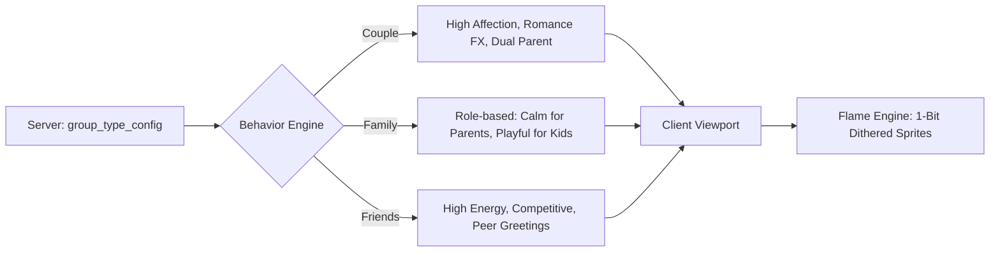

# Unix Tamagotchi: Group Types and Targeting

## 1. Group Types Overview
Care Groups in the Unix Tamagotchi ecosystem are divided into three distinct categories. When an Admin initializes a new `SECURED_SESSION`, they must designate the group's topology. This classification dictates the pet's behavioral algorithms, UI presentation, and event triggers.

### The Three Topologies
1. **Couple (2 members)**: Designed for romantic partnerships co-managing a shared entity.
2. **Family (2-6 members)**: Designed for family units with explicit "parent" and "child" permission roles.
3. **Friends (2-6 members)**: Designed for social squads with flat, equal permission roles.

## 2. Pet Personality Differentiation
The shared digital pet's 1-bit dithered animations and behavioral logic shift depending on the active group type.

### Couple Pets
- **Nomenclature**: Recognizes both members as "parents" (e.g., Mom/Dad, Mamá/Papá).
- **Behavior**: Expresses dual affection and demonstrates romantic-themed reactions (e.g., heart particle effects rendered with stippling dispersal).
- **Events**: Acknowledges real-world couple milestones, such as relationship anniversaries.

### Family Pets
- **Nomenclature**: Distinguishes between Parent and Child user roles.
- **Behavior**: Adapts its reaction based on who is interacting. It displays calmer, more compliant behavior with "Parent" accounts, and highly energetic, playful behavior with "Child" accounts.
- **Events**: Triggers family-themed cooperative events. *No romantic theming is present.*

### Friend Pets
- **Nomenclature**: Uses peer-level greetings. No parental titles or romantic references are ever used.
- **Behavior**: Highly playful, energetic, and slightly competitive. The pet reacts well to rapid interactions and group milestones.
- **Events**: Focuses on shared challenges and social engagement.

## 3. Group-Specific Features (TBD)
> **Note**: The features listed in this section are marked as **TBD (To Be Determined)** and represent planned functionalities for future development phases.

- **Couple (TBD)**:
  - **Shared Milestones**: Time capsules and pet anniversary dates.
  - **Couple Challenges**: Synchronized tasks requiring both members to participate simultaneously.
- **Family (TBD)**:
  - **Chore Assignment**: The terminal can assign care schedules (e.g., rotation for feeding and cleaning).
  - **Parental Controls**: Limits on when children can interact with the pet (e.g., sleep mode during school hours).
- **Friends (TBD)**:
  - **Competitive Mini-Events**: "Pet Olympics" and skill-based trials.
  - **Social Leaderboards**: Tracking which member has contributed the most care points.
  - **Pet Visiting**: Allowing the pet to momentarily visit other friend-groups.

## 4. UI Differentiation by Group Type
The industrial terminal interface subtly reconfigures its display based on the group type.

- **Boot Messages**: The initial system log adapts its greeting.
  - *Couple*: `> INITIALIZING PAIR_BOND PROTOCOL...`
  - *Family*: `> INITIALIZING FAMILY_UNIT PROTOCOL...`
  - *Friends*: `> INITIALIZING SQUAD PROTOCOL...`
- **Header Labels**: The active session header reflects the topology.
  - `[ PAIR_BOND: LEPUS-01 ]`
  - `[ FAMILY_UNIT: LEPUS-01 ]`
  - `[ SQUAD: LEPUS-01 ]`
- **Decorative Elements**: Hazard caution stripes and camera reticles (`┌ ┐ └ ┘`) may shift in accent color distribution or pattern density depending on the group type to subconsciously orient the users.

## 5. Backend Configuration
To ensure flexibility without requiring constant client updates, personality traits are driven by backend configurations.

- **State Storage**: The active group type is stored as a string field (`group_type`) within the PostgreSQL `groups` table.
- **Behavior Rules**: Pet parameters (affection rate, energy decay, animation pools) are loaded from a dedicated `group_type_config` table.
- **Server-Side Tuning**: Administrators can tweak personality traits per group type dynamically by adjusting the backend config, ensuring live behavioral updates without deploying new app versions.

## 6. Diagrams

### Group Type Selection Flow

### Pet Personality Behavior Matrix

