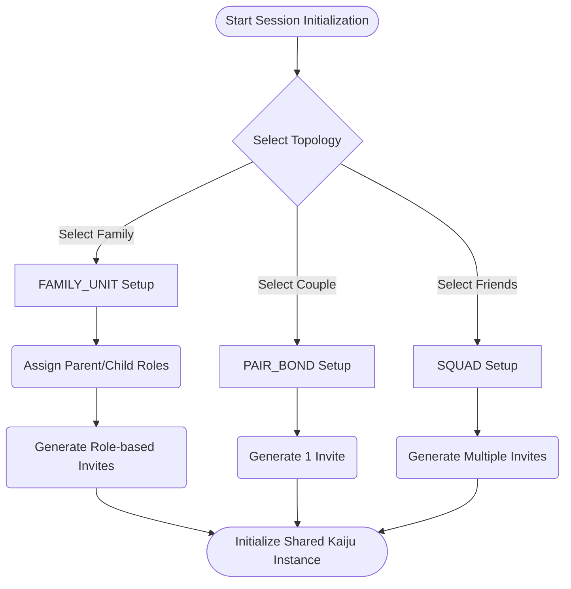
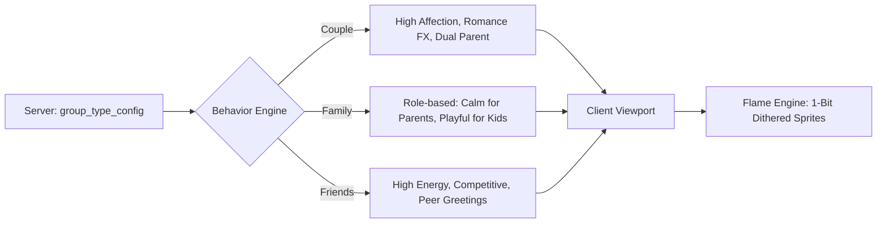

# Unix Tamagotchi: Group Types and Targeting

## 1. Group Types Overview
Care Groups in the Unix Tamagotchi ecosystem are divided into three distinct categories. When an Admin initializes a new `SECURED_SESSION`, they must designate the group's topology. This classification dictates the kaiju's behavioral algorithms, UI presentation, and event triggers.

> **Primary Marketing Target — `COUPLE`**: While all three topologies are fully supported, the game is **marketed primarily as an experience for couples**. The `COUPLE` group type is the flagship mode; it drives the default app store copy, onboarding illustrations, and promotional communications. `FAMILY` and `FRIENDS` are real, supported features — they are simply not the product's primary identity.

### The Three Topologies
1. **Couple (2 members)** ⭐ *Primary marketed experience*: Designed for romantic partnerships co-managing a shared entity.
2. **Family (2-6 members)**: Designed for family units with explicit "parent" and "child" permission roles.
3. **Friends (2-6 members)**: Designed for social squads with flat, equal permission roles.

## 2. Kaiju Personality Differentiation
The shared digital kaiju's 1-bit dithered animations and behavioral logic shift depending on the active group type.

### Couple Kaijus
- **Nomenclature**: Addresses both members using parental terms (e.g., Mom/Dad, Mamá/Papá) in its dialogue and reactions. This is a **narrative/dialogue label only** — both members in a `COUPLE` group share equal `ADMIN`-level permissions. The `PARENT`/`CHILD` role distinction in `group_members.role` is only relevant for `FAMILY` groups.
- **Behavior**: Expresses dual affection and demonstrates romantic-themed reactions (e.g., heart particle effects rendered with stippling dispersal).
- **Events**: Acknowledges real-world couple milestones, such as relationship anniversaries.

### Family Kaijus
- **Nomenclature**: Uses `PARENT` and `CHILD` role labels stored in `group_members.role`. These labels are **dialogue and behavioral cues only** — they determine how the kaiju addresses each caretaker and how it reacts to them, but they do not constitute a permission system. A `PARENT` member has the same app-level permissions as any `MEMBER`.
- **Behavior**: Adapts its reaction based on who is interacting. It displays calmer, more compliant behavior with `PARENT` accounts, and highly energetic, playful behavior with `CHILD` accounts.
- **Events**: Triggers family-themed cooperative events. *No romantic theming is present.*

### Friend Kaijus
- **Nomenclature**: Uses peer-level greetings. No parental titles or romantic references are ever used.
- **Behavior**: Highly playful, energetic, and slightly competitive. The kaiju reacts well to rapid interactions and group milestones.
- **Events**: Focuses on shared challenges and social engagement.

## 3. Group-Specific Features (TBD)
> **Note**: The features listed in this section are marked as **TBD (To Be Determined)** and represent planned functionalities for future development phases.

- **Couple (TBD)**:
  - **Shared Milestones**: Time capsules and kaiju anniversary dates.
  - **Couple Challenges**: Synchronized tasks requiring both members to participate simultaneously.
- **Family (TBD)**:
  - **Chore Assignment**: The terminal can assign care schedules (e.g., rotation for feeding and cleaning).
  - **Parental Controls**: Limits on when children can interact with the kaiju (e.g., sleep mode during school hours).
- **Friends (TBD)**:
  - **Competitive Mini-Events**: "Kaiju Destruction Trials" and skill-based rampage challenges.
  - **Social Leaderboards**: Tracking which member has contributed the most care and containment points.
  - **Kaiju Visiting**: Allowing the Kaiju to momentarily visit or raid other friend-groups' containment sectors.

## 4. UI Differentiation by Group Type
The industrial terminal interface subtly reconfigures its display based on the group type.

- **Boot Messages**: The initial system log adapts its greeting.
  - *Couple*: `> INITIALIZING PAIR_BOND PROTOCOL...`
  - *Family*: `> INITIALIZING FAMILY_UNIT PROTOCOL...`
  - *Friends*: `> INITIALIZING SQUAD PROTOCOL...`
- **Header Labels**: The active session header reflects the topology.
  - `[ PAIR_BOND: TITAN-01 ]`
  - `[ FAMILY_UNIT: TITAN-01 ]`
  - `[ SQUAD: TITAN-01 ]`
- **Decorative Elements**: Hazard caution stripes and camera reticles (`┌ ┐ └ ┘`) may shift in accent color distribution or pattern density depending on the group type to subconsciously orient the users.

## 5. Backend Configuration
To ensure flexibility without requiring constant client updates, personality traits are driven by backend configurations.

- **State Storage**: The active group type is stored as a string field (`group_type`) within the PostgreSQL `groups` table.
- **Behavior Rules**: Kaiju parameters (affection rate, energy decay, animation pools, dialogue labels) are loaded from the `group_type_config` table (defined in `Architecture/05`).
- **Server-Side Tuning**: Administrators can tweak personality traits per group type dynamically by adjusting the backend config, ensuring live behavioral updates without deploying new app versions.

### `group_type_config` DDL Reference
See full DDL in [Architecture/05-database-and-auth.md](../Architecture/05-database-and-auth.md). Key columns:

| Column | Type | Purpose |
|---|---|---|
| `group_type` | TEXT PK | `SOLO`, `COUPLE`, `FAMILY`, `FRIENDS` |
| `affection_rate` | NUMERIC | Multiplier for affection-based animations |
| `energy_decay_modifier` | NUMERIC | Adjusts stat decay speed per group type |
| `animation_pool` | JSONB | List of animation IDs available for this group type |
| `dialogue_labels` | JSONB | Caretaker address strings, e.g. `{"caretaker_a": "Mom", "caretaker_b": "Dad"}` |
| `special_events` | JSONB | Event definitions (anniversaries, milestones) |

## 6. Diagrams

### Group Type Selection Flow

### Kaiju Personality Behavior Matrix

