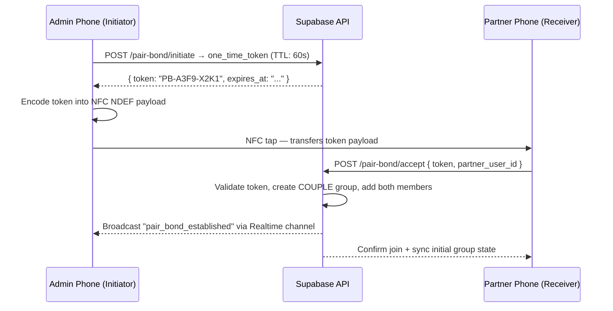

# Multiplayer: 03 Pair-Bond Physical Connection

## 1. Overview

The **Pair-Bond Connection** is the primary onboarding flow for `COUPLE` groups. Instead of a generic alphanumeric invite code, the connection is established by **physically touching both smartphones** — via NFC tap or Bluetooth Low Energy proximity.

The physical act of touching two phones is intentional: it is a moment of shared action that fits the game's couple-first identity and its terminal diagnostic aesthetic. A generic invite code fallback remains available for devices without NFC/BLE hardware and for `FAMILY` / `FRIENDS` group types.

---

## 2. Connection Methods

| Method | Trigger | Range | Flutter Package |
|---|---|---|---|
| **NFC Tap** | Physical touch / very close proximity | ~4 cm | `flutter_nfc_kit` |
| **BLE Proximity** | Proximity scan + mutual confirmation | ~10 cm (gated) | `flutter_blue_plus` |
| **Invite Code** | Manual fallback — alphanumeric code entry | N/A | Native text input |

---

## 3. NFC Pairing Flow

### Sequence


### Terminal UI Copy
```text
[ ADMIN SCREEN ]
> GENERATING PAIR_BOND TOKEN...
> TOKEN: PB-A3F9-X2K1  [ EXPIRES IN 60s ]
> HOLD DEVICES TOGETHER TO COMPLETE HANDSHAKE
> AWAITING PARTNER SIGNAL...    [■□□□□□□□]

[ PARTNER SCREEN ]
> NFC SIGNAL DETECTED
> PAIR_BOND REQUEST FROM: [PARTNER_NAME]
> ACCEPT CONNECTION?
  [ CONFIRM ]    [ DENY ]
```

---

## 4. BLE Proximity Pairing Flow (Fallback to NFC)

For devices without NFC or as an explicit alternative:

1. Admin phone starts a BLE advertisement broadcasting a hashed pairing beacon.
2. Partner phone scans for nearby pairing beacons and displays a list of nearby initiators (identified by username).
3. Partner selects the correct device.
4. A 4-digit PIN is shown on the Admin screen. Partner enters the PIN to confirm mutual intent — this prevents accidental pairing with nearby devices.
5. Once PIN is confirmed on both sides, the server-side token exchange follows the same flow as NFC (section 3).

---

## 5. Flutter Implementation

```dart
import 'package:flutter_nfc_kit/flutter_nfc_kit.dart';

/// Writes a pairing token to an NFC tag (admin side)
Future<void> writeNfcPairingToken(String token) async {
  final availability = await FlutterNfcKit.nfcAvailability;
  if (availability != NFCAvailability.available) {
    // Surface fallback invite code UI instead
    return;
  }
  await FlutterNfcKit.poll(timeout: const Duration(seconds: 60));
  await FlutterNfcKit.writeNDEFRecords([NDEFRecord.plain(token)]);
  await FlutterNfcKit.finish();
}

/// Reads a pairing token from an NFC tag (partner side)
Future<String?> readNfcPairingToken() async {
  await FlutterNfcKit.poll(timeout: const Duration(seconds: 60));
  final records = await FlutterNfcKit.readNDEFRecords();
  await FlutterNfcKit.finish();
  return records.isNotEmpty ? records.first.payload : null;
}
```

---

## 6. Security Constraints

- **Single-use token**: A pairing token is consumed on first acceptance. Re-use returns `409 CONFLICT`.
- **60-second TTL**: Expired tokens return `410 GONE`. The server enforces expiry — never the client.
- **Server-side group creation**: The `COUPLE` group record is created exclusively by the server after both user IDs are validated. The client never writes to `groups` directly.
- **One active COUPLE group per user**: The server rejects a pairing request if either user is already a member of an active `COUPLE` group.
- **No token in logs**: Pairing tokens must be excluded from all analytics, crash reporting, and FCM pipelines.

See [Security/01-security-overview.md](../Security/01-security-overview.md) for the `pair_bond_tokens` DDL.

---

## 7. Required Permissions

| Platform | Permission | Reason |
|---|---|---|
| Android | `NEAR_FIELD_COMMUNICATION` | NFC read/write |
| Android | `BLUETOOTH_SCAN`, `BLUETOOTH_CONNECT` | BLE pairing |
| iOS | `NFCReaderUsageDescription` (Info.plist) | NFC read |
| iOS | `NSBluetoothAlwaysUsageDescription` | BLE pairing |
