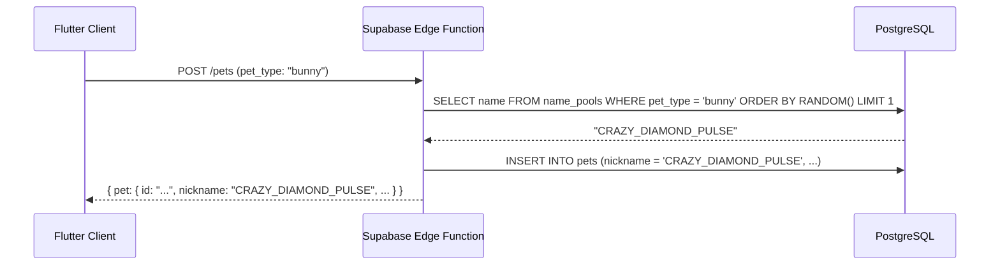

# Name Generation: 01 System Overview

This document defines the automated pet naming system for the **Unix Tamagotchi**. Every pet receives a unique designation at the moment of adoption. Names are **generated once and persist for the pet's entire lifetime** — they can only be changed manually through the post-PoC backend rename feature.

---

## 1. Design Philosophy

Pet names in Unix Tamagotchi serve a dual purpose:

1. **Lore Immersion**: Names read as internal system designations, consistent with the Tactical 1-Bit Cyber-Specimen OS aesthetic. A pet name like `STAR_PLATINUM_VOID` or `CRAZY_DIAMOND_PULSE` feels like a classified biological specimen ID.
2. **Cultural Signal**: The naming patterns draw structural and thematic inspiration from **JoJo's Bizarre Adventure** Stand names — iconic two-to-five-word titles that combine expressive adjectives with strong nouns. This reference is intentional and explicit (see [02-per-type-name-pools.md](./02-per-type-name-pools.md)), but a player with no knowledge of JoJo will simply read the names as cool, evocative specimen designations.

> The names should feel like they belong in a classified government database of living digital weapons.

---

## 2. Scope Matrix (PoC vs. Post-PoC)

| Capability | PoC (Offline / Hive) | Post-PoC (Supabase Backend) | Future (Token-Bank Engine) |
| :--- | :---: | :---: | :---: |
| Auto-generate name at adoption | 🟢 Client-side static pool | 🟢 Server-side flat pool | 🟢 Server-side token composition |
| Name pool per pet type | 🟢 Hardcoded in Dart source | 🟢 Stored in `name_pools` DB table | 🟢 Token bank + affinity weights |
| Combinatorial name space | ~12 names / type | ~12 names / type | 4,000+ combinations / type |
| Global uniqueness guarantee | 🔴 Not enforced | 🔴 Not enforced | 🟢 `name_registry` collision check |
| New pet type without app update | 🔴 Requires Dart change | 🔴 Requires DB migration | 🟢 Insert affinity rows only |
| Player-initiated rename | 🔴 Not available | 🟢 Via `PATCH /pets/{id}/name` | 🟢 Via `PATCH /pets/{id}/name` |
| Rename UI (`[ RENAME ]` button) | 🔴 Not rendered | 🟢 Rendered in Customization screen | 🟢 Rendered in Customization screen |
| Name validation rules | 🔴 N/A | 🟢 Server enforced (length, charset) | 🟢 Server enforced (length, charset) |
| Group-synced nickname | 🟢 Local Hive key (solo only) | 🟢 Synced via Realtime broadcast | 🟢 Synced via Realtime broadcast |

---

## 3. Name Structure

Names consist of **2 to 5 uppercase tokens** separated by underscores, following the terminal identifier format already established by the UI (e.g. `VITALS.ENERGY`, `STAT: IDLE_ID_004`).

```
[TOKEN_A]_[TOKEN_B]                   → 2 words  (e.g. CRAZY_DIAMOND)
[TOKEN_A]_[TOKEN_B]_[TOKEN_C]         → 3 words  (e.g. STAR_PLATINUM_VOID)
[TOKEN_A]_[TOKEN_B]_[TOKEN_C]_[D]     → 4 words  (e.g. GOLD_EXPERIENCE_REQUIEM_NODE)
[A]_[B]_[C]_[D]_[E]                   → 5 words  (rarest, reserved for legendary variants)
```

**Rules:**
- All uppercase, no special characters beyond `_`.
- Minimum 2 tokens, maximum 5 tokens.
- Tokens may be Stand names, concepts, or synthetic system-lore suffixes.
- Each pet **type** has its own curated token pool (see Section 5).

---

## 4. PoC Implementation: Static Client-Side Pools

In the PoC, there is **no backend call** for name generation. Each pet type has a pre-composed list of valid names embedded directly in the Dart source. One name is randomly selected at adoption time and persisted to Hive.

```dart
// lib/core/naming/pet_name_generator.dart  (PoC implementation)

import 'dart:math';

const Map<String, List<String>> _pocNamePools = {
  'bunny': [
    'CRAZY_DIAMOND_PULSE',
    'SILVER_CHARIOT_ECHO',
    'HARVEST_NODE',
    'PEARL_JAM_SIGNAL',
    'SOFT_MACHINE_CORE',
    'WHITE_ALBUM_TRACE',
    'MOODY_BLUES_HUM',
    'BEACH_BOY_DRIFT',
    'CRAZY_DIAMOND',
    'SILVER_CHARIOT',
    'HARVEST_CALL',
    'SOFT_MACHINE',
  ],
  'cat': [
    'STAR_PLATINUM_VOID',
    'KING_CRIMSON_LOOP',
    'GOLD_EXPERIENCE_GLITCH',
    'STICKY_FINGERS_HACK',
    'AEROSMITH_BURST',
    'EMPEROR_CIRCUIT',
    'CREAM_VECTOR',
    'KILLER_QUEEN_ZERO',
    'STAR_PLATINUM',
    'KING_CRIMSON',
    'GOLD_EXPERIENCE',
    'KILLER_QUEEN',
  ],
};

/// Returns a random pre-composed name for the given [petType].
/// Falls back to the 'bunny' pool for unknown types.
String generatePetName(String petType) {
  final pool = _pocNamePools[petType] ?? _pocNamePools['bunny']!;
  return pool[Random().nextInt(pool.length)];
}
```

**Integration point with store:** The `processStorePurchase` function (documented in [Features/02-pet-store-and-credits.md](../Features/02-pet-store-and-credits.md)) currently falls back to `BUNNY_01` / `CAT_01` style identifiers when no `customNickname` is provided. In the implementation, this fallback **must be replaced** with a call to `generatePetName(catalogItem.petType)`.

```
// BEFORE (legacy fallback):
nickname = uppercase(catalogItem.petType) + "_0" + (count(ownedPets) + 1)

// AFTER (name generation):
nickname = generatePetName(catalogItem.petType)
```

---

## 5. Pet-Type Pool Assignment

Each registered pet type maps to a thematic pool designed to match the type's personality and lore role:

| Pet Type | Theme | Pool Source |
| :--- | :--- | :--- |
| `bunny` | Gentle, precise, light energy — repair & growth | Stands with precision/repair themes (Crazy Diamond, Silver Chariot, Harvest…) |
| `cat` | Aggressive, fast, dark energy — hacker feline | Stands with power/speed/darkness themes (Star Platinum, King Crimson, Cream…) |

For the full wordlists, name examples, and JoJo's Bizarre Adventure source mapping see [02-per-type-name-pools.md](./02-per-type-name-pools.md).

---

## 6. Post-PoC: Backend-Driven Generation

When the Supabase backend is introduced (Phase 2), name generation moves server-side:



The `name_pools` table stores the same curated entries currently hardcoded in Dart, but becomes remotely extensible — new pools for new pet types can be added without an app update.

```sql
CREATE TABLE name_pools (
    id            UUID PRIMARY KEY DEFAULT uuid_generate_v4(),
    pet_type      TEXT NOT NULL REFERENCES pet_catalog(pet_type) ON DELETE CASCADE,
    name          TEXT NOT NULL,
    token_count   SMALLINT NOT NULL,       -- number of underscore-separated tokens
    rarity        TEXT DEFAULT 'common',   -- 'common' | 'rare' | 'legendary'
    created_at    TIMESTAMPTZ DEFAULT NOW(),
    UNIQUE (pet_type, name)
);
```

---

## 7. Future System: Composable Token-Bank Generation

The Phase 2 backend (Section 6) migrates the static Dart pool to a PostgreSQL table but still picks from a flat list of **pre-composed** names. This is sufficient for the initial catalog of 2 pet types, but it does not scale: adding a new pet type requires manually curating a new list, and the total number of reachable names is bounded by the list size.

The following system is proposed for a later phase. It replaces the flat `name_pools` table with a **token bank** from which the backend **composes** names at generation time, producing a combinatorial space large enough to guarantee uniqueness across the entire player base.

### 7.1 Core Concept

Instead of storing `CRAZY_DIAMOND_PULSE` as a single row, the system stores its three constituent tokens separately, each tagged with a semantic role and per-type affinity weights:

| Token | Role | bunny affinity | cat affinity |
| :--- | :--- | :--- | :--- |
| `CRAZY` | `MODIFIER` | 0.9 | 0.4 |
| `DIAMOND` | `NOUN` | 0.9 | 0.3 |
| `PULSE` | `SUFFIX` | 0.7 | 0.7 |
| `STAR` | `MODIFIER` | 0.2 | 1.0 |
| `PLATINUM` | `NOUN` | 0.2 | 1.0 |
| `VOID` | `SUFFIX` | 0.1 | 0.9 |

A name is generated by sampling one token per required role in order, biased by the pet type's affinity weights. The result is joined with underscores. The `bunny` pet will statistically never receive `STAR_PLATINUM_VOID` and the `cat` pet will statistically never receive `CRAZY_DIAMOND_PULSE` — but neither combination is technically impossible, which preserves the element of surprise.

### 7.2 Token Bank Schema

```sql
CREATE TABLE name_tokens (
    id          UUID PRIMARY KEY DEFAULT uuid_generate_v4(),
    token       TEXT NOT NULL UNIQUE,
    role        TEXT NOT NULL,    -- 'MODIFIER' | 'NOUN' | 'SUFFIX'
    rarity      TEXT NOT NULL DEFAULT 'common',  -- 'common' | 'rare' | 'legendary'
    created_at  TIMESTAMPTZ DEFAULT NOW()
);

-- Per-type affinity: how likely a token is to appear for a given pet type (0.0 – 1.0)
CREATE TABLE name_token_affinity (
    token_id    UUID NOT NULL REFERENCES name_tokens(id) ON DELETE CASCADE,
    pet_type    TEXT NOT NULL REFERENCES pet_catalog(pet_type) ON DELETE CASCADE,
    weight      NUMERIC(3,2) NOT NULL DEFAULT 0.5,  -- 0.00 to 1.00
    PRIMARY KEY (token_id, pet_type)
);

-- Global registry of all names currently assigned to living pets (collision prevention)
CREATE TABLE name_registry (
    name        TEXT PRIMARY KEY,
    pet_id      UUID NOT NULL REFERENCES pets(id) ON DELETE CASCADE,
    assigned_at TIMESTAMPTZ DEFAULT NOW()
);
```

### 7.3 Generation Algorithm

```
FUNCTION composeName(petType, tokenCountRange = [2, 5], maxAttempts = 10):

  FOR attempt IN 1..maxAttempts:
    tokenCount = weightedRandom(tokenCountRange)  -- 2 most common, 5 rarest

    roles = ['MODIFIER', 'NOUN']
    IF tokenCount >= 3: roles += ['SUFFIX']
    IF tokenCount >= 4: roles += ['SUFFIX']        -- second suffix tier
    IF tokenCount == 5: roles += ['SUFFIX']        -- third suffix tier (legendary)

    tokens = []
    FOR role IN roles:
      candidates = SELECT token, weight
                   FROM name_tokens
                   JOIN name_token_affinity USING (token_id)
                   WHERE role = role
                     AND pet_type = petType
                     AND rarity <= allowedRarity(petType)
                   ORDER BY (random() * weight) DESC
                   LIMIT 1
      tokens.append(candidates.token)

    candidate = JOIN(tokens, '_')

    IF NOT EXISTS (SELECT 1 FROM name_registry WHERE name = candidate):
      RETURN candidate   -- unique name found

  -- All attempts collided; fall back to appending a hex fragment
  RETURN candidate + '_' + HEX(RANDOM_4_BYTES)
```

**Key properties:**
- **Uniqueness** is enforced by `name_registry`. A collision triggers a re-roll; after `maxAttempts` a 4-byte hex suffix is appended as a guaranteed-unique escape hatch.
- **Rarity** is derived from the rarest token in the composed name, not from a hard-coded pool position. A name containing a `legendary` token is itself legendary.
- **Combinatorial space** for 2 token types with 20 MODIFIERs × 20 NOUNs × 10 SUFFIXes yields 20 × 20 + 20 × 20 × 10 = **4,400 unique 2-3 token combinations** per pet type with the initial token set — trivially extensible by adding tokens without any app update.

### 7.4 Extending the System

Adding support for a new pet type requires only two steps — no app update needed:

1. Insert rows into `name_token_affinity` for the new `pet_type` against existing tokens, setting weights that reflect the archetype.
2. Optionally insert new token rows into `name_tokens` if the archetype demands vocabulary not yet in the bank.

Adding a new token to the bank automatically benefits **all** pet types that have an affinity row for it.

---

## 8. Name Display in the UI

The pet designation is rendered at several locations in the terminal UI, always in uppercase monospace (`VT323` font):

| Location | Format | Example |
| :--- | :--- | :--- |
| Main screen header | `SUB_SYS: [NAME]` | `SUB_SYS: CRAZY_DIAMOND_PULSE` |
| Vitals panel label | `VITALS.[STAT]` | unchanged by name |
| Log messages | `> [ALERT] [NAME] is too exhausted to play!` | `> [ALERT] CRAZY_DIAMOND_PULSE is too exhausted to play!` |
| Viewport overlay | `STAT: IDLE_ID_004` + `TYPE: [pet_type_label]` | unchanged by name |
| Pet inventory list | `[NAME] — [pet_type_label]` | `CRAZY_DIAMOND_PULSE — BUNNY` |

---

## 9. Cross-References

- [02-per-type-name-pools.md](./02-per-type-name-pools.md) — Full curated wordlists per pet type with JoJo source mapping.
- [Customization/03-pet-name-customization.md](../Customization/03-pet-name-customization.md) — Post-PoC manual rename feature, UI spec, and validation rules.
- [Features/02-pet-store-and-credits.md](../Features/02-pet-store-and-credits.md) — `processStorePurchase` integration point.
- [Architecture/05-database-and-auth.md](../Architecture/05-database-and-auth.md) — `PETS.nickname` column definition.
