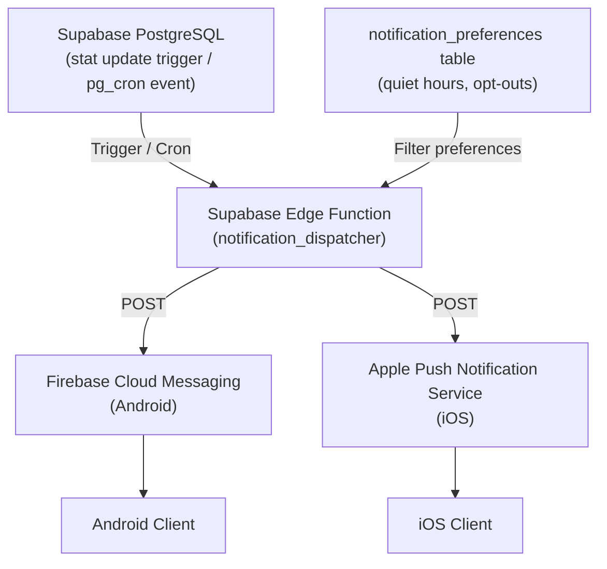

# Notifications: 01 Push Notification System

## 1. Overview

The Unix Tamagotchi notification system serves two primary functions:

1. **Pet Care Alerts** — notifying players when their pet's stats reach critical thresholds.
2. **Partner Activity Notifications** — reinforcing the couple bond by surfacing your partner's care actions in real-time.

All notifications are delivered via **Firebase Cloud Messaging (FCM)** for Android and **Apple Push Notification Service (APNs)** for iOS, both triggered from **Supabase Edge Functions**. Notifications are scoped per-user and respect individual preferences.

> Notifications are a **Phase 2+ feature** and require the Supabase backend. They are not part of the PoC.

---

## 2. Notification Types

### 2.1 Emergency Care Alerts
Triggered when a pet's stat drops to a critical threshold and **no group member is currently online**.

| Trigger | Threshold | Terminal-Style Copy |
|---|---|---|
| Hunger critical | `hunger < 15` | `[ SYS_DIAG ] WARN: NUTRITION_FAIL. <PetName> requires feeding immediately.` |
| Energy critical | `energy < 10` | `[ SYS_DIAG ] WARN: POWER_LOW. <PetName> needs rest. INITIATE SLEEP SEQUENCE.` |
| Happiness critical | `happiness < 10` | `[ SYS_DIAG ] WARN: MOOD_CRITICAL. <PetName> is showing signs of system distress.` |
| All stats critical | all < 15 | `[ SYS_DIAG ] PRIORITY_OMEGA: VITALS FAILING. <PetName> requires immediate attention.` |

**Deduplication**: If one group member resolves the issue while others still have the notification unread, the backend sends a cancellation push to dismiss it on all other devices.

---

### 2.2 Partner Action Notifications (Couple Mode)
Sent to the **offline partner** when the **online partner** completes a care action. Default: enabled. Can be toggled off per user.

| Action | Copy |
|---|---|
| Feed | `> <PartnerName> fed <PetName>. SATURATION +25.` |
| Sleep | `> <PartnerName> put <PetName> to sleep. ENERGY RECHARGING.` |
| Play | `> <PartnerName> played with <PetName>. JOY INDEX ELEVATED.` |

---

### 2.3 Milestone & Anniversary Notifications
Scheduled by Supabase Edge Function cron jobs (`pg_cron`).

| Milestone | Trigger | Copy |
|---|---|---|
| Pet birthday | 1 year since `pets.created_at` | `[ ANNIVERSARY_LOG ] <PetName> has completed 365 CYCLES. Celebrate together.` |
| Couple anniversary | Custom date set at COUPLE group creation | `[ PAIR_BOND_ANNIVERSARY ] <N> YEARS LOGGED. Status: NOMINAL.` |
| Pet evolution | Lifecycle phase threshold reached | `[ EVO_MGR ] <PetName> has reached a new lifecycle phase. Check your terminal.` |

---

### 2.4 Inactivity / Comeback Notifications
Sent when no group member has opened the app within the configured window.

| Window | Copy |
|---|---|
| 8 hours | `[ IDLE_ALERT ] <PetName> is waiting. Last interaction: 8 HOURS AGO.` |
| 24 hours | `[ SYS_WARNING ] <PetName> shows elevated decay metrics. Return to terminal.` |
| 48 hours | `[ CRITICAL_IDLE ] SYSTEM DEGRADATION DETECTED. <PetName> needs care urgently.` |

---

### 2.5 Group Event Notifications

| Event | Copy |
|---|---|
| Pair-bond invite received | `[ PAIR_BOND_REQUEST ] <SenderName> wants to establish a PAIR_BOND. Accept?` |
| Partner joined group | `[ SYS_LOG ] <PartnerName> has joined the session. PAIR_BOND ACTIVE.` |
| Partner left / group dissolved | `[ DISSOLUTION_ALERT ] PAIR_BOND terminated. Pet clones transferred to SOLO group.` |

---

## 3. Technical Architecture



### Edge Function Trigger Sources

| Source | Notification Type |
|---|---|
| PostgreSQL trigger on `pets` stat update | Emergency care alerts |
| Supabase Realtime presence (all members offline) | Emergency care alerts |
| `pg_cron` scheduled job | Milestones, anniversaries, inactivity |
| Realtime broadcast on group action | Partner action notifications |

---

## 4. Per-User Notification Preferences

```sql
CREATE TABLE public.notification_preferences (
    user_id UUID PRIMARY KEY REFERENCES public.profiles(id) ON DELETE CASCADE,
    emergency_alerts BOOLEAN NOT NULL DEFAULT true,
    partner_action_alerts BOOLEAN NOT NULL DEFAULT true,
    milestone_alerts BOOLEAN NOT NULL DEFAULT true,
    inactivity_alerts BOOLEAN NOT NULL DEFAULT true,
    -- Store as TIMETZ or pair with a timezone TEXT column to handle users outside Argentina.
    quiet_hours_start TIMETZ DEFAULT '22:00+00',
    quiet_hours_end TIMETZ DEFAULT '08:00+00',
    timezone TEXT NOT NULL DEFAULT 'America/Argentina/Buenos_Aires',
    updated_at TIMESTAMPTZ NOT NULL DEFAULT NOW()
);
```

Quiet hours are enforced server-side in the Edge Function dispatcher — notifications generated during quiet hours are queued and delivered at `quiet_hours_end`.

---

## 5. Flutter Integration (`firebase_messaging`)

```dart
import 'package:firebase_messaging/firebase_messaging.dart';

class NotificationService {
  static Future<void> initialize() async {
    final fcm = FirebaseMessaging.instance;

    // Permission request is mandatory on iOS
    await fcm.requestPermission(alert: true, badge: true, sound: true);

    // Store FCM token in profiles so the backend can target this device
    final token = await fcm.getToken();
    if (token != null) {
      await Supabase.instance.client
          .from('profiles')
          .update({'fcm_token': token})
          .eq('id', Supabase.instance.client.auth.currentUser!.id);
    }

    // Foreground: render as terminal-style in-app overlay instead of OS banner
    FirebaseMessaging.onMessage.listen((RemoteMessage message) {
      TerminalOverlay.show(
        text: message.notification?.body ?? '',
        prefix: '> SYS_MSG',
      );
    });
  }
}
```

> The `fcm_token TEXT` column is already included in the `profiles` DDL in `Architecture/05-database-and-auth.md`.
