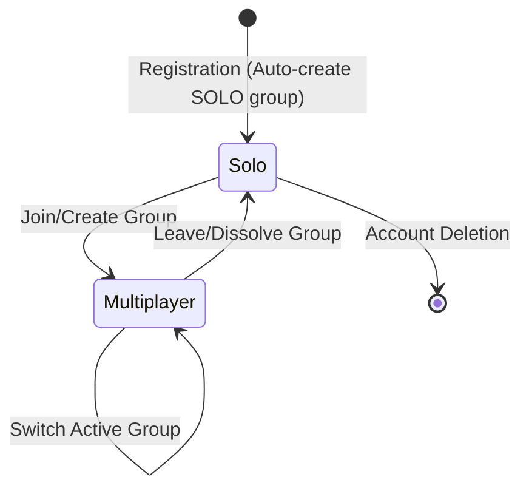
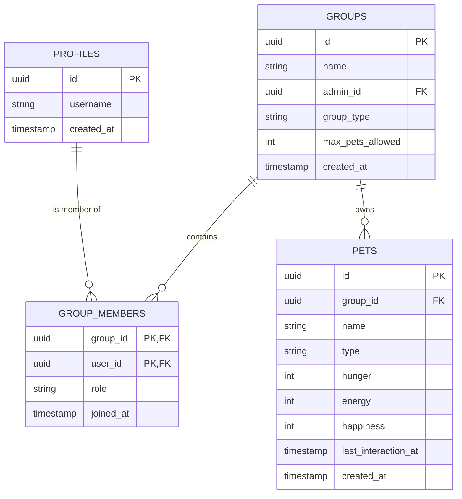

# Ownership: 01 Unified Ownership Model Overview

## 1. Core Philosophy
Every user in the Unix Tamagotchi ecosystem gets a personal `SOLO` group upon registration. This group forms the foundation of the player experience. 

### Core Principle
**Pets belong to GROUPS, not to individual users.** 

This unified 'group of 1' ownership model reconciles solo and multiplayer gameplay. Instead of separate `pets` and `shared_pets` concepts, all pets exist within a group context.

## 2. Group Types
The `group_type` dictates not only capacity but also subtle shifts in pet personality and behavior.

> **Marketing Note**: The game is **primarily marketed as a couple experience**. `COUPLE` is the flagship group type. `SOLO`, `FAMILY`, and `FRIENDS` are fully supported but are not the product's primary audience.

| Type | Capacity | Description |
|---|---|---|
| `SOLO` | 1 member | Auto-created upon registration. The foundation of ownership. |
| `COUPLE` | 2 members | **Primary marketed experience.** Intimate sharing, synchronized push notifications. |
| `FAMILY` | 2-6 members | Shared responsibility, asynchronous care schedules. |
| `FRIENDS` | 2-6 members | Casual interaction, competitive care mechanics. |

## 3. Ownership State Machine


## 4. Unified Entity-Relationship Diagram (ERD)
This replaces the old `profiles -> pets` direct relationship.



## 5. Unified Schema DDL
```sql
-- Groups Table
CREATE TABLE groups (
    id UUID PRIMARY KEY DEFAULT uuid_generate_v4(),
    name TEXT NOT NULL,
    admin_id UUID REFERENCES profiles(id),
    group_type TEXT NOT NULL CHECK (group_type IN ('SOLO', 'COUPLE', 'FAMILY', 'FRIENDS')),
    max_pets_allowed INTEGER DEFAULT 5,
    created_at TIMESTAMPTZ DEFAULT NOW()
);

-- Group Members Table
CREATE TABLE group_members (
    group_id UUID REFERENCES groups(id) ON DELETE CASCADE,
    user_id UUID REFERENCES profiles(id) ON DELETE CASCADE,
    role TEXT NOT NULL DEFAULT 'MEMBER',
    joined_at TIMESTAMPTZ DEFAULT NOW(),
    PRIMARY KEY (group_id, user_id)
);

-- Pets Table (Unified)
CREATE TABLE pets (
    id UUID PRIMARY KEY DEFAULT uuid_generate_v4(),
    group_id UUID REFERENCES groups(id) ON DELETE CASCADE,
    name TEXT NOT NULL,
    type TEXT NOT NULL,
    hunger INTEGER DEFAULT 100,
    energy INTEGER DEFAULT 100,
    happiness INTEGER DEFAULT 100,
    spritesheet_data JSONB,
    last_interaction_at TIMESTAMPTZ DEFAULT NOW(),
    created_at TIMESTAMPTZ DEFAULT NOW()
);
```

## 6. Auto-Create SOLO Group Trigger
When a user registers, their foundational SOLO group is instantiated immediately.

```sql
CREATE OR REPLACE FUNCTION handle_new_user_solo_group()
RETURNS TRIGGER AS $$
DECLARE
    new_group_id UUID;
BEGIN
    -- Create the SOLO group
    INSERT INTO groups (name, admin_id, group_type)
    VALUES (NEW.username || '''s Solo Group', NEW.id, 'SOLO')
    RETURNING id INTO new_group_id;

    -- Add the user to their new SOLO group
    INSERT INTO group_members (group_id, user_id, role)
    VALUES (new_group_id, NEW.id, 'ADMIN');

    RETURN NEW;
END;
$$ LANGUAGE plpgsql;

CREATE TRIGGER on_user_created_solo_group
    AFTER INSERT ON profiles
    FOR EACH ROW
    EXECUTE FUNCTION handle_new_user_solo_group();
```

## 7. Row Level Security (RLS)
> [!IMPORTANT]
> Users can only interact with pets that belong to a group they are currently a member of.

```sql
ALTER TABLE pets ENABLE ROW LEVEL SECURITY;

CREATE POLICY "Users can view and update pets in their groups" 
ON pets
FOR ALL 
USING (
    EXISTS (
        SELECT 1 FROM group_members
        WHERE group_members.group_id = pets.group_id
        AND group_members.user_id = auth.uid()
    )
);
```
