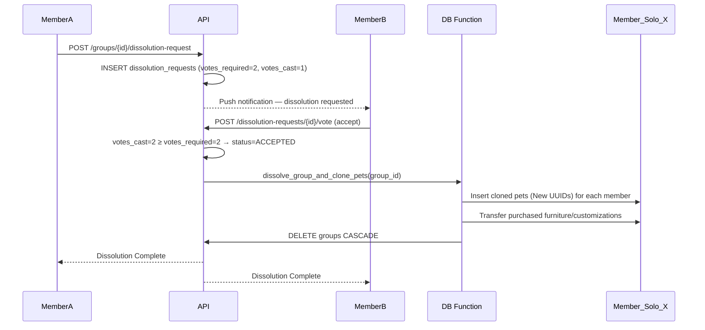

# Ownership: 02 Group Dissolution & Pet Cloning

## 1. Dissolution Overview
Group dissolution requires **member consensus**, not unilateral admin action:

- **COUPLE (2 members)**: Both partners must accept the dissolution request. Either member can initiate it, but the other must confirm.
- **FAMILY / FRIENDS (2–6 members)**: A majority vote is required (50 % + 1). The initiator’s vote is cast automatically.

A `dissolution_requests` row is created when a member initiates the process (see `Architecture/05-database-and-auth.md` for the DDL). The request expires in 48 hours if quorum is not reached. Once all required votes are cast, `dissolve_group_and_clone_pets()` is executed atomically. Because pets are deeply invested entities, they are never deleted — every member receives a clone.

## 2. Pet Cloning Protocol
Upon group dissolution, **every member receives an exact clone of every shared pet**, placed into their personal `SOLO` group.

### Clone Properties
- **Retained**: Pet type, nickname, current stats (hunger, energy, happiness), age, spritesheet data.
- **New**: The clone receives a NEW unique `UUID` and a new `last_interaction_at` timestamp.

## 3. Asset Reconciliation
> [!NOTE]
> Items and customizations are bound to the original purchaser to prevent duplication exploits.

- **Furniture**: Returns to the user who purchased it (`furniture.purchased_by_user_id`). It is placed back in their `SOLO` group's room inventory.
- **Customizations**: Return to the user who set them (`customization.set_by_user_id`). Applied only in their `SOLO` group.
- Members who did not purchase specific furniture or set particular customizations will see default terminal aesthetics upon returning to their solo view.

## 4. Dissolution Sequence


## 5. PostgreSQL Dissolution Function
This function ensures atomic group dissolution, handling the cloning process seamlessly.

```sql
CREATE OR REPLACE FUNCTION dissolve_group_and_clone_pets(target_group_id UUID)
RETURNS VOID AS $$
DECLARE
    member_record RECORD;
    pet_record RECORD;
    member_solo_group_id UUID;
BEGIN
    -- 1. Loop through every member of the dissolving group
    FOR member_record IN SELECT user_id FROM group_members WHERE group_id = target_group_id LOOP
        
        -- Get the member's SOLO group ID
        SELECT id INTO member_solo_group_id FROM groups 
        WHERE admin_id = member_record.user_id AND group_type = 'SOLO' LIMIT 1;

        -- 2. Clone every pet from the target group into the member's SOLO group
        FOR pet_record IN SELECT * FROM pets WHERE group_id = target_group_id LOOP
            INSERT INTO pets (
                group_id, name, type, hunger, energy, happiness, spritesheet_data, last_interaction_at
            ) VALUES (
                member_solo_group_id, 
                pet_record.name, 
                pet_record.type, 
                pet_record.hunger, 
                pet_record.energy, 
                pet_record.happiness, 
                pet_record.spritesheet_data, 
                NOW() -- Fresh interaction timestamp
            );
        END LOOP;
        
        -- Note: Furniture/Customization transfer logic would execute here
        -- UPDATE furniture SET group_id = member_solo_group_id WHERE purchased_by_user_id = member_record.user_id AND group_id = target_group_id;

    END LOOP;

    -- 3. Delete the target group (Cascades to old pets and group_members)
    DELETE FROM groups WHERE id = target_group_id;
    
END;
$$ LANGUAGE plpgsql;
```

## 6. Edge Cases
- **Kicked Members**: If a member is involuntarily kicked from a group, the *exact same cloning rules apply*. They receive clones of the pets up to the point of their removal, deposited into their `SOLO` group.
