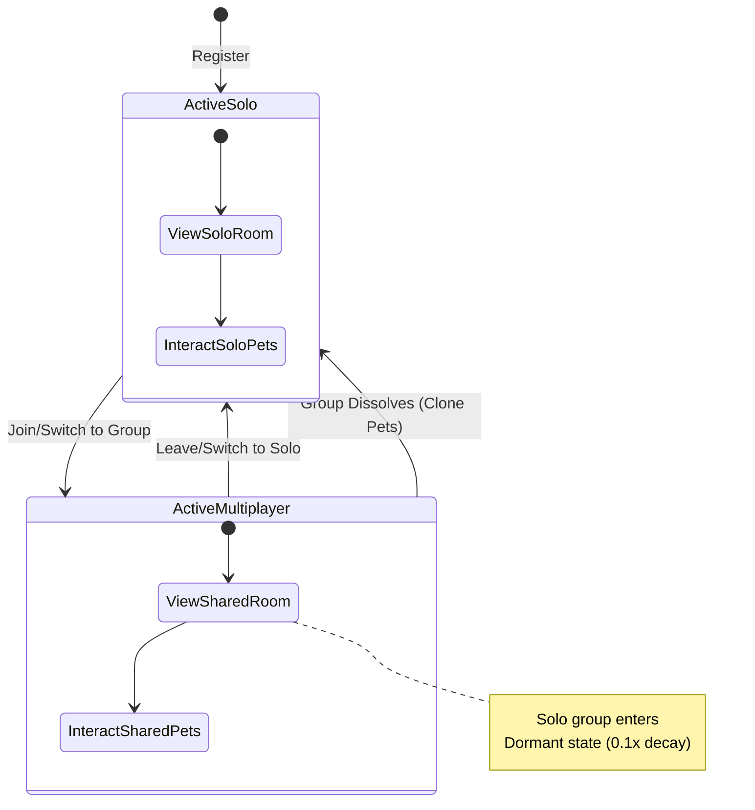

# Ownership: 03 Solo ↔ Group Transitions

## 1. Lifecycle Overview
The player lifecycle seamlessly flows between solo and multiplayer contexts without losing progression or ownership context.

1. **Registration**: Auto-creation of `SOLO` group.
2. **Multiplayer**: User invites/joins a shared group (`COUPLE`, `FAMILY`, `FRIENDS`).
3. **Dissolution/Leaving**: Group disbands, user returns to `SOLO` group (with cloned shared pets).

## 2. Transition Mechanics

### Joining a Group
When a user joins a multiplayer group, their personal `SOLO` group becomes **dormant**.
- The existing pets in the `SOLO` group stay in the `SOLO` group.
- The shared multiplayer group has its own distinct set of pets.
- **Standby Mechanics**: While a user is actively viewing a multiplayer group, their `SOLO` group pets experience heavily reduced stat decay (e.g., 0.1x normal rate) to prevent punishment for engaging in multiplayer.

### Leaving a Group
When a user leaves (or the group dissolves), they receive clones of the shared pets, which are added to their `SOLO` group. The `SOLO` group fully reactivates.

### Switching Active Groups
A user can potentially belong to multiple groups (their `SOLO` group + a multiplayer group). The application UI shows **one active group at a time**.

## 3. User Lifecycle State Diagram


## 4. Flutter/Dart Implementation Model
The Riverpod state management needs to reflect the active group context clearly.

```dart
// lib/models/group_context.dart

enum GroupType { solo, couple, family, friends }

class GroupContext {
  final String groupId;
  final String groupName;
  final GroupType type;
  final bool isDormant; // Relevant for background processing

  const GroupContext({
    required this.groupId,
    required this.groupName,
    required this.type,
    this.isDormant = false,
  });
  
  factory GroupContext.fromJson(Map<String, dynamic> json) {
    return GroupContext(
      groupId: json['id'],
      groupName: json['name'],
      type: GroupType.values.firstWhere((e) => e.name.toUpperCase() == json['group_type']),
    );
  }
}

// lib/providers/active_group_provider.dart
import 'package:flutter_riverpod/flutter_riverpod.dart';

class ActiveGroupNotifier extends StateNotifier<GroupContext?> {
  ActiveGroupNotifier() : super(null);

  void switchGroup(GroupContext newGroup) {
    // Save current group state, trigger UI transition, load new group pets
    state = newGroup;
  }
}

final activeGroupProvider = StateNotifierProvider<ActiveGroupNotifier, GroupContext?>((ref) {
  return ActiveGroupNotifier();
});
```

## 5. Edge Cases
- **Accumulation on Dissolution**: If a user has 5 pets in their `SOLO` group, joins a multiplayer group with 3 pets, and that group dissolves, the user ends up with 8 pets. Since there is no server-side pet cap, this is valid. The UI must handle variable-length pet lists (scrollable terminal view).
