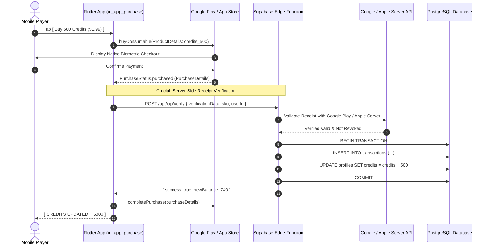

# Payments: 02 Native In-App Purchase Architecture (Flutter)

This document details the native technical implementation of **Google Play Billing** and **Apple StoreKit 2** using the official Flutter **`in_app_purchase`** package.

---

## 1. Native IAP Lifecycle Architecture



---

## 2. Flutter `in_app_purchase` Service Implementation

```dart
import 'dart:async';
import 'package:flutter/foundation.dart';
import 'package:in_app_purchase/in_app_purchase.dart';
import 'package:http/http.dart' as http;
import 'dart:convert';

class InAppPurchaseService {
  final InAppPurchase _iap = InAppPurchase.instance;
  late StreamSubscription<List<PurchaseDetails>> _subscription;

  static const Set<String> _kProductIds = {
    'credits_240',
    'credits_500',
    'exclusive_dragon_pet',
  };

  void initialize({required String userId}) {
    final Stream<List<PurchaseDetails>> purchaseUpdated = _iap.purchaseStream;
    _subscription = purchaseUpdated.listen((purchaseDetailsList) {
      _handlePurchaseUpdates(purchaseDetailsList, userId);
    }, onDone: () {
      _subscription.cancel();
    }, onError: (error) {
      debugPrint('[IAP Error]: $error');
    });
  }

  Future<List<ProductDetails>> fetchAvailableProducts() async {
    final bool available = await _iap.isAvailable();
    if (!available) return [];

    final ProductDetailsResponse response = await _iap.queryProductDetails(_kProductIds);
    return response.productDetails;
  }

  Future<void> buyCreditPack(ProductDetails product) async {
    final PurchaseParam purchaseParam = PurchaseParam(productDetails: product);
    await _iap.buyConsumable(purchaseParam: purchaseParam);
  }

  Future<void> _handlePurchaseUpdates(
    List<PurchaseDetails> purchaseDetailsList,
    String userId,
  ) async {
    for (final purchaseDetails in purchaseDetailsList) {
      if (purchaseDetails.status == PurchaseStatus.purchased) {
        // 1. Verify with backend
        final bool valid = await _verifyReceiptOnServer(purchaseDetails, userId);

        if (valid) {
          // 2. Mark complete with store
          if (purchaseDetails.pendingCompletePurchase) {
            await _iap.completePurchase(purchaseDetails);
          }
        }
      }
    }
  }

  Future<bool> _verifyReceiptOnServer(PurchaseDetails purchase, String userId) async {
    try {
      final response = await http.post(
        Uri.parse('https://your-api.supabase.co/functions/v1/verify-iap'),
        headers: {'Content-Type': 'application/json'},
        body: jsonEncode({
          'userId': userId,
          'sku': purchase.productID,
          'token': purchase.verificationData.serverVerificationData,
          'source': purchase.verificationData.source,
        }),
      );

      final data = jsonDecode(response.body);
      return data['success'] == true;
    } catch (e) {
      debugPrint('[IAP Server Verification Error]: $e');
      return false;
    }
  }

  void dispose() {
    _subscription.cancel();
  }
}
```
