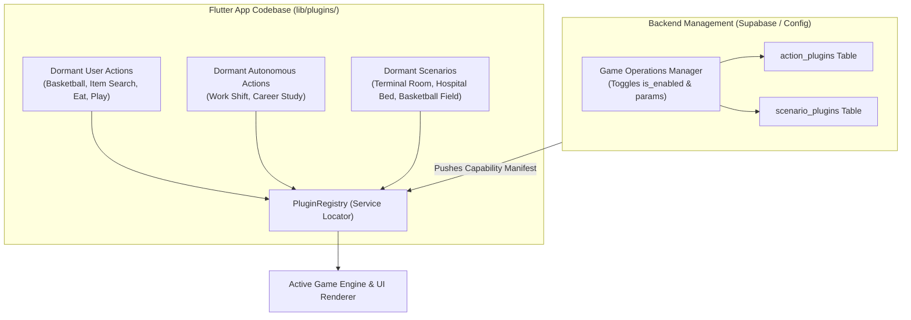

# Plugins: 01 Plugin Architecture Overview

This document specifies the core architecture for the **Dormant Plugin System** in the **Unix Tamagotchi**, explaining how action plugins and scenario plugins are organized in the Flutter codebase and controlled dynamically from the backend.

---

## 1. Architectural Philosophy: Dormant Plugins

In traditional mobile apps, adding a new minigame, seasonal action, or custom room environment requires compiling a new binary, passing app store review, and forcing users to update.

In **Unix Tamagotchi**, all capabilities are implemented as **modular plugins** residing dormant within the Flutter client codebase. The backend controls:
1. **Activation State**: Whether the plugin is currently enabled (`is_enabled: true`).
2. **Availability Window**: Specific dates and times when the plugin is active (`valid_from`, `valid_until`).
3. **Execution Parameters**: Dynamic variables passed to the plugin (e.g. payout rates, difficulty, energy drain).
4. **Target Scenario Binding**: Which environment scenario the pet will transition to when the action is executed.



---

## 2. Codebase Directory Organization

Inside the Flutter application (`lib/` or `packages/tamagotchi_core/lib/`):

```
lib/plugins/
├── plugin_registry.dart                  # Centralized registry & discovery map
├── interfaces/                           # Core abstract contracts
│   ├── action_plugin.dart                # Base contract for all actions
│   ├── user_action_plugin.dart           # Contract for user-tapped actions
│   ├── autonomous_action_plugin.dart     # Contract for automated/time-based actions
│   └── scenario_plugin.dart              # Contract for visual rooms & environments
│
├── user_triggered_actions/               # User-initiated interactions
│   ├── eat_action_plugin.dart            # Core action (PoC)
│   ├── sleep_action_plugin.dart          # Core action (PoC)
│   ├── play_action_plugin.dart           # Core action (PoC)
│   ├── basketball_action_plugin.dart     # Event action (Practice Basketball)
│   └── scavenge_action_plugin.dart       # Event action (Search for Relic)
│
├── non_user_triggered_actions/           # Autonomous / Condition-triggered actions
│   ├── office_work_action_plugin.dart    # Adult pet working shift (earns credits)
│   ├── career_study_action_plugin.dart   # Pet studying to unlock job tiers
│   └── hospital_recovery_plugin.dart     # Sick pet recovering in hospital bed
│
└── scenarios/                            # Dynamic room environments & layouts
    ├── default_terminal_room.dart        # Core scenario (PoC)
    ├── hospital_bed_scenario.dart        # Medical recovery environment
    └── basketball_court_scenario.dart    # Sports stadium environment
```

---

## 3. Core Dart Contracts

### A. Age Phase Enum (`lib/models/age_phase.dart`)

All age-gate logic references this enum. During the PoC, every pet returns `AgePhase.baby` as a static value; the real computation is introduced in Phase 2 via `Features/05-pet-lifecycle-and-aging.md`.

```dart
/// Ordered by lifecycle progression — ordinal comparisons are intentional.
enum AgePhase { baby, child, young, adult, elder }

extension AgePhaseName on AgePhase {
  String get label => name.toUpperCase(); // e.g. 'ADULT'
}
```

---

### B. Base Action Contract (`lib/plugins/interfaces/action_plugin.dart`)

```dart
import 'package:flutter/foundation.dart';
import '../../models/age_phase.dart';

enum ActionType { userTriggered, autonomous }

abstract class ActionPlugin {
  String get id;             // Unique identifier matching backend key (e.g. 'practice_basketball')
  String get displayName;    // User-facing label (e.g. 'Practice Basketball')
  ActionType get actionType; // User-triggered or autonomous
  String get defaultScenarioId; // Default scenario (e.g. 'basketball_court')

  // Age gates — null means no restriction on that bound
  AgePhase? get minAgePhase => null;
  AgePhase? get maxAgePhase => null;

  // Priority — lower value = higher priority (0 overrides everything)
  // Used by the PluginRegistry to resolve conflicts between autonomous plugins.
  // TBD: exact values finalized in Features/05-pet-lifecycle-and-aging.md
  int get priority => 50;

  /// Returns false if the pet's current phase is outside this plugin's age gate.
  bool isAgeEligible(AgePhase petPhase) {
    final min = minAgePhase;
    final max = maxAgePhase;
    if (min != null && petPhase.index < min.index) return false;
    if (max != null && petPhase.index > max.index) return false;
    return true;
  }

  /// Executes the action given the current pet state and backend-provided parameters
  ActionResult execute({
    required PetState currentPet,
    required Map<String, dynamic> backendParams,
    required DateTime triggeredAt,
  });
}

class ActionResult {
  final bool success;
  final String message;
  final int hungerDelta;
  final int energyDelta;
  final int happinessDelta;
  final int creditsEarned;
  final String animationSequence;
  final String targetScenarioId;
  final Duration duration;

  const ActionResult({
    required this.success,
    required this.message,
    this.hungerDelta = 0,
    this.energyDelta = 0,
    this.happinessDelta = 0,
    this.creditsEarned = 0,
    required this.animationSequence,
    required this.targetScenarioId,
    required this.duration,
  });
}
```

### B. Scenario Plugin Contract (`lib/plugins/interfaces/scenario_plugin.dart`)

```dart
import 'package:flame/components.dart';

abstract class ScenarioPlugin {
  String get id; // e.g. 'hospital_bed', 'basketball_court'
  String get displayName;

  /// Builds the 1-bit dithered scene for the Flame engine viewport.
  /// Returns a Flame Component (e.g., a PositionComponent or a Scene) containing
  /// the background sprites, props, and environment objects. The rendering
  /// pipeline applies the Bayer dithering shader to this entire scene graph.
  Component buildScene({
    required Map<String, dynamic> scenarioParams,
    required Component petComponent,
  });

  /// The coordinate layout for where the pet sprite is anchored within the scene.
  Vector2 get petAnchorPoint;
}
```

---

## 4. Central Plugin Registry (`lib/plugins/plugin_registry.dart`)

The `PluginRegistry` maintains all compiled plugins. At runtime, the backend manifest informs the registry which plugins are currently permitted:

```dart
class PluginRegistry {
  static final PluginRegistry _instance = PluginRegistry._internal();
  factory PluginRegistry() => _instance;
  PluginRegistry._internal();

  final Map<String, ActionPlugin> _actionPlugins = {};
  final Map<String, ScenarioPlugin> _scenarioPlugins = {};

  // Active configurations provided by backend
  final Map<String, Map<String, dynamic>> _activeActionConfigs = {};
  final Map<String, Map<String, dynamic>> _activeScenarioConfigs = {};

  void registerAction(ActionPlugin plugin) {
    _actionPlugins[plugin.id] = plugin;
  }

  void registerScenario(ScenarioPlugin plugin) {
    _scenarioPlugins[plugin.id] = plugin;
  }

  /// Syncs active states from backend capability manifest
  void applyBackendManifest({
    required List<BackendActionConfig> activeActions,
    required List<BackendScenarioConfig> activeScenarios,
  }) {
    _activeActionConfigs.clear();
    for (final act in activeActions) {
      if (act.isEnabled && act.isValidNow()) {
        _activeActionConfigs[act.id] = act.parameters;
      }
    }

    _activeScenarioConfigs.clear();
    for (final sc in activeScenarios) {
      if (sc.isEnabled) {
        _activeScenarioConfigs[sc.id] = sc.parameters;
      }
    }
  }

  /// Returns only action plugins that are enabled by the backend
  List<ActionPlugin> getEnabledUserActions() {
    return _actionPlugins.values.where((plugin) {
      return plugin.actionType == ActionType.userTriggered &&
          _activeActionConfigs.containsKey(plugin.id);
    }).toList();
  }

  ScenarioPlugin getScenario(String id) {
    return _scenarioPlugins[id] ?? _scenarioPlugins['default_room']!;
  }
}
```
