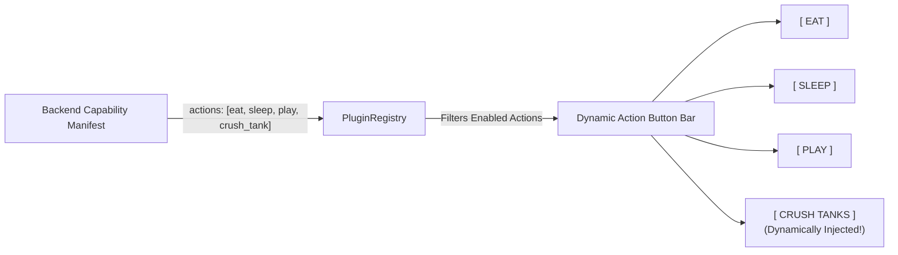

# Plugins: 02 User-Triggered Actions

This document specifies the architecture and implementation of **User-Triggered Action Plugins** in the **Unix Tamagotchi**.

---

## 1. Architectural Concept

User-triggered actions represent interactions initiated directly by the player tapping a terminal button in the UI.

In the initial PoC, **Eat**, **Sleep**, and **Play** are refactored into the first three user-triggered plugins. In future updates, seasonal events or special abilities (such as **Crush Tanks** or **Search for Relic**) reside dormant in `lib/plugins/user_triggered_actions/` and only appear as interactive buttons in the UI when the backend activates them.



---

## 2. Dynamic UI Action Injection

Instead of hardcoding static buttons in the Pet Room, the screen dynamically queries the `PluginRegistry` through a Riverpod provider to generate monospace bracket buttons:

```dart
// lib/features/room/widgets/action_button_bar.dart
import 'package:flutter/material.dart';
import 'package:flutter_riverpod/flutter_riverpod.dart';
import '../../../plugins/plugin_registry.dart';
import '../../../ui/widgets/terminal_bracket_button.dart';

class DynamicActionButtonBar extends ConsumerWidget {
  const DynamicActionButtonBar({super.key});

  @override
  Widget build(BuildContext context, WidgetRef ref) {
    final enabledActions = PluginRegistry().getEnabledUserActions();

    return SingleChildScrollView(
      scrollDirection: Axis.horizontal,
      child: Row(
        mainAxisAlignment: MainAxisAlignment.center,
        children: enabledActions.map((plugin) {
          return Padding(
            padding: const EdgeInsets.symmetric(horizontal: 4.0),
            child: TerminalBracketButton(
              label: plugin.displayName.toUpperCase(),
              onPressed: () {
                ref.read(petStateProvider.notifier).executeAction(plugin);
              },
            ),
          );
        }).toList(),
      ),
    );
  }
}
```

---

## 3. Implementation: PoC Core Action Plugins

Actions return results containing data like `animationSequence`, which tells the Flame viewport which 1-bit dithered sprite animation sequence to play.

### A. Eat Action Plugin (`lib/plugins/user_triggered_actions/eat_action_plugin.dart`)

```dart
import '../interfaces/action_plugin.dart';
import '../../models/pet_state.dart';

class EatActionPlugin extends ActionPlugin {
  @override
  String get id => 'eat';

  @override
  String get displayName => 'Eat';

  @override
  ActionType get actionType => ActionType.userTriggered;

  @override
  String get defaultScenarioId => 'default_room';

  @override
  ActionResult execute({
    required PetState currentPet,
    required Map<String, dynamic> backendParams,
    required DateTime triggeredAt,
  }) {
    // Dynamic override of food replenishment value if backend specifies it
    final hungerBonus = (backendParams['hunger_bonus'] as num?)?.toInt() ?? 25;
    final energyCost = (backendParams['energy_cost'] as num?)?.toInt() ?? 5;
    final targetScenario = (backendParams['scenario_id'] as String?) ?? defaultScenarioId;

    return ActionResult(
      success: true,
      message: 'Fed ${currentPet.nickname} a ball of human people. Hunger +$hungerBonus%',
      hungerDelta: hungerBonus,
      energyDelta: -energyCost,
      happinessDelta: 5,
      animationSequence: 'eating_humans',
      targetScenarioId: targetScenario,
      duration: const Duration(milliseconds: 3500),
    );
  }
}
```

### B. Event Action Plugin: Crush Tanks (`lib/plugins/user_triggered_actions/crush_tank_action_plugin.dart`)

This plugin resides dormant in the app. When a military defense seasonal event goes live, the backend enables it:

```dart
class CrushTankActionPlugin extends ActionPlugin {
  @override
  String get id => 'crush_tank';

  @override
  String get displayName => 'Crush Tanks';

  @override
  ActionType get actionType => ActionType.userTriggered;

  @override
  String get defaultScenarioId => 'metropolis_ruins';

  @override
  ActionResult execute({
    required PetState currentPet,
    required Map<String, dynamic> backendParams,
    required DateTime triggeredAt,
  }) {
    // Prerequisite: Kaiju must have sufficient energy
    final minEnergy = (backendParams['min_energy'] as num?)?.toInt() ?? 30;
    if (currentPet.energy < minEnergy) {
      return ActionResult(
        success: false,
        message: '${currentPet.nickname} is too depleted to crush tanks! (Needs $minEnergy% energy)',
        animationSequence: 'idle',
        targetScenarioId: defaultScenarioId,
        duration: Duration.zero,
      );
    }

    // Backend can override target scenario (e.g. if the event is set in an Arctic Outpost!)
    final targetScenario = (backendParams['scenario_id'] as String?) ?? defaultScenarioId;
    final happinessGain = (backendParams['happiness_gain'] as num?)?.toInt() ?? 40;
    final energyDrain = (backendParams['energy_drain'] as num?)?.toInt() ?? 25;
    final creditReward = (backendParams['credit_reward'] as num?)?.toInt() ?? 10;

    return ActionResult(
      success: true,
      message: '${currentPet.nickname} pulverized incoming military tanks! Joy +$happinessGain%, Salvaged $creditReward credits!',
      hungerDelta: -20,
      energyDelta: -energyDrain,
      happinessDelta: happinessGain,
      creditsEarned: creditReward,
      animationSequence: 'tank_crush_stomp',
      targetScenarioId: targetScenario,
      duration: const Duration(seconds: 4),
    );
  }
}
```
