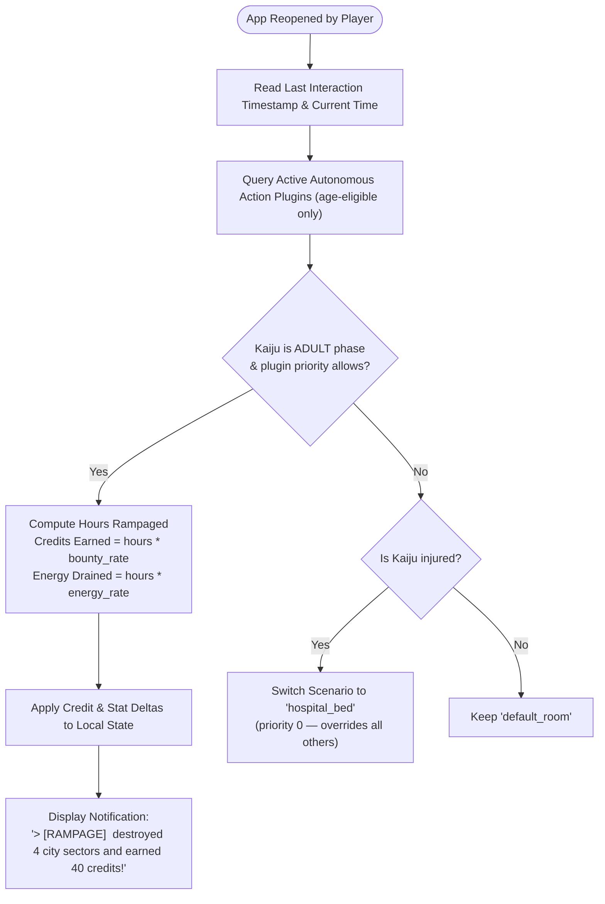

# Plugins: 03 Non-User-Triggered Actions

This document specifies the architecture, scheduling, and deterministic execution of **Non-User-Triggered Actions** (Autonomous Actions) in the **Unix Tamagotchi**.

---

## 1. Architectural Concept

Unlike user actions triggered by button taps, **Non-User-Triggered Actions** trigger autonomously based on:
1. **Circumstantial Conditions**: Pet reaching adult age, pet sickness, or low stat thresholds.
2. **Scheduled Working Hours**: Configured time intervals (e.g. 09:00 to 17:00) where the pet goes to work to generate credits.
3. **Automated Lifecycle Routines**: Career development, higher education, or hospital recovery.



---

## 2. Autonomous Action Contract (`lib/plugins/interfaces/autonomous_action_plugin.dart`)

```dart
import '../interfaces/action_plugin.dart';
import '../../models/pet_state.dart';

abstract class AutonomousActionPlugin extends ActionPlugin {
  @override
  ActionType get actionType => ActionType.autonomous;

  /// Checks if conditions are met for this action to engage
  bool shouldTrigger({
    required PetState pet,
    required Map<String, dynamic> backendParams,
    required DateTime currentTime,
  });

  /// Computes deterministic state changes over elapsed time
  AutonomousExecutionResult computeElapsedProgress({
    required PetState pet,
    required DateTime startTime,
    required DateTime endTime,
    required Map<String, dynamic> backendParams,
  });
}

class AutonomousExecutionResult {
  final int creditsEarned;
  final int hungerDelta;
  final int energyDelta;
  final int happinessDelta;
  final String statusSummary;
  final String? overrideScenarioId;

  const AutonomousExecutionResult({
    required this.creditsEarned,
    this.hungerDelta = 0,
    this.energyDelta = 0,
    this.happinessDelta = 0,
    required this.statusSummary,
    this.overrideScenarioId,
  });
}
```

---

## 3. Implementation: City Destruction Plugin (`lib/plugins/non_user_triggered_actions/city_destruction_action_plugin.dart`)

```dart
class CityDestructionActionPlugin extends AutonomousActionPlugin {
  @override
  String get id => 'city_destruction';

  @override
  String get displayName => 'City Rampage';

  @override
  String get defaultScenarioId => 'metropolis_ruins';

  @override
  bool shouldTrigger({
    required PetState pet,
    required Map<String, dynamic> backendParams,
    required DateTime currentTime,
  }) {
    // Condition 1: Must be enabled by backend
    if (backendParams['is_enabled'] != true) return false;

    // Condition 2: Age gate — city destruction requires ADULT phase
    if (!isAgeEligible(pet.currentPhase)) return false;

    // Condition 3: Sufficient energy
    if (pet.energy < 20) return false;

    return true;
  }

  @override
  AutonomousExecutionResult computeElapsedProgress({
    required PetState pet,
    required DateTime startTime,
    required DateTime endTime,
    required Map<String, dynamic> backendParams,
  }) {
    final bountyPerHr = (backendParams['bounty_per_hour'] as num?)?.toInt() ?? 10;
    final maxShiftHrs = (backendParams['max_shift_hours'] as num?)?.toDouble() ?? 8.0;

    final elapsedHours = endTime.difference(startTime).inMinutes / 60.0;
    final actualHoursWorked = elapsedHours.clamp(0.0, maxShiftHrs);

    final credits = (actualHoursWorked * bountyPerHr).round();
    final energyDrain = -(actualHoursWorked * 6).round();
    final hungerDrain = -(actualHoursWorked * 4).round();

    return AutonomousExecutionResult(
      creditsEarned: credits,
      energyDelta: energyDrain,
      hungerDelta: hungerDrain,
      statusSummary: '${pet.nickname} leveled urban sectors over a ${actualHoursWorked.toStringAsFixed(1)}hr rampage and earned $credits credits!',
      overrideScenarioId: 'metropolis_ruins',
    );
  }

  @override
  ActionResult execute({
    required PetState currentPet,
    required Map<String, dynamic> backendParams,
    required DateTime triggeredAt,
  }) {
    // Fallback if manually inspected
    return ActionResult(
      success: true,
      message: '${currentPet.nickname} is currently rampaging through the metropolis.',
      animationSequence: 'atomic_breath_sweep',
      targetScenarioId: defaultScenarioId,
      duration: const Duration(seconds: 4),
    );
  }
}
```

---

## 4. Deterministic Background Execution

Rather than running heavy battery-consuming background Dart isolates:
1. When the player exits the app, the current `DateTime.now()` is saved to local storage.
2. When the app returns to the foreground (`AppLifecycleState.resumed`), `PluginRegistry` evaluates all autonomous actions against the elapsed time interval.
3. Rewards and stat adjustments apply instantly, and a terminal dialog welcomes the player back with their Kaiju's demolition feats. Actions will update the Flame viewport to play the appropriate 1-bit dithered sprite animation sequences (e.g. `atomic_breath_sweep` or `stomping_skyscrapers`, as illustrated in `Desing References/Godzila.webp`).

---

## 5. Age-Gated Plugin Example: Destruction Study

The `destruction_study` plugin demonstrates how age gates are enforced on the Dart side for juvenile Kaijus learning how to destroy cities. The backend provides the gate as part of the capability manifest; the client enforces it via `isAgeEligible`.

```dart
class DestructionStudyActionPlugin extends AutonomousActionPlugin {
  @override
  String get id => 'destruction_study';

  @override
  String get displayName => 'Demolition Academy';

  @override
  String get defaultScenarioId => 'destruction_simulator';

  // Available during child and young phases only
  @override
  AgePhase get minAgePhase => AgePhase.child;

  @override
  AgePhase get maxAgePhase => AgePhase.young;

  @override
  int get priority => 40;

  @override
  bool shouldTrigger({
    required PetState pet,
    required Map<String, dynamic> backendParams,
    required DateTime currentTime,
  }) {
    if (backendParams['is_enabled'] != true) return false;
    if (!isAgeEligible(pet.currentPhase)) return false;
    if (pet.energy < 15) return false;
    return true;
  }

  @override
  AutonomousExecutionResult computeElapsedProgress({
    required PetState pet,
    required DateTime startTime,
    required DateTime endTime,
    required Map<String, dynamic> backendParams,
  }) {
    final studyHours = endTime.difference(startTime).inMinutes / 60.0;
    final cappedHours = studyHours.clamp(0.0, 6.0);
    final intelligenceGain = (backendParams['intel_per_hour'] as num?)?.toInt() ?? 5;

    return AutonomousExecutionResult(
      creditsEarned: 0,
      hungerDelta: -(cappedHours * 3).round(),
      energyDelta: -(cappedHours * 4).round(),
      happinessDelta: (cappedHours * 2).round(),
      statusSummary:
          '> [ACADEMY] ${pet.nickname} studied ${cappedHours.toStringAsFixed(1)}h of urban demolition tactics. INTEL +${(cappedHours * intelligenceGain).round()}.',
    );
  }
}
```

> `advanced_demolition` follows the same pattern with `minAgePhase: AgePhase.young`, `maxAgePhase: AgePhase.young`, and a higher `intel_per_hour` reward. See `Features/05-pet-lifecycle-and-aging.md` for the full plugin availability matrix.

