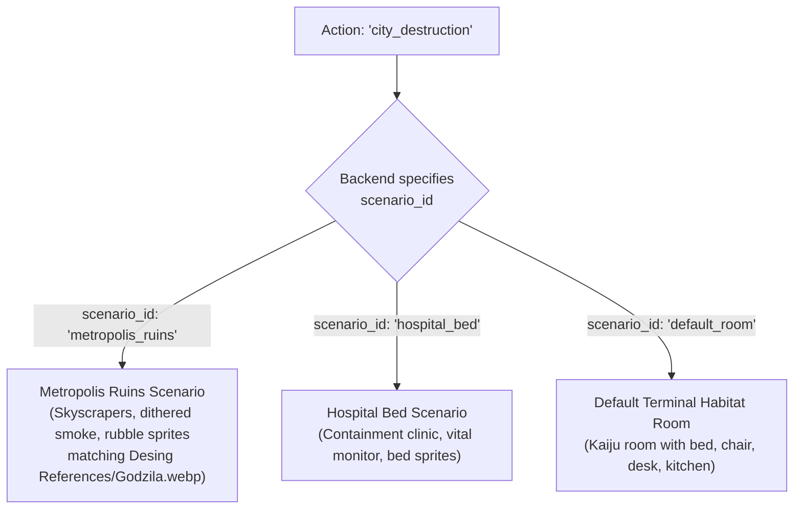

# Plugins: 04 Scenarios and Environments

This document specifies the architecture, rendering engine, and composability rules for **Scenario Plugins** in the **Unix Tamagotchi**.

---

## 1. Architectural Concept: Decoupled Scenarios

In traditional pet games, rooms are static background images. In **Unix Tamagotchi**, scenarios are independent plugins residing in `lib/plugins/scenarios/`.

Scenarios are **completely decoupled from actions**:
- An action (e.g., "City Rampage" or "Crush Tanks") can specify which scenario to load (e.g., "Metropolis Ruins" or "Containment Ward").
- Crucially, the backend can **rebind actions to different scenarios dynamically** via parameters. For example, if a special event features city destruction in a futuristic skyline or containment inside an arctic silo, the backend overrides the action's target scenario to `"metropolis_ruins"` or `"hospital_bed"` without modifying a single line of Flutter code.



---

## 2. Unified 1-Bit Dithered Scene Rendering

Every scenario plugin generates a scene for the Flame engine viewport. The rendering pipeline operates in two stages:
1. **Low-Resolution Compositing**: The scenario builds a scene graph of `SpriteComponent` and `PositionComponent` objects representing the background, environment props, and the pet. These are drawn at a low virtual resolution (e.g., 256x256).
2. **Post-Processing Pipeline**: A global Fragment Shader is applied to the viewport, processing the scene using an ordered Bayer matrix to achieve the signature 1-bit dithered shading. The final output is upscaled using nearest-neighbor filtering to provide crisp, chunky pixels underneath the Flutter native-resolution UI layer.

---

## 3. Implementation: Hospital Bed Scenario (`lib/plugins/scenarios/hospital_bed_scenario.dart`)

```dart
import 'package:flame/components.dart';
import '../interfaces/scenario_plugin.dart';

class HospitalBedScenarioPlugin extends ScenarioPlugin {
  @override
  String get id => 'hospital_bed';

  @override
  String get displayName => 'Hospital Bed Recovery';

  @override
  Vector2 get petAnchorPoint => Vector2(128, 160); // Centered on the bed sprite

  @override
  Component buildScene({
    required Map<String, dynamic> scenarioParams,
    required Component petComponent,
  }) {
    final showVitalMonitor = scenarioParams['vital_monitor'] ?? true;
    final ivDripLevel = scenarioParams['iv_drip_level'] ?? 'FULL';

    // Root node for the scenario graph
    final sceneRoot = PositionComponent(position: Vector2.zero());

    // Background tiles (e.g., medical ward wall)
    sceneRoot.add(SpriteComponent(
      sprite: Sprite(/* load clinic_wall.png */),
      position: Vector2.zero(),
      size: Vector2(256, 256),
      priority: 0, // Background layer
    ));

    // The hospital bed prop
    sceneRoot.add(SpriteComponent(
      sprite: Sprite(/* load bed.png */),
      position: Vector2(64, 140),
      size: Vector2(128, 64),
      priority: 10,
    ));

    // Optional Vital Monitor prop
    if (showVitalMonitor) {
      sceneRoot.add(SpriteComponent(
        sprite: Sprite(/* load vital_monitor.png */),
        position: Vector2(20, 100),
        size: Vector2(32, 32),
        priority: 5,
      ));
    }

    // Anchor the pet sprite onto the bed
    petComponent.position = petAnchorPoint;
    petComponent.priority = 20; // Ensure pet renders above the bed
    sceneRoot.add(petComponent);

    // Optional foreground IV Drip prop that overlaps the pet
    sceneRoot.add(SpriteComponent(
      sprite: Sprite(/* load iv_drip_$ivDripLevel.png */),
      position: Vector2(160, 120),
      size: Vector2(16, 64),
      priority: 30, // Rendered on top of the pet
    ));

    return sceneRoot;
  }
}
```

---

## 4. Implementation: Metropolis Ruins Scenario (`lib/plugins/scenarios/metropolis_ruins_scenario.dart`)

```dart
import 'package:flame/components.dart';
import '../interfaces/scenario_plugin.dart';

class MetropolisRuinsScenarioPlugin extends ScenarioPlugin {
  @override
  String get id => 'metropolis_ruins';

  @override
  String get displayName => 'Metropolis Ruins Destruction Zone';

  @override
  Vector2 get petAnchorPoint => Vector2(128, 160);

  @override
  Component buildScene({
    required Map<String, dynamic> scenarioParams,
    required Component petComponent,
  }) {
    final sceneRoot = PositionComponent(position: Vector2.zero());

    // Metropolis shattered skyline background (matching Desing References/Godzila.webp)
    sceneRoot.add(SpriteComponent(
      sprite: Sprite(/* load metropolis_skyline.png */),
      position: Vector2.zero(),
      size: Vector2(256, 256),
      priority: 0,
    ));

    // Crumbling skyscraper prop behind Kaiju
    sceneRoot.add(SpriteComponent(
      sprite: Sprite(/* load crumbling_skyscraper.png */),
      position: Vector2(30, 80),
      size: Vector2(80, 160),
      priority: 5,
    ));

    // Position the giant Kaiju towering over ruins
    petComponent.position = petAnchorPoint;
    petComponent.priority = 10;
    sceneRoot.add(petComponent);

    // Foreground rubble, crushed vehicles, and Bayer-dithered smoke
    sceneRoot.add(SpriteComponent(
      sprite: Sprite(/* load rubble_smoke_foreground.png */),
      position: Vector2(0, 180),
      size: Vector2(256, 76),
      priority: 55,
    ));

    return sceneRoot;
  }
}
```

---

## 5. Scene Layer Compositing Algorithm

Instead of manipulating multi-line text strings, the **Unix Tamagotchi** relies on Flame's component graph `priority` system (z-index) to compose the scene and ensure depth sorting.

```dart
void compositeScene({
  required Component sceneRoot,
  required Component petComponent,
  required Vector2 anchorPoint,
}) {
  // 1. Establish pet anchor position
  petComponent.position = anchorPoint;
  
  // 2. Set default pet z-index to a middle layer
  petComponent.priority = 50; 
  
  // 3. Add to the scene root. The Flame engine automatically sorts
  // components by their priority field during the render loop.
  // - Backgrounds (Priority: 0 - 20)
  // - Environment Props behind pet (Priority: 21 - 49)
  // - Pet Sprite (Priority: 50)
  // - Foreground Props / Effects (Priority: 51 - 100)
  sceneRoot.add(petComponent);
}
```
