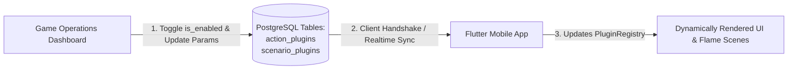

# Plugins: 05 Backend Control & Schemas

This document defines the backend database schemas, remote configuration payloads, and management workflows for orchestrating action and scenario plugins in the **Unix Tamagotchi**.

---

## 1. Backend Orchestration Model

The backend acts as the mission control for all plugins dormant in the Flutter app. Game operators and managers can:
1. **Enable / Disable actions instantly** by toggling a boolean flag in PostgreSQL or Supabase.
2. **Schedule limited-time events** by setting `valid_from` and `valid_until` timestamps.
3. **Rebind Scenarios**: Point an action to any scenario (e.g. binding `practice_basketball` to `hospital_bed`).
4. **Tune Parameters**: Adjust rewards, stat costs, and cooldowns dynamically via JSON payloads without publishing app updates.



---

## 2. PostgreSQL DDL Schema

```sql
-- 1. Action Plugins Table
CREATE TABLE public.action_plugins (
    id TEXT PRIMARY KEY,                       -- Matches Dart plugin id (e.g. 'practice_basketball')
    display_name TEXT NOT NULL,                -- User-facing button label
    action_type TEXT NOT NULL CHECK (action_type IN ('USER_TRIGGERED', 'AUTONOMOUS')),
    is_enabled BOOLEAN NOT NULL DEFAULT false, -- Master toggle
    valid_from TIMESTAMPTZ,                   -- Start of seasonal event (nullable = always active)
    valid_until TIMESTAMPTZ,                  -- End of event
    target_scenario_id TEXT REFERENCES public.scenario_plugins(id) ON DELETE SET NULL,
    -- Age gates: pet must be within [min_age_phase, max_age_phase] for plugin to be eligible.
    -- NULL on either bound means that bound is unconstrained.
    -- Values: 'baby' | 'child' | 'young' | 'adult' | 'elder'
    min_age_phase TEXT DEFAULT NULL CHECK (min_age_phase IN ('baby','child','young','adult','elder')),
    max_age_phase TEXT DEFAULT NULL CHECK (max_age_phase IN ('baby','child','young','adult','elder')),
    -- Priority: lower value = higher precedence when resolving plugin conflicts.
    -- A priority-0 plugin (e.g. hospital_recovery) overrides all others.
    -- TBD: exact values — see Features/05-pet-lifecycle-and-aging.md for design intent.
    priority INTEGER NOT NULL DEFAULT 50,
    -- blocking_conditions: JSON array of runtime conditions that suppress this plugin.
    -- e.g. [{"condition": "is_sick", "blocks": true}, {"condition": "is_sleeping", "blocks": true}]
    blocking_conditions JSONB NOT NULL DEFAULT '[]'::jsonb,
    parameters JSONB NOT NULL DEFAULT '{}'::jsonb, -- Dynamic variables (wages, bonuses, min_energy)
    created_at TIMESTAMPTZ NOT NULL DEFAULT timezone('utc'::text, now()),
    updated_at TIMESTAMPTZ NOT NULL DEFAULT timezone('utc'::text, now())
);

-- 2. Scenario Plugins Table
CREATE TABLE public.scenario_plugins (
    id TEXT PRIMARY KEY,                       -- Matches Dart scenario id (e.g. 'hospital_bed')
    display_name TEXT NOT NULL,
    is_enabled BOOLEAN NOT NULL DEFAULT true,
    parameters JSONB NOT NULL DEFAULT '{}'::jsonb, -- Decorator variables (iv_drip, lights)
    created_at TIMESTAMPTZ NOT NULL DEFAULT timezone('utc'::text, now()),
    updated_at TIMESTAMPTZ NOT NULL DEFAULT timezone('utc'::text, now())
);

-- Seed Default Plugins
INSERT INTO public.scenario_plugins (id, display_name, is_enabled, parameters) VALUES
('default_room', 'Default Terminal Room', true, '{"ambient_fog": true, "dither_pattern": "bayer4x4"}'::jsonb),
('hospital_bed', 'Clinic Recovery Ward', true, '{"vital_monitor": true, "iv_drip_level": "FULL"}'::jsonb),
('basketball_court', 'Cyber Arena', true, '{"stadium_name": "TOKYO DOME 2088"}'::jsonb);

INSERT INTO public.action_plugins (id, display_name, action_type, is_enabled, target_scenario_id, min_age_phase, max_age_phase, priority, blocking_conditions, parameters) VALUES
('eat',                'Eat',              'USER_TRIGGERED', true,  'default_room',    NULL,    NULL,    50, '[]'::jsonb, '{"hunger_bonus": 25, "energy_cost": 5}'::jsonb),
('sleep',              'Sleep',            'USER_TRIGGERED', true,  'default_room',    NULL,    NULL,    50, '[]'::jsonb, '{"energy_bonus": 35, "hunger_cost": 10}'::jsonb),
('play',               'Play',             'USER_TRIGGERED', true,  'default_room',    'child', NULL,    50, '[{"condition": "is_sick", "blocks": true}]'::jsonb, '{"happiness_bonus": 30, "energy_cost": 20}'::jsonb),
('practice_basketball','Basketball',       'USER_TRIGGERED', false, 'basketball_court','young', 'adult', 60, '[{"condition": "is_sick", "blocks": true}]'::jsonb, '{"credit_reward": 15, "min_energy": 25}'::jsonb),
('school_study',       'Go to School',     'AUTONOMOUS',     false, 'default_room',    'child', 'young', 40, '[{"condition": "is_sick", "blocks": true}]'::jsonb, '{"intel_per_hour": 5}'::jsonb),
('university_study',   'University',       'AUTONOMOUS',     false, 'default_room',    'young', 'young', 40, '[{"condition": "is_sick", "blocks": true}]'::jsonb, '{"intel_per_hour": 12}'::jsonb),
('office_work',        'Office Shift',     'AUTONOMOUS',     false, 'default_room',    'adult', 'adult', 50, '[{"condition": "is_sick", "blocks": true}, {"condition": "is_sleeping", "blocks": true}]'::jsonb, '{"wage_per_hour": 12}'::jsonb),
('hospital_recovery',  'Hospital Recovery','AUTONOMOUS',     false, 'hospital_bed',    NULL,    NULL,     0, '[]'::jsonb, '{"recovery_rate": 5}'::jsonb);
```

---

## 3. Remote Capability Manifest (Client API Response)

When the Flutter app launches, it fetches the active capability manifest from `GET /api/v1/plugins/manifest`:

```json
{
  "timestamp": "2026-09-27T12:00:00.000Z",
  "scenarios": [
    {
      "id": "default_room",
      "display_name": "Default Terminal Room",
      "is_enabled": true,
      "parameters": {
        "dither_matrix": "bayer8x8",
        "ambient_fog": true
      }
    },
    {
      "id": "hospital_bed",
      "display_name": "Clinic Recovery Ward",
      "is_enabled": true,
      "parameters": {
        "vital_monitor": true,
        "iv_drip_level": "FULL"
      }
    }
  ],
  "actions": [
    {
      "id": "eat",
      "display_name": "Eat",
      "action_type": "USER_TRIGGERED",
      "is_enabled": true,
      "target_scenario_id": "default_room",
      "parameters": {
        "hunger_bonus": 25,
        "energy_cost": 5
      }
    },
    {
      "id": "practice_basketball",
      "display_name": "Basketball Event",
      "action_type": "USER_TRIGGERED",
      "is_enabled": true,
      "valid_from": "2026-09-25T00:00:00.000Z",
      "valid_until": "2026-10-05T23:59:59.000Z",
      "target_scenario_id": "hospital_bed",
      "min_age_phase": "young",
      "max_age_phase": "adult",
      "priority": 60,
      "blocking_conditions": [
        { "condition": "is_sick", "blocks": true }
      ],
      "parameters": {
        "credit_reward": 20,
        "min_energy": 20,
        "special_event_title": "Hospital Slam Dunk Fundraiser"
      }
    }
  ]
}
```

> [!TIP]
> Notice how in the payload above, the game operator dynamically set `target_scenario_id: "hospital_bed"` for `practice_basketball`. The Flutter client will seamlessly execute the basketball action while rendering the pet inside the hospital bed scenario!
