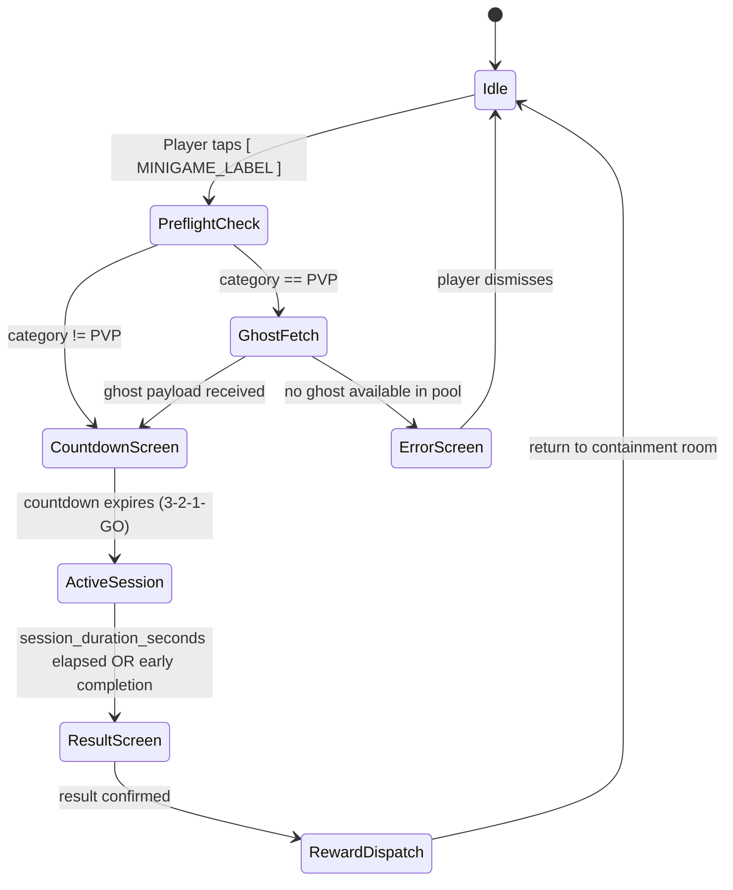
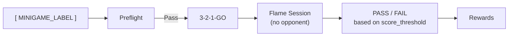
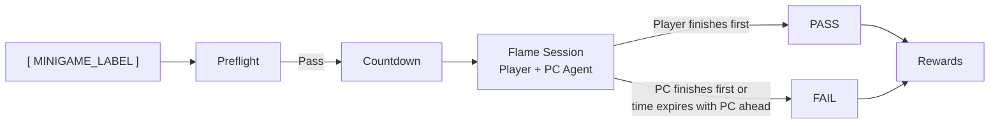
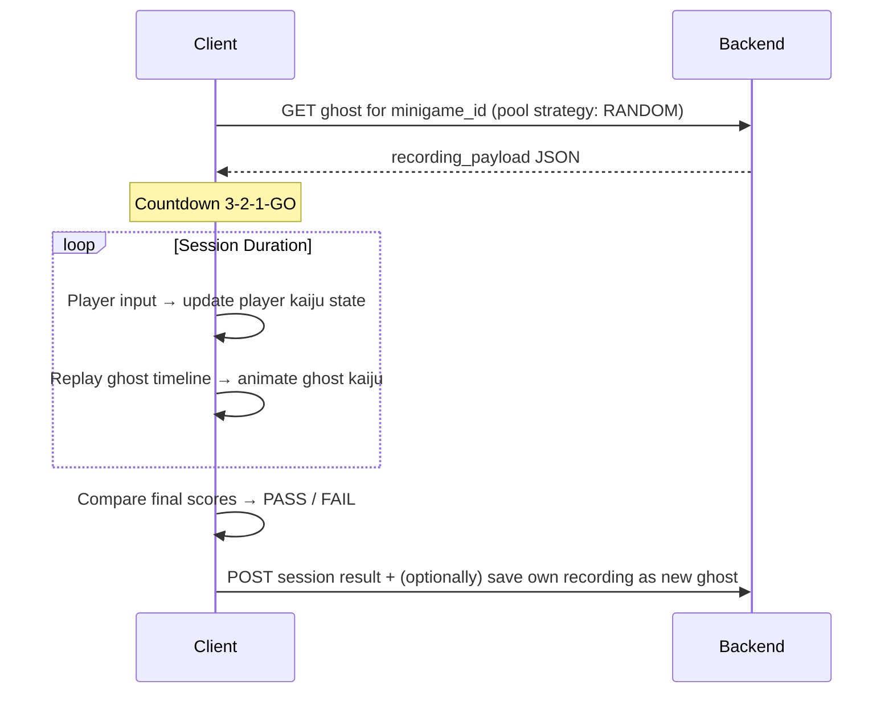

# Minigames Plugin: 02 Session Lifecycle & Categories

This document specifies the full session lifecycle for a minigame and the behavioral rules for each of the three categories: **SOLO**, **SOLO_VS_PC**, and **PVP (Ghost)**.

---

## 1. Session Lifecycle Overview

A minigame session follows a strict state machine from the moment the player taps the button to the moment they return to the containment room.



### State Descriptions

| State | Duration | Description |
| :--- | :--- | :--- |
| **PreflightCheck** | Instant | Client verifies `min_energy_required` and `blocking_conditions` against current kaiju state. |
| **GhostFetch** | < 500ms | For PVP only: client fetches one ghost recording from `minigame_ghost_recordings` using the configured `ghost_pool_strategy`. |
| **CountdownScreen** | 3 seconds | Full-screen 3-2-1-GO overlay rendered in 1-bit terminal style before the Flame session starts. |
| **ActiveSession** | `session_duration_seconds` | The interactive Flame minigame runs. Input is captured, score accumulates, ghost animates (if PVP). |
| **ResultScreen** | ~3 seconds | Pass/fail verdict displayed with final score (if `score_tracking_enabled`), reward preview, and terminal log. |
| **RewardDispatch** | Instant | Backend applies rewards to the player's account and kaiju stats. |

---

## 2. SOLO Category

The player competes against no opponent — pure personal performance.



### Backend-Configured Parameters (in `action_plugins.parameters` JSONB)

```jsonc
{
  "score_threshold": 50,         // Minimum score to PASS
  "lives": 3,                    // Attempts before FAIL
  "obstacle_density": "medium",  // Drives Flame scene config
  "pet_sprite_override": null    // null = use active kaiju sprite
}
```

### Pass/Fail Logic

The backend defines a `score_threshold` in the parameters JSONB. At session end:
- `score >= score_threshold` → **PASS** → full reward applied
- `score < score_threshold` → **FAIL** → fail reward applied (may be zero or a partial stat penalty)

---

## 3. SOLO_VS_PC Category

The player races or competes against a simulated PC opponent. The PC's behavior is entirely deterministic and driven by backend parameters — no AI runtime is required on the client.



### Difficulty System

Difficulty is defined in `action_plugins.parameters` and controls the PC agent's scripted behavior:

```jsonc
{
  "difficulty": "medium",       // "easy" | "medium" | "hard"
  "pc_speed_multiplier": 1.0,   // 0.5 (easy) → 1.0 (medium) → 1.5 (hard)
  "pc_error_rate": 0.15,        // Probability of PC making a suboptimal move per tick
  "pc_sprite_id": "rival_bot"   // Sprite rendered for the PC opponent
}
```

The PC agent is a **scripted sequence** computed from these parameters client-side. No adaptive AI or backend compute is involved. The operator tunes difficulty entirely via the JSONB row.

---

## 4. PVP (Ghost) Category

The player competes against a **ghost** — a serialized recording of a past session played by another user, replayed deterministically in the same Flame scene. The ghost opponent is never live; there is no real-time network call during the session.



### Ghost Pool Strategy

The `ghost_pool_strategy` column on `minigame_plugins` defines how the backend selects a ghost:

| Strategy | Behavior |
| :--- | :--- |
| `RANDOM` | Any recording from the pool, regardless of score. Default. |
| `CLOSEST_SCORE` | Ghost closest in score to the player's recent average (requires score history). |
| `RANDOM_RECENT` | Random selection from ghosts recorded in the last 7 days. |

### Ghost Recording Payload Schema

```jsonc
{
  "schema_version": 1,
  "minigame_id": "relay_race",
  "total_duration_ms": 60000,
  "events": [
    { "t": 0,    "action": "start" },
    { "t": 1240, "action": "jump" },
    { "t": 2880, "action": "collect_relic", "value": 1 },
    { "t": 59800,"action": "finish", "score": 74 }
  ]
}
```

`events` is a sparse timeline of discrete actions. The Flame `GhostPlayerComponent` interpolates between events to produce smooth animation.

### Ghost Capture Condition

After completing a PVP session, the client may submit the player's own recording to the ghost pool. The backend decides whether to store it based on configurable rules (e.g., only store PASS results, only store if pool size < N).

---

## 5. Full-Screen Flame Session Host

All three categories render inside a shared `MinigameSessionScreen` widget that wraps a `FlameGame` instance:

```dart
// lib/plugins/minigames/shared/minigame_session_screen.dart
class MinigameSessionScreen extends StatelessWidget {
  final MinigamePlugin plugin;
  final Map<String, dynamic> params;
  final GhostRecording? ghost; // null for SOLO and SOLO_VS_PC

  const MinigameSessionScreen({
    super.key,
    required this.plugin,
    required this.params,
    this.ghost,
  });

  @override
  Widget build(BuildContext context) {
    return Scaffold(
      backgroundColor: Colors.black,
      body: GameWidget(
        game: plugin.buildGame(params: params, ghost: ghost),
        overlayBuilderMap: {
          'hud': (context, game) => MinigameHudOverlay(game: game as MinigameFlameGame),
          'result': (context, game) => MinigameResultOverlay(game: game as MinigameFlameGame),
        },
      ),
    );
  }
}
```

### Minigame HUD Elements (1-Bit Terminal Style)

The in-session HUD maintains the terminal aesthetic:

```
┌─────────────────────────────────────────┐
│ [RELAY_RACE]    TIME: 00:42   SCORE: 32 │
│ ─────────────────────────────────────── │
│                                         │
│         [Flame scene renders here]      │
│                                         │
│ PLAYER ──────────────────────────>      │
│ GHOST  ──────────────────>              │
│                                         │
└─────────────────────────────────────────┘
```

- Timer counts down in `MM:SS` format.
- Score visible only when `score_tracking_enabled = true`.
- Ghost progress bar visible only in PVP sessions.
- All text rendered in `VT323` monospace, consistent with global terminal UI.

---

## 6. Abstract Dart Contract

```dart
// lib/plugins/minigames/interfaces/minigame_plugin.dart
import '../../interfaces/user_action_plugin.dart';
import '../shared/ghost_recording.dart';
import 'package:flame/game.dart';

abstract class MinigamePlugin extends UserActionPlugin {
  /// Minigame category: 'SOLO', 'SOLO_VS_PC', or 'PVP'.
  String get category;

  /// Minimum kaiju energy required to enter the session.
  int get minEnergyRequired;

  /// Maximum session duration in seconds before auto-end.
  int get sessionDurationSeconds;

  /// Builds the Flame game instance for this minigame.
  /// [ghost] is only non-null for PVP sessions.
  FlameGame buildGame({
    required Map<String, dynamic> params,
    GhostRecording? ghost,
  });
}
```
