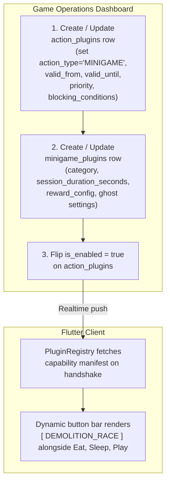
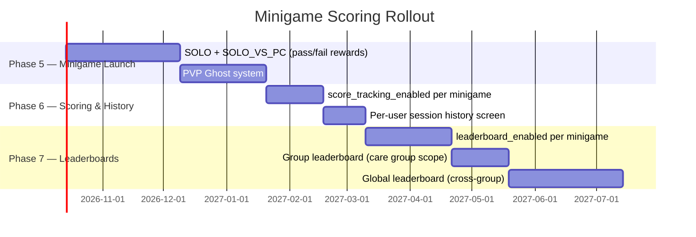

# Minigames Plugin: 03 Backend Schema, Control & Rewards

This document defines the PostgreSQL DDL, backend management workflow, reward configuration, and scoring roadmap for the Minigame Plugin subsystem.

---

## 1. PostgreSQL DDL Schema

Minigames extend the existing `action_plugins` table via a 1:1 composition relationship. Every row in `minigame_plugins` must have a corresponding row in `action_plugins` with `action_type = 'MINIGAME'`.

```sql
-- Extend the action_type CHECK constraint to include MINIGAME
-- (Run as a migration when minigame feature ships)
ALTER TABLE public.action_plugins
    DROP CONSTRAINT IF EXISTS action_plugins_action_type_check;

ALTER TABLE public.action_plugins
    ADD CONSTRAINT action_plugins_action_type_check
    CHECK (action_type IN ('USER_TRIGGERED', 'AUTONOMOUS', 'MINIGAME'));


-- 1. Minigame Plugins Table (extends action_plugins 1:1)
CREATE TABLE public.minigame_plugins (
    -- Shares PK with action_plugins
    id TEXT PRIMARY KEY REFERENCES public.action_plugins(id) ON DELETE CASCADE,

    -- Category: determines opponent model and session behavior
    category TEXT NOT NULL CHECK (category IN ('SOLO', 'SOLO_VS_PC', 'PVP')),

    -- Session constraints
    session_duration_seconds INTEGER NOT NULL DEFAULT 60
        CHECK (session_duration_seconds BETWEEN 10 AND 120),
    min_energy_required INTEGER NOT NULL DEFAULT 0
        CHECK (min_energy_required BETWEEN 0 AND 100),

    -- PVP ghost configuration (ignored for SOLO and SOLO_VS_PC)
    ghost_pool_strategy TEXT NOT NULL DEFAULT 'RANDOM'
        CHECK (ghost_pool_strategy IN ('RANDOM', 'CLOSEST_SCORE', 'RANDOM_RECENT')),
    ghost_capture_on_pass BOOLEAN NOT NULL DEFAULT true,
    ghost_capture_on_fail BOOLEAN NOT NULL DEFAULT false,
    ghost_pool_max_size INTEGER NOT NULL DEFAULT 500,

    -- Reward config: defines what is awarded on PASS and on FAIL.
    -- See Section 3 for the full JSON schema.
    reward_config JSONB NOT NULL DEFAULT '{}'::jsonb,

    -- Phase-gated feature flags (disabled until Phase 5+)
    score_tracking_enabled BOOLEAN NOT NULL DEFAULT false,
    leaderboard_enabled BOOLEAN NOT NULL DEFAULT false,

    created_at TIMESTAMPTZ NOT NULL DEFAULT timezone('utc'::text, now()),
    updated_at TIMESTAMPTZ NOT NULL DEFAULT timezone('utc'::text, now())
);


-- 2. Ghost Recordings Table
CREATE TABLE public.minigame_ghost_recordings (
    id UUID PRIMARY KEY DEFAULT gen_random_uuid(),
    minigame_id TEXT NOT NULL REFERENCES public.minigame_plugins(id) ON DELETE CASCADE,
    user_id UUID NOT NULL REFERENCES public.users(id) ON DELETE CASCADE,
    pet_id UUID NOT NULL REFERENCES public.pets(id) ON DELETE CASCADE,
    score INTEGER,
    result TEXT NOT NULL CHECK (result IN ('PASS', 'FAIL')),
    -- Sparse event timeline for client-side ghost replay (see doc 02 for schema)
    recording_payload JSONB NOT NULL,
    recorded_at TIMESTAMPTZ NOT NULL DEFAULT timezone('utc'::text, now())
);

-- Index for efficient ghost pool queries
CREATE INDEX idx_ghost_recordings_minigame_id ON public.minigame_ghost_recordings(minigame_id);
CREATE INDEX idx_ghost_recordings_recent ON public.minigame_ghost_recordings(minigame_id, recorded_at DESC);


-- 3. Seed: Example Minigames
-- Step 1: insert the base action_plugins rows
INSERT INTO public.action_plugins
    (id, display_name, action_type, is_enabled, valid_from, valid_until,
     target_scenario_id, min_age_phase, max_age_phase, priority, blocking_conditions, parameters)
VALUES
(
    'tank_toss',
    'Tank Toss',
    'MINIGAME', false, NULL, NULL,
    'metropolis_ruins', 'child', NULL, 60,
    '[{"condition": "is_sick", "blocks": true}]'::jsonb,
    '{"score_threshold": 50, "lives": 3, "obstacle_density": "medium"}'::jsonb
),
(
    'skyline_demolition_race',
    'Demolition Race',
    'MINIGAME', false, NULL, NULL,
    'metropolis_ruins', 'child', NULL, 60,
    '[{"condition": "is_sick", "blocks": true}]'::jsonb,
    '{}'::jsonb
);

-- Step 2: insert the minigame-specific rows
INSERT INTO public.minigame_plugins
    (id, category, session_duration_seconds, min_energy_required,
     ghost_pool_strategy, ghost_capture_on_pass, reward_config)
VALUES
(
    'tank_toss',
    'SOLO',
    60,
    20,
    'RANDOM',
    true,
    '{
        "pass": {"credits": 50, "stats": {"energy": -10, "hunger": -5}},
        "fail": {"credits": 0,  "stats": {"energy": -5}}
    }'::jsonb
),
(
    'skyline_demolition_race',
    'PVP',
    60,
    20,
    'RANDOM',
    true,
    '{
        "pass": {"credits": 80, "stats": {"energy": -15, "joy": 15}},
        "fail": {"credits": 10, "stats": {"energy": -10}}
    }'::jsonb
);
```

---

## 2. Backend Management Workflow

Game operators interact with two tables to publish a minigame event:



### Key Operator Controls (via `action_plugins`)

| Column | Purpose |
| :--- | :--- |
| `is_enabled` | Master on/off switch. Flipping to `false` removes the button instantly for all clients. |
| `valid_from` / `valid_until` | Time-bound event window. Client enforces locally; backend validates on reward dispatch. |
| `priority` | Lower value = higher precedence. A `priority: 0` minigame can override all other actions. |
| `blocking_conditions` | JSON array of runtime conditions (e.g. `is_sick`, `is_sleeping`) that suppress the button. |
| `parameters` | Minigame-specific runtime config (score thresholds, difficulty, obstacle density) without redeployment. |

---

## 3. Reward Configuration

The `reward_config` JSONB column on `minigame_plugins` defines what the player receives for a PASS or FAIL result. All fields are optional; omitted fields produce no effect.

### Full Reward Config Schema

```jsonc
{
  "pass": {
    "credits": 80,                      // Integer credits added to the player's balance
    "stats": {
      "energy":  -15,                   // Negative = cost; positive = bonus (clamped 0-100)
      "hunger":  -10,
      "joy":      15
    },
    "items": [                          // Optional inventory items granted on PASS
      { "item_id": "energy_mist", "quantity": 1 }
    ],
    "lifecycle_xp": 20                  // Phase 3+ only; ignored if lifecycle system inactive
  },
  "fail": {
    "credits": 0,
    "stats": {
      "energy": -5
    }
    // items and lifecycle_xp can appear here too if desired
  }
}
```

### Reward Type Availability by Phase

| Reward Type | Available | Phase Gate |
| :--- | :---: | :--- |
| Credits | Yes | Phase 5+ (when minigames ship) |
| Stat bonuses/costs | Yes | Phase 5+ |
| Inventory items | Yes | Phase 5+ (requires inventory system from Phase 2+) |
| `lifecycle_xp` | Conditional | Phase 3+ (requires aging system) — field is stored but silently ignored if lifecycle is inactive |

> The backend can freely populate all fields in `reward_config`. The client applies only the fields whose underlying systems are active. This allows operators to pre-configure future rewards without waiting for each system to launch.

---

## 4. Scoring & Leaderboard Roadmap

Per the current design decision, scoring in the initial minigame release is **pass/fail only**. Numeric scores are computed client-side during the session but are not persisted or displayed unless `score_tracking_enabled = true`.

### Phased Scoring Rollout



When `score_tracking_enabled` is flipped to `true` on a specific minigame row, the client begins persisting session scores and displaying them on the result screen. No app update is required.

---

## 5. Security & Anti-Cheat Considerations

Because rewards are applied server-side on result dispatch, the client cannot self-award credits or items:

1. **Server-side reward application**: The client posts only `{ minigame_id, result: 'PASS'|'FAIL', score?, ghost_recording? }` to the backend. The backend reads `reward_config` from `minigame_plugins` and applies the rewards itself.
2. **Session token**: Each session start issues a short-lived token (`session_token`) from the backend. The result endpoint validates this token to prevent replay attacks.
3. **Time window enforcement**: Even if `is_enabled` is cached locally, the backend re-validates `valid_from`/`valid_until` on reward dispatch and rejects out-of-window submissions.
4. **Score bounds**: If `score_tracking_enabled`, the backend validates that the submitted score is plausible given `session_duration_seconds` and the minigame's known maximum score rate. Implausible scores are accepted as `FAIL` and flagged for review.

> Cross-reference: [Security/03-attack-prevention.md](../../Security/03-attack-prevention.md) for the broader anti-cheat framework.
